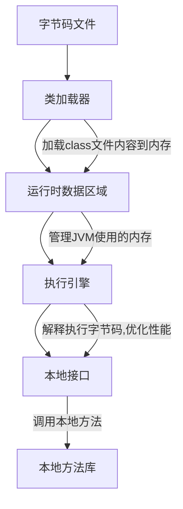
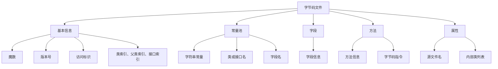
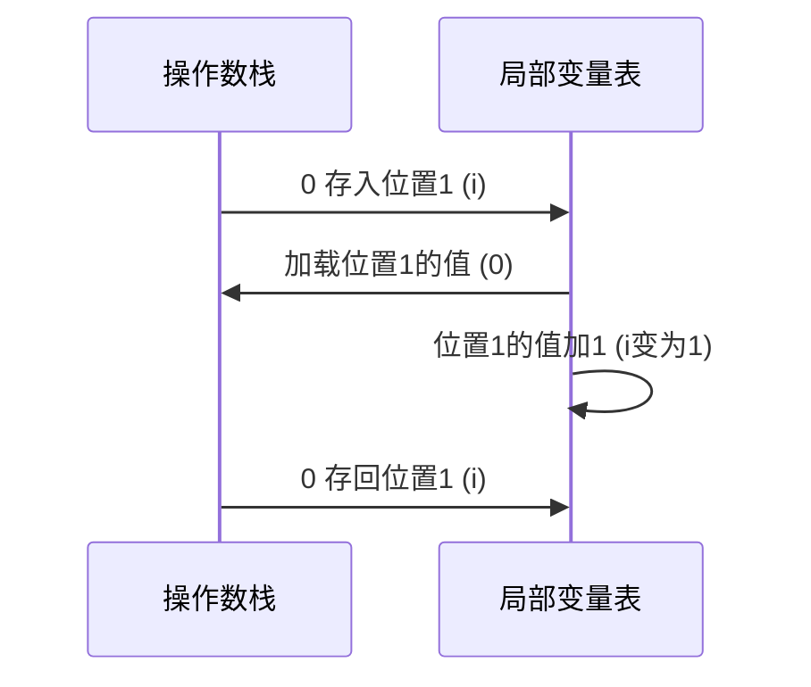
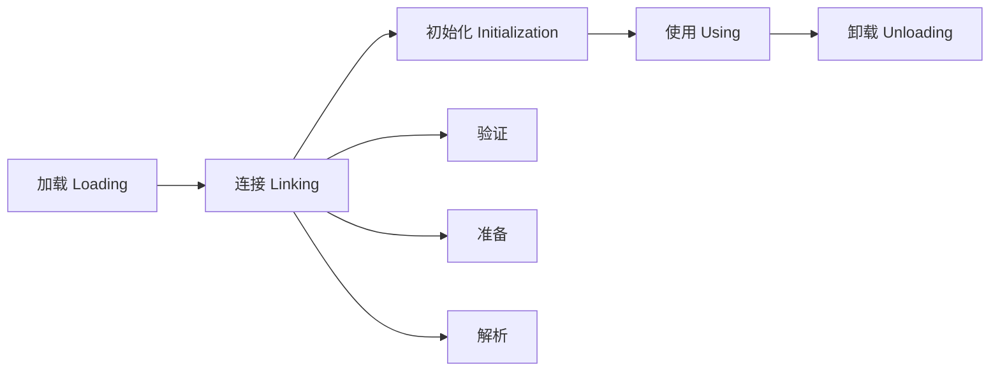
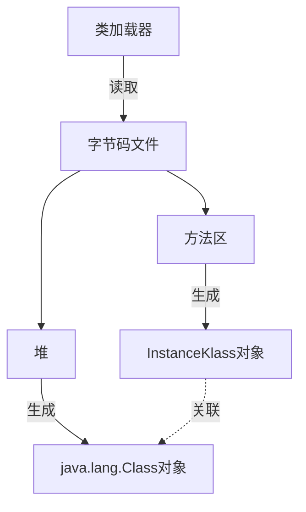
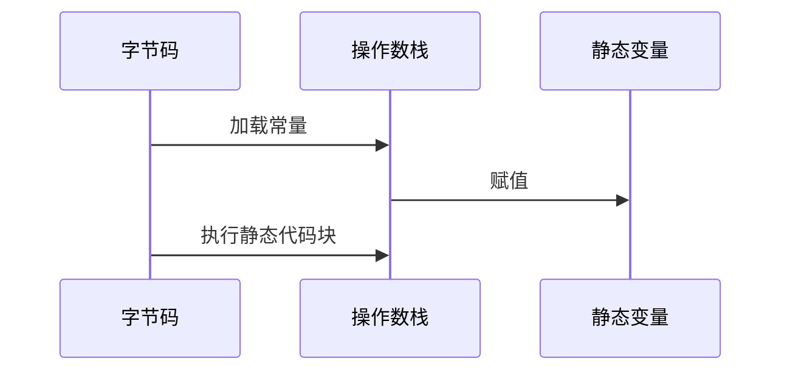

# 字节码文件详解

## JVM的组成

首先了解下JVM的整体结构



## 字节码文件的组成

字节码文件主要由以下部分组成



## Magic魔数

每个class文件的前四个字节被称为Magic Number（魔数），固定值为0xCAFEBABE。它的作用是确定这个文件是否为一个能被虚拟机接受的Class文件。

## 版本号

紧接着魔数的4个字节存储Class文件的版本号：

- 第5-6字节：次版本号
- 第7-8字节：主版本号

Java的版本号从45开始，JDK 1.2之后每个JDK大版本发布主版本号向上加1。

| JDK版本 | 主版本号 |
| ------- | -------- |
| JDK 1.2 | 46       |
| JDK 1.3 | 47       |
| JDK 1.4 | 48       |
| JDK 5   | 49       |
| JDK 6   | 50       |
| JDK 7   | 51       |
| JDK 8   | 52       |

## 常量池

常量池是字节码文件中非常重要的结构，它用于存储字符串常量、类和接口名、字段名等信息。常量池的作用是避免重复定义相同的内容，从而节省空间。

例如:

String str1 = "我爱北京天安门";
String str2 = "我爱北京天安门";

在常量池中，"我爱北京天安门"只会存储一次，str1和str2都会引用这个常量。

## 方法区

方法区是存放字节码指令的核心位置, 通过一个例子来理解方法区中的字节码指令：

```java
public class Example {
    public static void main(String[] args) {
        int i = 0;
        i = i++;
        System.out.println(i);  // 输出 0
    }
}
```

字节码指令执行流程：



这个例子展示了为什么i = i++;执行后i的值仍然是0。

## 常用工具

1. javap命令：JDK自带的反编译工具
   使用方法：`javap -v ClassName.class`

2. jclasslib：可视化字节码查看工具
   可以作为IDEA插件使用，方便在开发时查看字节码

3. Arthas：阿里巴巴开源的Java诊断工具
   可以用于线上问题排查，支持查看加载的类、方法调用、性能分析等

## 案例: 使用Arthas定位线上问题

背景：系统升级后，某个bug仍然存在，怀疑是因为新的字节码文件没有正确部署。

步骤:

1. 在问题服务器上部署并启动Arthas
2. 连接Arthas控制台
3. 使用jad命令反编译可疑的类
4. 确认反编译的源码是否为最新版本

```bash
$ java -jar arthas-boot.jar
$ jad com.example.ProblemClass
```

# 类的生命周期

类的生命周期描述了一个从加载到使用再到卸载的整个过程. 这是一个重要的概念, 不仅仅是高频面试题, 也是许多其他Java知识点的基础

## 类生命周期的重要性

1. 高频面试题
2. 初始化阶段常见于大厂面试题
3. 是许多其他知识点的基础, 如
   - 运行时常量池
   - 多态的原理
   - 类加载器的作用
   - 类的加密和解密

## 类的生命周期概览



### 1 加载阶段

加载阶段主要完成以下三个步骤：

1. 通过类的全限定名获取该类的二进制字节流。
2. 将字节流所代表的静态存储结构转化为方法区的运行时数据结构。
3. 在堆中生成一个代表该类的 java.lang.Class 对象。



### 2 连接阶段（Linking）

连接阶段分为三个步骤：

1. 验证

验证的目的是确保Class文件的字节流中包含的信息符合《Java虚拟机规范》的全部约束要求。主要包括四种验证：

    - 文件格式验证
    - 元数据验证
    - 字节码验证
    - 符号引用验证

2. 准备

准备阶段为类的静态变量分配内存并设置类变量初始值

| 数据类型 | 初始值   |
| -------- | -------- |
| int      | 0        |
| long     | 0L       |
| short    | 0        |
| char     | '\u0000' |
| byte     | 0        |
| boolean  | false    |
| float    | 0.0f     |
| double   | 0.0d     |
| 引用类型 | null     |

注意：被final修饰的静态变量（常量）会直接被赋予原值。

3. 解析

解析阶段是虚拟机将常量池内的符号引用替换为直接引用的过程

### 3 初始化阶段（Initialization）

初始化是类加载过程的最后一步，主要完成以下操作：

1. 执行类构造器 <clinit>() 方法
2. 初始化静态变量
3. 执行静态代码块



## 类初始化的触发条件

1. 创建类的实例（new关键字）
2. 访问类的静态变量（除了final常量）
3. 调用类的静态方法
4. 反射（Class.forName("xxx")）
5. 初始化一个类的子类
6. Java虚拟机启动时被标明为启动类的类
7. JDK7开始提供的动态语言支持

## 案例: 类的初始化顺序

```java
class Parent {
    static {
        System.out.println("Parent static block");
    }
}

class Child extends Parent {
    static {
        System.out.println("Child static block");
    }
}

public class Test {
    public static void main(String[] args) {
        new Child();
    }
}
```

输出结果
```
Parent static block
Child static block
```
子类初始化前，父类会先被初始化

## 总结

1. 类的生命周期包括：加载、连接（验证、准备、解析）、初始化、使用和卸载
2. 加载阶段将类的字节码载入内存，并在堆中创建Class对象。
3. 连接阶段进行验证、为静态变量分配内存、将符号引用替换为直接引用。
4. 初始化阶段执行静态代码块和静态变量的赋值操作。
5. 类的初始化是懒惰的，只有在首次使用时才会被初始化。
6. 子类初始化前，父类会先被初始化。

