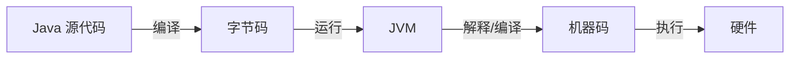
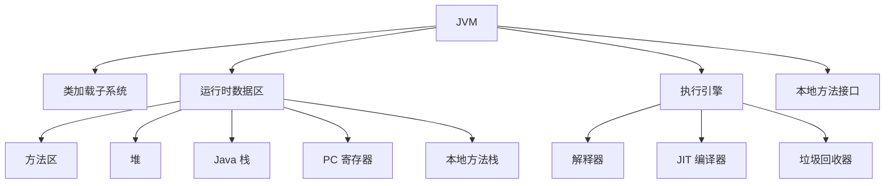
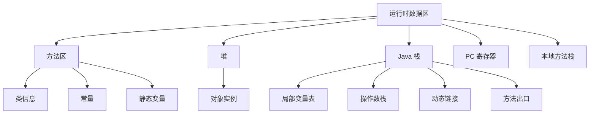
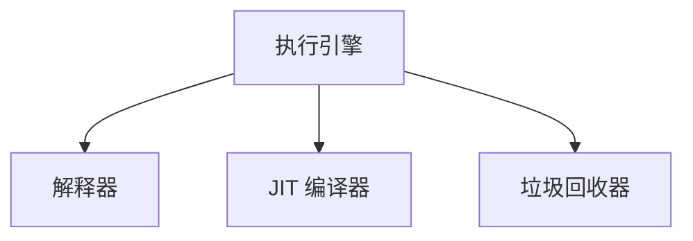

## JVM的定义和作用

JVM (Java Virtual Machine) 即Java程序运行的环境, 它是Java平台的核心


### JVM的主要作用
1. 实现跨平台: 一次编写, 到处运行
2. 自动内存管理
3. 提供安全机制


### JVM的整体架构

在首页我们也看到了, JVM由以下几部分组成



### 类加载子系统

类加载是JVM将类的字节码加载到内存, 并对数据进行校验, 转换解析和初始化, 最终形成JVM可以直接使用的Java类型的过程

```meimaid
graph LR
    A[加载] --> B[连接]
    B --> C[验证]
    B --> D[准备]
    B --> E[解析]
    E --> F[初始化]
```

- 加载: 查找并读取类文件, 创建Class对象
- 连接:
  - 验证: 确保加载的类信息符合 JVM 规范
  - 准备: 为静态变量分配内存并设置初始值
  - 解析: 将符号引用转换为直接引用
- 初始化: 执行静态初始化块，初始化静态变量

这个流程具体是什么样呢? 

首先在加载的过程, JVM通过类的全限定名, 又叫全类名(从你的根包开始的类路径)找到类文件, 然后将类文件字节流读入内存, 到内存中之后, 会将静态存储结构转化为接下来方法区需要运行时的数据结构, 紧接着在堆区中生成一个代表你这个类的java.lang.Class对象.

紧接着, 开始进行连接, 链接前需要进行验证, 保证第一步类文件的字节流包含的信息符合规范, 你得符合虚拟机的要求, 格式正确且不会危害虚拟机自身安全, 验证的信息主要包括文件格式, 元数据, 字节码, 符号引用的验证, 在验证之后, 会进入准备阶段, 也就是为类当中变量(static变量)分配内存并设置初始值, 准备好之后便开始解析, 解析是什么的, 就是将常量池内的符号引用替换为直接引用

这些工作都做好之后, 便会进行初始化, 包括执行类构造器(<clinit>()方法,这个我不太清楚), 然后为类的静态变量赋予正确的初始值

### 运行时数据区



- 方法区: 存储类结构信息, 常量, 静态变量等
  - 存储已被虚拟机加载的类信息, 常量, 静态变量, 即时编译器编译后的代码等数据
  - JDK8之后也被称为元空间, 那之前呢? 我查了下叫什么的都有, 叫永久代的多一点
- 堆: 存储对象实例, 是垃圾收集器管理的主要区域
  - Java堆是虚拟机所管理的内存中最大的一块
  - 所有的对象实例以及数组都在堆上分配
  - GC的主要区域
  - 可以处于物理上不连续的内存空间中
- Java栈: 每个线程私有, 存储局部变量, 部分结果等
  - 每个线程都有自己的Java栈, 与线程同时创建
  - 存储局部变量表, 操作数栈, 动态连接, 方法出口等信息
  - 局部变量表存放了编译期可知的各种基本数据类型, 对象引用
  - 每个对象从调用直至执行完成的过程, 就对应着一个栈帧在Java栈中入栈到出栈的过程
- PC寄存器: 存储当前线程执行的字节码行号
  - 每个线程都有一个PC寄存器
  - 记录当前线程执行的字节码的行号指示器
- 本地方法栈: 为本地方法服务
  - 与Java栈类似, 但它是为虚拟机使用的Native方法服务的

### 执行引擎


执行引擎负责执行字节码



- 解释器
  - 逐条解释字节码并执行
  - 优点是立即执行, 缺点是执行效率较低
- JIT(Just-In-Time)编译器
  - 将热点代码编译成本地机器码
  - 优点是执行效率高, 缺点是需要编译时间
- GC垃圾回收器
  - 自动管理Java堆内存
  - 主要算法包括标记-清楚, 复制, 标记-整理, 分代收集等


关于垃圾回收我还记得的是什么, 一开始正常执行, 放入新生代, 然后执行一段时间, 栈满了, 执行垃圾回收, 然后仍然存活的新生代会被放入存活区, 之后再满, 但是存活区也会加入垃圾回收, 经历多次垃圾回收还活着的, 会被放入老年代, 好像差不多是这样, 我找了个案例

```java
public class GCExample {
    public static void main(String[] args) {
        for (int i = 0; i < 100000; i++) {
            Object obj = new Object();
            // obj 在这里失去引用，成为垃圾
        }
        System.gc(); // 建议 JVM 进行垃圾回收
    }
}
```
在这个例子中, 循环创建了大量的 Object 实例，这些对象很快就失去了引用。这些对象首先在 Eden 区被创建。当 Eden 区满时，会触发 Minor GC，存活的对象会被移动到 Survivor 区。如果对象在 Survivor 区经历了足够多次的 GC 仍然存活，它们会被提升到老年代。System.gc() 会被建议 JVM 进行垃圾回收，但不保证立即执行。

栈为什么会满, 很简单:
```java
public class StackOverflowExample {
    public static void recursiveMethod() {
        recursiveMethod(); // 无限递归调用
    }

    public static void main(String[] args) {
        recursiveMethod();
    }
}
```
因为每次方法调用都会在栈上创建一个新的栈帧, 无线递归会导致栈空间被消耗殆尽, 最终抛出StackOverflowError


首页[[JVM/index|JVM学习专栏]]
