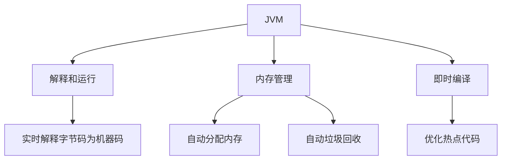
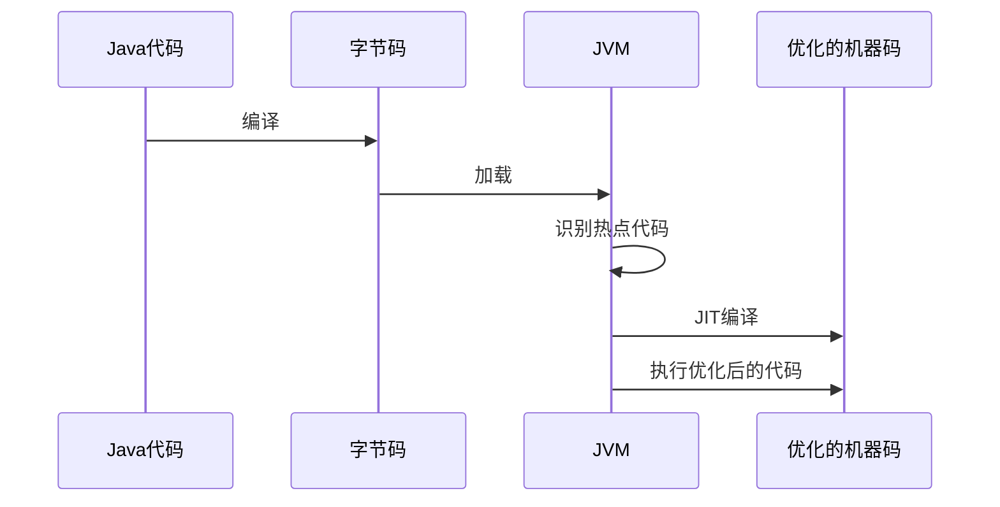

> 这一部分是跟着黑马程序员的JVM学习视频整理的笔记,下面赋上原视频链接【黑马程序员JVM虚拟机入门到实战全套视频教程，java大厂面试必会的jvm一套搞定（丰富的实战案例及最热面试题）】 https://www.bilibili.com/video/BV1r94y1b7eS/?p=9&share_source=copy_web&vd_source=c3f11670c018bfa92ad847e8e0f84309

# 初始JVM

## 什么是JVM

JVM全称是Java Virtual Machine，中文译名为Java虚拟机。

JVM本质上是一个运行在计算机上的程序，它的主要职责是运行Java字节码文件。


## JVM的功能

JVM具有三个核心功能：

1. 解释和运行
2. 内存管理
3. 即时编译



### 解释和运行
JVM对字节码文件中的指令进行实时解释，转换成机器码让计算机执行

### 内存管理
- 自动为对象、方法等分配内存
- 提供自动的垃圾回收机制，回收不再使用的对象

### 即时编译
JVM通过即时编译（Just-In-Time，简称JIT）来优化性能



这种优化使得Java在某些场景下可以达到接近甚至超越C/C++的性能。

## 常见的JVM
| 名称 | 作者 | 支持版本 | 特性 | 适用场景 |
|------|------|----------|------|----------|
| HotSpot (Oracle JDK版) | Oracle | 所有版本 | 使用最广泛，稳定可靠，JIT支持 | 默认选择 |
| HotSpot (Open JDK版) | Oracle | 所有版本 | 开源，与Oracle版本相似 | 对JDK有二次开发需求 |
| GraalVM | Oracle | 11, 17, 19 | 多语言支持，高性能 | 微服务、云原生架构 |
| Dragonwell JDK | Alibaba | 8, 11, 17 | 高性能，安全性提升 | 电商、物流、金融领域 |
| Eclipse OpenJ9 | IBM | 8, 11, 17, 19, 20 | 高性能，可扩展 | 微服务、云原生架构 |


## Java虚拟机规范

- 由Oracle制定
- 规定了JVM在设计和实现时需要遵守的规范
- 包含class字节码文件的定义、类和接口的加载和初始化、指令集等内容
- 不仅适用于Java，也适用于其他可生成class字节码的语言（如Groovy、Scala）

官网地址：https://docs.oracle.com/javase/specs/index.html

## 案例

接下来我们通过一个简单的例子来理解JVM的作用

```java
public class HelloJVM {
    public static void main(String[] args) {
        System.out.println("Hello, JVM!");
    }
}
```

1. 首先，我们编写Java源代码并保存为HelloJVM.java。
2. 使用Java编译器（javac）将源代码编译成字节码文件HelloJVM.class
3. JVM加载HelloJVM.class文件。
4. JVM解释执行字节码，将其转换为机器码
5. 如果这段代码被频繁执行，JVM的JIT编译器会将其编译为优化的机器码以提高性能。
6. JVM管理程序执行过程中的内存分配和垃圾回收。

## HotSpot的发展历程

HotSpot 虚拟机的发展历程是 Java 技术演进的重要组成部分。虽然您提供的文本中没有详细信息，但通常这部分内容会包括：

- HotSpot 的起源（最初由 Longview Technologies 开发）
- 被 Sun Microsystems 收购并开源
- Oracle 收购 Sun 后继续发展 HotSpot
- 主要版本的发布和重要特性的引入

## 总结

回顾一下这一章的主要内容

1. JVM定义:
JVM 是 Java Virtual Machine 的缩写，是一个运行在计算机上的程序，其主要职责是运行 Java 字节码文件。
2. JVM 的三大核心功能：
   - 解释和运行：实时将字节码转换为机器码执行
   - 内存管理：自动分配内存和进行垃圾回收
   - 即时编译：对热点代码进行优化，提升执行效率
3. 常见的 JVM：
包括 HotSpot（Oracle JDK 和 OpenJDK 版本）、GraalVM、Dragonwell JDK（阿里巴巴的龙井）和 Eclipse OpenJ9 等。其中 HotSpot 是使用最广泛的 JVM 实现。


