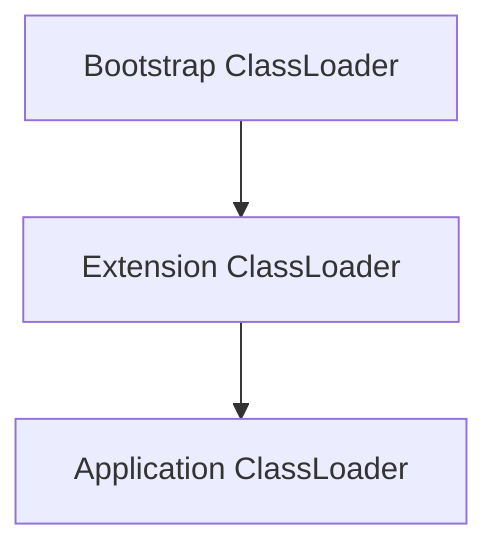
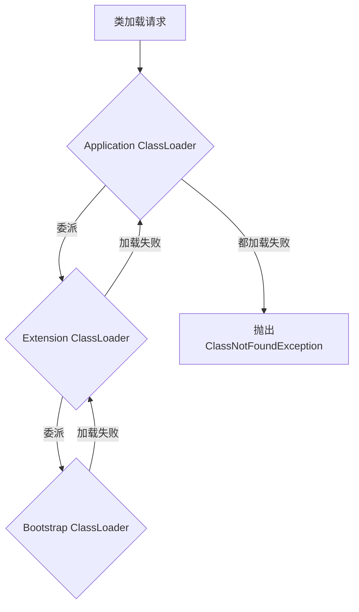

# JVM类加载机制

## 类加载器的层次结构

JVM中有三种标准的类加载器:

- Bootstrap ClassLoader：最顶层的加载类，主要加载核心类库，如rt.jar、resources.jar等。
- Extension ClassLoader：加载ext目录下的jar包。
- Application ClassLoader：加载应用程序的类，即classpath下的类。

## 双亲委派模型

