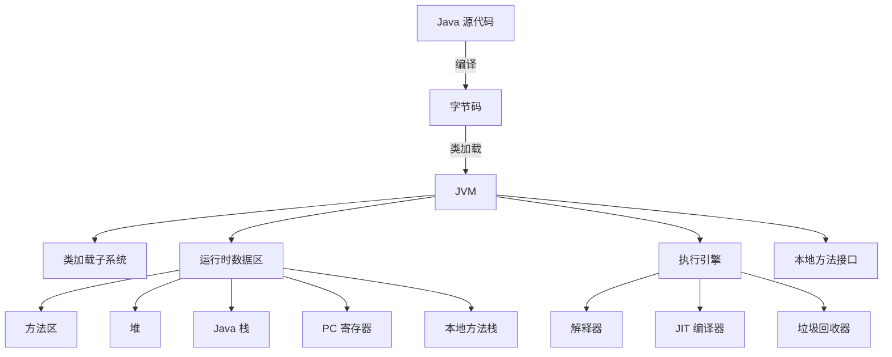

# JVM 学习专栏

在这一部分, 主要是学习JVM虚拟机的一些知识

欢迎来到我的 JVM 学习笔记专栏, 这里记录了我学习 JVM 的全过程

让我们从JVM的整体框架开始, 整理下JVM的知识

这个图展示了JVM的主要组成部分:

1. 类加载子系统: 负责加载, 链接和初始化类
2. 运行时数据区:
   - 方法区: 存储类结构, 常量, 静态变量等
   - 堆: 存储对象实例
   - Java栈: 存储局部变量和部分结果, 管理方法调用和返回
   - PC寄存器: 存储当前执行指令的地址
   - 本地方法栈: 用于本地方法调用
3. 执行引擎:
   - 解释器: 逐条解释执行字节码
   - JIT编译器: 将热点代码编译成本地机器码
   - 垃圾回收机制: 自动管理内存, 回收不再使用的对象
4. 本地方法接口: 允许Java代码调用本地(native)方法

接下来我们分部分简单了解虚拟机
>其实我对虚拟机的了解并不深入, 前后看视频十天, 算上看看文档花了两周, 仅此而已, 不过作为Java开发程序员回头我一定要好好看看, 很多地方的源码我都没有看过, 我的技术栈仅仅限于某一个技术能干什么, 解决什么问题, 怎么用, 不足之处, 找其他技术搭配结合, 仅此而已, 我还是代码路上的一只小趴菜
[[JVM/JVM的定义和作用|(一)JVM的定义和作用]]
[[JVM/JVM的类加载机制|(二)JVM的类加载机制]]