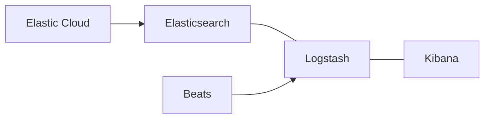

# ELK搜索

我记得这个笔记是在我听尚硅谷的课的时候记下的, b站上应该还有原视频, 这部分十几个小时听起来也很快, 奈何我忘得更快, 这也是为什么我把听课的笔记也都整理记下来, 便于我之后查找, 可惜的是, 后来项目过程中遗忘了这个好习惯, 很多问题还是需要记录下了, 只是因为当时写的时候也不知道出现什么问题, 不断调试过程中问题解决了, 但是难以复现了, 可惜~

ELK是Elasticsearch、Logstash和Kibana的简称,是一套完整的数据处理和可视化解决方案。下面让我们一起深入这三个组件,尤其是Elasticsearch,因为它是ELK的核心。

## Elastic Stack简介

### 简介

ELK最初指Elasticsearch、Logstash和Kibana。随着Beats和Elastic Cloud的加入,现在更多地被称为Elastic Stack。



### 特性

- 灵活的数据处理
- 简单的配置
- RESTful API
- 高效的性能
- 易于扩展
- 强大的数据可视化

### 组件介绍

- Elasticsearch: 分布式搜索和分析引擎
- Logstash: 数据收集和转换引擎
- Kibana: 数据可视化平台
- Beats: 轻量级数据采集器
- Elastic Cloud: 基于Elasticsearch的云服务

## Elasticsearch概述

### 搜索的概念

搜索是根据用户输入的关键词,返回包含该关键词的所有相关信息的过程。

### 数据库搜索的局限性

- 性能问题：大数据量下全表扫描效率低
- 功能局限：难以实现复杂的全文检索
- 扩展性差：难以应对互联网级的数据量

### 全文检索和倒排索引

全文检索使用倒排索引技术,在数据入库时进行分词,建立词项到文档的映射。

### Elasticsearch简介

Elasticsearch是一个分布式、RESTful风格的搜索和数据分析引擎。

主要功能:

- 分布式搜索和数据分析
- 全文检索和结构化搜索
- 近实时处理

应用场景:

- 网站搜索
- 日志分析
- 业务指标分析
- 价格监控系统

特点:

- 分布式和高可用
- 向上扩展能力强
- 接口简单（RESTful API）
- 支持多种编程语言

### Elasticsearch核心概念

- 近实时（NRT）：数据从写入到可被搜索的延迟很短
- 集群（Cluster）：一个或多个节点的集合
- 节点（Node）：单个Elasticsearch实例
- 索引（Index）：文档的集合
- 文档（Document）：可被索引的基本信息单元
- 分片（Shard）：索引的分布式存储单元
- 副本（Replica）：分片的备份

Elasticsearch vs 关系型数据库概念对比:

| 关系型数据库 | Elasticsearch    |
| ------------ | ---------------- |
| 数据库       | 索引             |
| 表           | 索引（原为类型） |
| 行           | 文档             |
| 列           | 字段             |
| 模式         | 映射             |

## Elasticsearch相关软件安装

### Mac安装Elasticsearch

1. 安装Java开发工具包（JDK），版本至少为1.8.0

```bash
brew cask install java
```

验证安装：

```bash
java -version
```

2. 使用Homebrew安装Elasticsearch：

```bash
brew tap elastic/tap
brew install elastic/tap/elasticsearch-full
```

3. 启动Elasticsearch：

```bash
elasticsearch
```

4. 验证安装

打开浏览器，访问 http://localhost:9200

### Mac安装Kibana

1. 使用Homebrew安装Kibana

```bash
brew install elastic/tap/kibana-full
```
