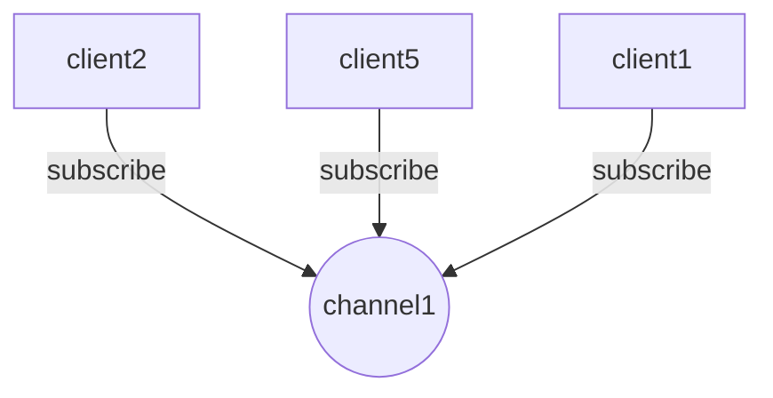
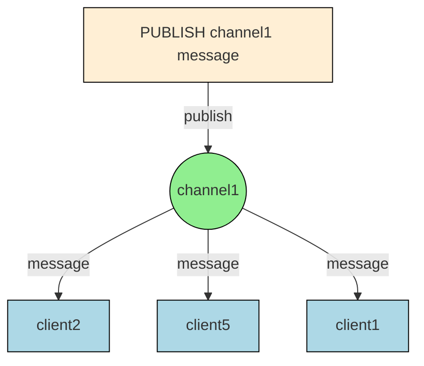

# Redis简介

Redis(Remote Dictionary Server)是由Salvatore Sanfilippo开发的ket-value缓存数据库

Redis是开源的, 遵守BSD协议,使用ANSI C语言开发

Redis与其它key/value缓存产品有以下三个特点

1. Redis支持数据的持久化, 可以将内存中的数据保存在磁盘中, 重启的时候可以再次加载使用;
2. Redis不仅支持key-value类型的数据, 还提供list, set, zset, hash等数据结构的存储
3. Redis支持数据的备份, 即`master-slave`模式的数据备份

## Redis 优势

1. **高性能:**Redis能读的速度是110000次/s,写的速度是81000次/s;
2. **丰富的数据类型:**Redis支持Strings, Lists, Hashes, Sets及OrderedSets数据类型操作;
3. **原子型操作:**Redis的所有操作都是原子性的, 还支持对几个操作全并后的原子性执行;
4. **丰富的特性:**Redis支持publish/subscribe, 通知, key过期等等特性;

## Redis与其他key-value存储有什么不同?

1. Redis支持更多的数据类型, 并且提供对这些数据类型的原子性操作;
   Redis的数据类型都是基于基本数据结构的同时对程序员透明, 无需进行额外的抽象;
2. Redis的数据可以持久化到磁盘;
   > 所以在对不同数据集进行告诉读写时需要权衡内存, 因为数据量不能大于硬件内存.

# Redis 安装

## Windows安装Redis

1. 下载 Redis for Windows：
   - 访问 https://github.com/microsoftarchive/redis/releases
   - 下载最新版本的 ZIP 文件
2. 解压文件我们: 下载 Redis-x64-xxx.zip 压缩包到 C 盘，解压后，将文件夹重新命名为 redis
3. 打开一个 cmd 窗口 使用 cd 命令切换目录到 C:\redis 运行 `redis-server.exe redis.windows.conf` 可以把redis 的路径加到系统的环境变量里，这样就省得再输路径了redis.windows.conf 可以省略，如果省略，会启用默认的。

另启一个cmd窗口, 原来的不要关闭, 不然就无法访问服务端了

切换到redis目录下运行

```bash
redis-cli.exe -h 127.0.0.1 -p 6379
```

设置键值对

```bash
127.0.0.1:6379 > set name zhangsan
OK
```

取出键值对

```bash
127.0.0.1:6379 > get name
"zhangsan"
```

## Ubuntu安装Redis

1. 首先, 确保系统已经安装了必要的编译工具

```bash
sudo apt-get update
sudo apt-get install build-essential tcl
```

2. 下载最新的Redis稳定版本

```bash
wget https://download.redis.io/releases/redis-7.2.3.tar.gz
```

3. 解压下载的文件

```bash
tar xzf redis-7.2.3.tar.gz
```

4. 进入Redis目录

```bash
cd redis-7.2.3
```

5. 编译Redis

```bash
make
```

6. 可选）运行测试以确保一切正常

```bash
make test
```

7. 安装Redis到系统

```bash
sudo make install
```

8. 创建Redis配置目录和数据目录

```bash
sudo mkdir /etc/redis
sudo mkdir /var/redis
```

9. 复制默认配置文件到配置目录

```bash
sudo cp redis.conf /etc/redis/redis.conf
```

10. 编辑配置文件（根据需要）

```bash
sudo vi /etc/redis/redis.conf
```

主要修改：

- 将 daemonize 设置为 yes（使 Redis 作为守护进程运行）
- 设置 dir 到 /var/redis（数据目录）

11. 创建一个 systemd 服务文件以便于管理 Redis

```bash
sudo vi /etc/systemd/system/redis.service
```

**添加以下内容**

```bash
[Unit]
Description=Redis In-Memory Data Store
After=network.target

[Service]
User=redis
Group=redis
ExecStart=/usr/local/bin/redis-server /etc/redis/redis.conf
ExecStop=/usr/local/bin/redis-cli shutdown
Restart=always

[Install]
WantedBy=multi-user.target
```

12. 创建Redis用户和组

```bash
sudo adduser --system --group --no-create-home redis
```

13. 设置适当的权限

```bash
sudo chown redis:redis /var/redis
sudo chmod 770 /var/redis
```

14. 启动 Redis 服务

```bash
sudo systemctl start redis
```

15. 设置 Redis 开机自启

```bash
sudo systemctl enable redis
```

16. 验证 Redis 是否正在运行

```bash
sudo systemctl status redis
```

17. 使用Redis客户端测试连接

```bash
redis-cli
127.0.0.1:6379> ping
PONG
127.0.0.1:6379> set test "Hello, Redis!"
OK
127.0.0.1:6379> get test
"Hello, Redis!"
127.0.0.1:6379> exit
```

## CentOS安装Redis

1. 首先, 更新系统并安装必要的依赖

```bash
sudo yum update
sudo yum install gcc make tcl
```

2. 下载最新的 Redis 稳定版本

```bash
wget https://download.redis.io/releases/redis-7.2.3.tar.gz
```

3. 解压下载的文件

```bash
tar xzf redis-7.2.3.tar.gz
```

4. 进入Redis目录

```bash
cd redis-7.2.3
```

5. 编译 Redis

```bash
make
```

6. 安装Redis

```bash
sudo make install
```

7. 创建 Redis 配置目录和数据目录

```bash
sudo mkdir /etc/redis
sudo mkdir /var/lib/redis
```

8. 复制默认配置文件到配置目录

```bash
sudo cp redis.conf /etc/redis/
```

9. 编辑配置文件

```bash
sudo vi /etc/redis/redis.conf
```

主要修改：

- 将 daemonize 设置为 no
- 设置 dir 到 /var/lib/redis

10. 创建systemd服务文件

```bash
sudo vi /etc/systemd/system/redis.service
```

添加以下内容

```bash
[Unit]
Description=Redis In-Memory Data Store
After=network.target

[Service]
User=redis
Group=redis
ExecStart=/usr/local/bin/redis-server /etc/redis/redis.conf
ExecStop=/usr/local/bin/redis-cli shutdown
Restart=always

[Install]
WantedBy=multi-user.target
```

11. 创建Redis用户和组

```bash
sudo adduser --system --no-create-home redis
sudo groupadd redis
sudo usermod -aG redis redis
```

12. 设置适当的权限

```bash
sudo chown redis:redis /var/lib/redis
sudo chmod 770 /var/lib/redis
```

13. 启动 Redis 服务

```bash
sudo systemctl start redis
```

14. 设置 Redis 开机自启

```bash
sudo systemctl enable redis
```

15. 验证Redis是否正在运行

```bash
sudo systemctl status redis
```

16. 如果需要，配置防火墙

```bash
sudo firewall-cmd --permanent --add-port=6379/tcp
sudo firewall-cmd --reload
```

# Redis 配置

Redis 提供了很多配置选项来优化Redis服务
Redis 的配置文件位于 Redis 安装目录下, 文件名为 redis.conf
可以通过 Redis CONFIG 命令查看或设置配置项

## Redis CONFIG GET 命令语法格式

Redis CONFIG GET 命令语法格式如下

```bash
CONGIG GET CONFIG_SETTING_NAME
```

### 范例

```bash
127.0.0.1:6379> CONFIG GET loglevel
1) "loglevel"
2) "notice"
```

可以使用 \* 号获取所有的 Redis 配置

```bash
127.0.0.1:6379> CONFIG GET *
```

## 编辑配置

可以通过修改redis.conf文件或使用CONFIG set命令来修改配置

### Redis CONFIG SET 命令

Redis CONFIG SET 命令用来设置配置选项

### Redis CONFIG SET 语法

```bash
CONFIG SET CONFIG_SETTING_NAME NEW_CONFIG_VALUE
```

### 范例

```bash
127、0.0.1:6379> CONFIG SET loglevel "notice"
OK
127、0.0.1:6379> CONFIG GET loglevel

1) "loglevel"
2) "notice"
```

# Redis redis.conf 配置选项

Redis 提供了很多配置选项来优化 Redis 服务
Redis 的配置文件位于 Redis 安装目录下, 文件名为 redis.conf

## Redis 配置参数说明

Redis 配置文件 redis.conf 配置说明如下

### 1. daemonize

Redis默认不是以守护进程的方式运行, 可以通过该配置项修改, 使用yes启用守护进程

```bash
# daemonize yes|no
daemonize yes
```

### 2. pidfile

Redis 以守护进程方式运行时, Redis默认会把pid写入`/var/run/redis.pid`文件, 可以通过pidfile项指定

```bash
pidfile /var/run/redis.pid
```

### 3. port

指定 Redis 监听端口, 默认端口为 6379

> 6379的典故:
> Redis 作者曾经解释了为什么选用6379作为默认端口
> 因为6379在手机按键上MERZ对应的号码, 而MERZ取自意大利歌女Alessia Merz的名字

```bash
port 6379
```

### 4. bind

绑定的主机地址

```bash
bind 127.0.0.1
```

### 5. timeout

设置客户端闲置多长时间后关闭连接, 如果指定为0, 表示关闭该功能

```bash
timeout 300
```

### 6. loglevel

指定日志记录级别
Redis支持四个级别: debug, verbose, notice, warning, 默认为verbose

```bash
loglevel verbose
```

### 7. logfile

日志记录方式, 默认为标准输出
如果配置Redis为守护进程方式运行, 而这里又配置为日志记录方式为标准输出, 则日志将会发送给/dev/null

```bash
logfile stdout
```

### 8. databases

设置数据库的数量, 默认数据库为0
可以使用SELECT命令在连接上指定数据库id

```bash
database 16
```

### 9. save

指定在多长时间内, 有多少次更新操作, 就将数据同步到数据文件, 可以多个条件配合

```bash
save <seconds> <changes>
```

Redis 默认配置文件中提供了三个条件

```bash
save 900 1      # 表示 900 秒 ( 15分钟 ) 内有 1 个更改
save 300 10     # 表示 300 秒 ( 5分钟 ) 内有 10 个更改
save 60 10000   # 表示 60  秒内有 10000 个更改
```

### 10. rdbcompression

指定存储至本地数据库时是否压缩数据, 默认为yes
Redis采用LZF压缩, 如果为了节省CPU时间, 可以关闭该选项, 但会导致数据库文件变得巨大

```bash
rdbcompression yes
```

### 11. dbfilename

指定本地数据库文件名, 默认值为 dump.rdb

```bash
dbfilename dump.rdb
```

### 12. dir

指定本地数据库存放目录

```bash
dir ./
```

### 13. slaveof

当本机为slave服务时, 设置master服务的IP地址及端口
在Redis启动时, 它会自动从master进行数据同步

```bash
slaveof <masterip> <masterport>
```

### 14. masterauth

当master服务设置了密码保护时, slave服务连接master的密码

```bash
masterauth <master-passeord>
```

### 15. requirepass

设置Redis连接密码, 默认关闭

如果配置了密码, 客户端在连接Redis时需要需要通过AUTH`<password>`提供密码

```bash
requirepass <require-password>
```

### 16. maxclients

设置同一时间最大客户端连接数, 默认无限制

Redis可以同时打开的客户端连接数为Redis进程可以打开的最大文件描述符数
如果设置`maxclients 0`, 表示不作限制
当客户端连接数到达限制时, Redis会关闭新的连接并向客户端返回max number of clients reached错误信息

```bash
maxclients 128
```

### 17. maxmemory

指定Redis 最大内存限制

Redis 在启动时会把数据加载到内存中，达到最大内存后，Redis 会先尝试清除已到期或即将到期的 Key

当此方法处理后，仍然到达最大内存设置，将无法再进行写入操作，但仍然可以进行读取操作。

Redis 新的 vm 机制，会把 key 存放内存，value 会存放在 swap 区

```bash
maxmemory <bytes>
```

### 18. appendonly

指定是否在每次更新操作后进行日志记录，默认为 no

Redis 在默认情况下是异步的把数据写入磁盘，如果不开启，可能会在断电时导致一段时间内的数据丢失

因为Redis 本身同步数据文件是按上面 save 条件来同步的，所以有的数据会在一段时间内只存在于内存中

```bash
appendonly no|yes
```

### 19. appendfilename

指定更新日志文件名, 默认为appendonly.aof

```bash
appendfilename appendonly.aof
```

### 20. appendfsync

指定更新日志条件, 默认为everysec

```bash
appendfsync everysec
```

日志条件共有3个可选值:

- no:表示等操作系统进行数据缓存同步到磁盘(快)
- always:每次更新操作后手动调用fsync()将数据写到磁盘(慢,安全)
- everysec:每秒同步一次(折中,默认值)

### 21. vm-enabled

指定是否启用虚拟内存机制, 默认值为no

```bash
vm-enabled no
```

VM机制将数据分页存放，由 Redis 将访问量较少的页即冷数据 swap 到磁盘上，访问多的页面由磁盘自动换出到内存中

### 22. vm-swap-file

虚拟内存文件路径, 默认值为`/tmp/redis.swap`不可多个Redis实例共享

```bash
vm-swap-file /tmp/redis.swap
```

### 23. vm-max-memory

将所有大于vm-max-memory的数据存入虚拟内存

```bash
vm-max-memory 0
```

无论vm-max-memory设置多小, 所有索引数据都是内存存储的, 当vm-max-memory设置为0的时候,其实所有value都存在于磁盘, 默认值为0

Redis的索引数据就是keys

### 24. vm-page-size

vm-page-size是要根据存储的数据大小来设定的

```bash
vm-page-size 32
```

Redis swap文件分成了很多的page, 一个对象可以保存在多个page上面, 但一个page上不能被多个对象共享,

Redis建议如果存储很多小对象, page大小最好设置为32或者64bytes;如果存储很大的对象, 则可以使用更大的page,如果不稳定, 就是用默认值

### 25. vm-pages

设置swap文件中的page数量

```bash
vm-pages 134217728
```

页表(一种表示页面空闲或使用bitmap)是放在内存中的,在磁盘上每8个pages将消耗1byte的内存

### 26. vm-max-threads

设置访问swap文件的线程数,默认值为4

```bash
vm-max-threads 4
```

最好不要超过机器的核数
若设置为0, 所有对swap文件的操作都是串行的, 可能会造成长时间的延迟

### 27. glueoutputbuf

设置在向客户端应答时, 是否把较小的包合并为一个包发送, 默认为开启(yes)

```bash
glueoutputbuf yes
```

### 28. hash-max-zipmap和hash-max-zipmap-value

指定在超过一定的数量或者最大的元素超过某一临界值, 采用特殊的哈希算法

```bash
hash-max-zipmap-entries 64
hash-max-zipmap-value 512
```

### 29. activerehashing

指定是否激活重置哈希, 默认为开启(yes)

```bash
activerehashing yes*
```

### include

指定包含其他的配置文件

```bash
include /path/to/local.conf
```

可以在同一主机上多个Redis实例之间使用同一份配置文件, 而同时各个实例又拥有自己的特定配置文件

# Redis 数据类型

Redis 比 Memcached 更优秀的地方之一就是支持更丰富的数据类型

Redis 支持七种数据类型

1. string(字符串)；
2. hash(哈希)；
3. list(列表)；
4. set(集合)；
5. zset(sortedset：有序集合)；
6. Bitmaps(位图)；
7. HyperLogLogs(基数统计)；

## String(字符串)

string 是 Redis 最基本的数据类型，一个 key 对应一个 value

string 类型是二进制安全的

Redis 的 string 可以包含任何数据，比如 jpg 图片或者序列化的对象

string 类型的一个键最大能存储 512 MB 数据

```bash
127.0.0.1:6379> set name "zhangsan"
OK
127.0.0.1:6379> get name
"zhangsan"
```

上面的范例中我们使用了 Redis 的 SET 和 GET 命令

## Hash(哈希)

Redis Hash 是一个键名对集合

Redis Hash 是一个 string 类型的 field 和 value 的映射表

Redis Hash 特别适合用于存储对象

Redis 每个 hash 可以存储 232-1 键值对（40多亿）

```bash
127.0.0.1:6379> hmset user:1 username wangwu password 123456 points 200
OK
127.0.0.1:6379> hgetall user:1
1) "username"
2) "wangwu"
3) "password"
4) "123456"
5) "points"
6) "200"
```

上面的范例中hash数据类型存储了包含用户脚本信息的用户对象
范例中我们使用了Redis HMSET, HGETALL命令, user:1为键

## List(列表)

Redis List ( 列表 ) 是简单的字符串列表，按照插入顺序排序

我们可以添加一个元素到列表的头部 ( 左边 ) 或者尾部 ( 右边 )

Redis List( 列表 ) 最多可存储 232- 1 元素 (4294967295, 每个列表可存储40多亿)

```bash
127.0.0.1:6379> lpush database redis
(integer) 1
127.0.0.1:6379> lpush database mongodb
(integer) 2
127.0.0.1:6379> lpush database rabbitmq
(integer) 3
127.0.0.1:6379> lrange database 0 10
1) "rabbitmq"
2) "mongodb"
3) "redis"
127.0.0.1:6379>
```

## Set(集合)

Redis Set 是 string 类型的无序集合

Redis Set 是通过哈希表实现的，所以添加，删除，查找的时间复杂度都是 O(1)

Redis Set 最大的成员数为 232- 1(4294967295, 每个集合可存储40多亿个成员)

Redis Set 内元素具有唯一性，不管插入多少次都只会有一份

### sadd命令

Redis sadd 添加一个 string 元素到 key 对应的 set 集合

语法:

```bash
sadd key member
```

范例:

```bash
127.0.0.1:6379> sadd users zhangsan
(integer) 1
127.0.0.1:6379> sadd users wangwu
(integer) 1
127.0.0.1:6379> sadd users lisi
(integer) 1
127.0.0.1:6379> sadd users lisi
(integer) 0
127.0.0.1:6379> smembers users
1) "lisi"
2) "wangwu"
3) "zhangsan"
```

上面的范例, lisi添加了两次, 但最后只存储了一份

### zset(sorted set: 有序集合)

Redis zset 和 set 一样也是 string 类型元素的集合

Redis zset 不同的是每个元素都会关联一个 double 类型的分数

Redis zset 通过分数来为集合中的成员进行从小到大的排序

Redis zset 的成员是唯一的，但分数( score ) 却可以重复

Redis zset添加元素到集合, 如果元素在集合中存在则更新对应score

语法:

```bash
zadd key score member
```

示例:

```bash
127.0.0.1:6379> zadd long_rank 0 redis
(integer) 1
127.0.0.1:6379> zadd long_rank 0 mongodb
(integer) 1
127.0.0.1:6379> zadd long_rank 0 rabitmq
(integer) 1
127.0.0.1:6379> zadd long_rank 0 r
(integer) 1
127.0.0.1:6379> zadd long_rank 0 r
(integer) 0
127.0.0.1:6379> ZRANGEBYSCORE long_rank 0 100
1) "mongodb"
2) "r"
3) "rabitmq"
4) "redis"
```

## REdis Bitmap(位图)

Redis Bitmap 通过类似 map 结构存放 0 或 1 ( bit 位 ) 作为值

Redis Bitmap 可以用来统计状态，如 日活，是否浏览过某个东西

### Redis setbit 命令

Redis setbit 命令用于设置或者清除一个 bit 位

### Redis setbit 命令语法格式

```bash
SETBIT key offset value
```

### 范例

```bash
127、0.0.1:6379> setbit aaa:001 10001 1 # 返回操作之前的数值
(integer) 0
127、0.0.1:6379> setbit aaa:001 10002 2 # 如果值不是0或1就报错
(error) ERR bit is not an integer or out of range
127、0.0.1:6379> setbit aaa:001 10002 0
(integer) 0
127、0.0.1:6379> setbit aaa:001 10003 1
(integer) 0
```

## HyperLogLogs(基数统计)

Redis HyperLogLog 可以接受多个元素作为输入，并给出输入元素的基数估算值

- 基数

集合中不同元素的数量，比如 {’apple’, ‘banana’, ‘cherry’, ‘banana’, ‘apple’} 的基数就是 3

- 估算值

算法给出的基数并不是精确的，可能会比实际稍微多一些或者稍微少一些，但会控制在合 理的范围之内

HyperLogLog 的优点是

即使输入元素的数量或者体积非常非常大，计算基数所需的空间总是固定的、并且是很小的

在Redis 里面，每个 HyperLogLog 键只需要花费 12 KB 内存，就可以计算接近 2^64 个不同元素的基数

这和计算基数时，元素越多耗费内存就越多的集合形成鲜明对比

因为HyperLogLog 只会根据输入元素来计算基数，而不会储存输入元素本身，所以 HyperLogLog 不能像集合那样，返回输入的各个元素

## Redis PFADD 命令

Redis PFADD 命令将元素添加至 HyperLogLog

### Redis PFADD 命令语法格式

PFADD key element [element ...]

### 范例

```bash
127、0.0.1:6379> PFADD unique::ip::counter '192.168.0.1'
(integer) 1
127、0.0.1:6379> PFADD unique::ip::counter '127.0.0.1'
(integer) 1
127、0.0.1:6379> PFADD unique::ip::counter '255.255.255.255'
(integer) 1
127、0.0.1:6379> PFCOUNT unique::ip::counter
(integer) 3
```

# Redis 命令

## 启动redis-cli客户端

```bash
redis-cli
```

## 示例

```bash
$ redis-cli
127、0.0.1:6379>
127、0.0.1:6379> PING
PONG
```

PING命令用于检测Redis服务是否启动

## 使用redis-cli在远程Redis服务上执行命令

使用`redis-cli`也可以在远程Redis服务上执行命令

### 启动远程redis-cli语法

```bash
$ redis-cli -h host -p port -a password
```

下面的示例演示了如何连接到主机为192.168.1.100,端口为6379,密码为123456的Redis服务上

```bash
$ redis-cli -h 192.168.1.100 -p 6379 -a "123456"
192、168.1.100>
192、168.1.100> PING
PONG
```

# Redis键(key)命令

Redis键相关的命令用于管理redis的键

## Redis键命令语法

```bash
127、0.0.1:6379> COMMAND KEY_NAME
```

## 范例

```bash
127.0.0.1:6379> set site baidu.com
OK
127.0.0.1:6379> del site
(integer) 1
```

`DEl`是一个命令, 用来删除一个键site
如果键被删除成功, 命令执行后输出(integer) 1,否则将输出(integer) 0

## Redis keys命令

下面市Redis键相关的命令

| 命令      | 描述                                                  |
| --------- | ----------------------------------------------------- |
| DEL       | 用于删除 key                                          |
| DUMP      | 序列化给定 key ，并返回被序列化的值                   |
| EXISTS    | 检查给定 key 是否存在                                 |
| EXPIRE    | 为给定 key 设置过期时间                               |
| EXPIREAT  | 用于为 key 设置过期时间，接受的时间参数是 UNIX 时间戳 |
| PEXPIRE   | 设置 key 的过期时间，以毫秒计                         |
| PEXPIREAT | 设置 key 过期时间的时间戳 (unix timestamp)，以毫秒计  |
| KEYS      | 查找所有符合给定模式的 key                            |
| MOVE      | 将当前数据库的 key 移动到给定的数据库中               |
| PERSIST   | 移除 key 的过期时间，key 将持久保持                   |
| PTTL      | 以毫秒为单位返回 key 的剩余的过期时间                 |
| TTL       | 以秒为单位，返回给定 key 的剩余生存时间               |
| RANDOMKEY | 从当前数据库中随机返回一个 key                        |
| RENAME    | 修改 key 的名称                                       |
| RENAMENX  | 仅当 newkey 不存在时，将 key 改名为 newkey            |
| TYPE      | 返回 key 所储存的值的类型                             |

更多命令请参考：https://redis.io/commands

# Redis字符串(String)命令

Redis字符串数据类型的相关命令用于管理Redis字符串值

## Redis字符串命令语法

```bash
127、0.0.1:6379> COMMAND KEY_NAME
```

## 范例

```bash
127、0.0.1:6379> set name zhangsan
OK
127、0.0.1:6379> get name
"zhangsan"
```

`SET`命令用于设置指定key的值
`GET`命令用于获取指定key的值

## Redis字符串命令

| 命令        | 描述                                                        |
| ----------- | ----------------------------------------------------------- |
| SET         | 设置指定 key 的值                                           |
| GET         | 获取指定 key 的值                                           |
| GETRANGE    | 返回 key 中字符串值的子字符                                 |
| GETSET      | 将给定 key 的值设为 value ，并返回 key 的旧值 ( old value ) |
| GETBIT      | 对 key 所储存的字符串值，获取指定偏移量上的位 ( bit )       |
| MGET        | 获取所有(一个或多个)给定 key 的值                           |
| SETBIT      | 对 key 所储存的字符串值，设置或清除指定偏移量上的位(bit)    |
| SETEX       | 设置 key 的值为 value 同时将过期时间设为 seconds            |
| SETNX       | 只有在 key 不存在时设置 key 的值                            |
| SETRANGE    | 从偏移量 offset 开始用 value 覆写给定 key 所储存的字符串值  |
| STRLEN      | 返回 key 所储存的字符串值的长度                             |
| MSET        | 同时设置一个或多个 key-value 对                             |
| MSETNX      | 同时设置一个或多个 key-value 对                             |
| PSETEX      | 以毫秒为单位设置 key 的生存时间                             |
| INCR        | 将 key 中储存的数字值增一                                   |
| INCRBY      | 将 key 所储存的值加上给定的增量值 ( increment )             |
| INCRBYFLOAT | 将 key 所储存的值加上给定的浮点增量值 ( increment )         |
| DECR        | 将 key 中储存的数字值减一                                   |
| DECRBY      | 将 key 所储存的值减去给定的减量值 ( decrement )             |
| APPEND      | 将 value 追加到 key 原来的值的末尾                          |

# Redis 哈希(Hash)命令

Redis hash 是一个string类型的field和vlaue的映射表

Redis hash特别适合用于存储对象

Redis 中每个hash可以存储40多亿键值对

## 示例

```bash
127、0.0.1:6379> HMSET company:qq name "腾讯" url "http://www.qq.com" rank 1 visitors 230000000
OK
127、0.0.1:6379> HGETALL company:qq
1) "name"
2) "\xe8\x85\xbe\xe8\xae\xaf"
3) "url"
4) "http://www.qq.com"
5) "rank"
6) "1"
7) "visitors"
8) "230000000"
```

## Redis hash命令

| 命令         | 描述                                                     |
| ------------ | -------------------------------------------------------- |
| HDEL         | 删除一个或多个哈希表字段                                 |
| HEXISTS      | 查看哈希表 key 中，指定的字段是否存在                    |
| HGET         | 获取存储在哈希表中指定字段的值                           |
| HGETALL      | 获取在哈希表中指定 key 的所有字段和值                    |
| HINCRBY      | 为哈希表 key 中的指定字段的整数值加上增量 increment      |
| HINCRBYFLOAT | 为哈希表 key 中的指定字段的浮点数值加上增量 increment    |
| HKEYS        | 获取所有哈希表中的字段                                   |
| HLEN         | 获取哈希表中字段的数量                                   |
| HMGET        | 获取所有给定字段的值                                     |
| HMSET        | 同时将多个 field-value (域-值)对设置到哈希表 key 中      |
| HSET         | 将哈希表 key 中的字段 field 的值设为 value               |
| HSETNX       | 只有在字段 field 不存在时，设置哈希表字段的值            |
| HVALS        | 获取哈希表中所有值                                       |
| HSCAN        | 迭代哈希表中的键值对                                     |
| HSTRLEN      | 返回哈希表 key 中，与给定域 field 相关联的值的字符串长度 |

# Redis列表(List)命令

Redis List(列表) 是简单的字符串列表，按照插入顺序排序

可以添加一个元素到 Redis 列表的头部（左边）或者尾部（右边）

Redis 一个列表最多可以包含 232- 1 个元素 (4294967295)

## 范例

```bash
127.0.0.1:6379> lpush language Java
(integer) 1
127.0.0.1:6379> lpush language Python
(integer) 2
127.0.0.1:6379> lpush language Ruby
(integer) 3
127.0.0.1:6379> lpush language C++
(integer) 4
127.0.0.1:6379> lrange language  0 2
1) "C++"
2) "Ruby"
3) "Python"
127.0.0.1:6379> lrange language  0 4
1) "C++"
2) "Ruby"
3) "Python"
4) "Java"
```

## Redis列表命令

| 命令       | 描述                                                     |
| ---------- | -------------------------------------------------------- |
| BLPOP      | 移出并获取列表的第一个元素                               |
| BRPOP      | 移出并获取列表的最后一个元素                             |
| BRPOPLPUSH | 从列表中弹出一个值，并将该值插入到另外一个列表中并返回它 |
| LINDEX     | 通过索引获取列表中的元素                                 |
| LINSERT    | 在列表的元素前或者后插入元素                             |
| LLEN       | 获取列表长度                                             |
| LPOP       | 移出并获取列表的第一个元素                               |
| LPUSH      | 将一个或多个值插入到列表头部                             |
| LPUSHX     | 将一个值插入到已存在的列表头部                           |
| LRANGE     | 获取列表指定范围内的元素                                 |
| LREM       | 移除列表元素                                             |
| LSET       | 通过索引设置列表元素的值                                 |
| LTRIM      | 对一个列表进行修剪(trim)                                 |
| RPOP       | 移除并获取列表最后一个元素                               |
| RPOPLPUSH  | 移除列表的最后一个元素，并将该元素添加到另一个列表并返回 |
| RPUSH      | 在列表中添加一个或多个值                                 |
| RPUSHX     | 为已存在的列表添加值                                     |

# Redis集合(Set)命令

Redis Set是 string 类型的无序集合

Redis set 集合成员是唯一的，这就意味着集合中不能出现重复的数据

Redis set 是通过哈希表实现的，所以添加，删除，查找的复杂度都是 O(1)

Redis set 最大的成员数量为 232 – 1(4294967295)

## 示例

```bash
127、0.0.1:6379> SADD language PHP
(integer) 1
127、0.0.1:6379> SADD language Python
(integer) 1
127、0.0.1:6379> SADD language Perl
(integer) 1
127、0.0.1:6379> SADD language Python
(integer) 0
127、0.0.1:6379> SMEMBERS language

1) "Perl"
2) "Python"
3) "PHP"
```

## Redis集合命令

| 命令        | 描述                                                |
| ----------- | --------------------------------------------------- |
| SADD        | 向集合添加一个或多个成员                            |
| SCARD       | 获取集合的成员数                                    |
| SDIFF       | 返回给定所有集合的差集                              |
| SDIFFSTORE  | 返回给定所有集合的差集并存储在 destination 中       |
| SINTER      | 返回给定所有集合的交集                              |
| SINTERSTORE | 返回给定所有集合的交集并存储在 destination 中       |
| SISMEMBER   | 判断 member 元素是否是集合 key 的成员               |
| SMEMBERS    | 返回集合中的所有成员                                |
| SMOVE       | 将 member 元素从 source 集合移动到 destination 集合 |
| SPOP        | 移除并返回集合中的一个随机元素                      |
| SRANDMEMBER | 返回集合中一个或多个随机数                          |
| SREM        | 移除集合中一个或多个成员                            |
| SUNION      | 返回所有给定集合的并集                              |
| SUNIONSTORE | 所有给定集合的并集存储在 destination 集合中         |
| SSCAN       | 迭代集合中的元素                                    |

# Redis 有序集合(sorted set)

Redis sorted set 和 set 一样也是 string 类型元素的集合，且不允许重复的成员

Redis sorted set 的每个元素都会关联一个 double 类型的分数(score)

Redis sorted set 通过分数(score) 来为集合中的成员进行从小到大的排序

Redis sorted set(有序集合) 的成员是唯一的,但分数 (score) 却可以重复

Redis sorted set 是通过哈希表实现的，所以添加，删除，查找的复杂度都是O(1)

Redis sorted set 中最大的成员数为 232 – 1

## 示例

```bash
127.0.0.1:6379> zadd language 1 PHP
(integer) 1
127.0.0.1:6379> zadd language 2 Python
(integer) 1
127.0.0.1:6379> zadd language 3 Ruby
(integer) 1
127.0.0.1:6379> zadd language 4 Perl
(integer) 1
127.0.0.1:6379> zadd language 4 Perl
(integer) 0
127.0.0.1:6379> zadd language 3 Java
(integer) 1
127.0.0.1:6379> zrange language 0 10
1) "PHP"
2) "Python"
3) "Java"
4) "Ruby"
5) "Perl"
127.0.0.1:6379> zrange language 0 10 withscores
 1) "PHP"
 2) "1"
 3) "Python"
 4) "2"
 5) "Java"
 6) "3"
 7) "Ruby"
 8) "3"
 9) "Perl"
10) "4"
```

## Redis有序集合命令

| 命令             | 描述                                                                |
| ---------------- | ------------------------------------------------------------------- |
| ZADD             | 向有序集合添加一个或多个成员，或者更新已存在成员的分数              |
| ZCARD            | 获取有序集合的成员数                                                |
| ZCOUNT           | 计算在有序集合中指定区间分数的成员数                                |
| ZINCRBY          | 有序集合中对指定成员的分数加上增量 increment                        |
| ZINTERSTORE      | 计算给定的一个或多个有序集的交集并将结果集存储在新的有序集合 key 中 |
| ZLEXCOUNT        | 在有序集合中计算指定字典区间内成员数量                              |
| ZRANGE           | 通过索引区间返回有序集合成指定区间内的成员                          |
| ZRANGEBYLEX      | 通过字典区间返回有序集合的成员                                      |
| ZRANGEBYSCORE    | 通过分数返回有序集合指定区间内的成员                                |
| ZRANK            | 返回有序集合中指定成员的索引                                        |
| ZREM             | 移除有序集合中的一个或多个成员                                      |
| ZREMRANGEBYLEX   | 移除有序集合中给定的字典区间的所有成员                              |
| ZREMRANGEBYRANK  | 移除有序集合中给定的排名区间的所有成员                              |
| ZREMRANGEBYSCORE | 移除有序集合中给定的分数区间的所有成员                              |
| ZREVRANGE        | 返回有序集中指定区间内的成员，通过索引，分数从高到底                |
| ZREVRANGEBYSCORE | 返回有序集中指定分数区间内的成员，分数从高到低排序                  |
| ZREVRANK         | 返回有序集合中指定成员的排名，有序集成员按分数值递减(从大到小)排序  |
| ZSCORE           | 返回有序集中，成员的分数值                                          |
| ZUNIONSTORE      | 计算一个或多个有序集的并集，并存储在新的 key 中                     |
| ZSCAN            | 迭代有序集合中的元素（包括元素成员和元素分值）                      |

# Redis HyperLogLog命令

Redis 在 2.8.9 版本添加了 HyperLogLog 结构

Redis HyperLogLog 是用来做基数统计的算法

HyperLogLog 的优点是，在输入元素的数量或者体积非常非常大时，计算基数所需的空间总是固定 的、并且是很小的

每个HyperLogLog 键只需要花费 12 KB 内存，就可以计算接近 2^64 个不同元素的基 数。这和计算基数时，元素越多耗费内存就越多的集合形成鲜明对比。

但是，因为 HyperLogLog 只会根据输入元素来计算基数，而不会储存输入元素本身，所以 HyperLogLog 不能像集合那样，返回输入的各个元素

## 什么是基础?

假如我们有一个数据集 {1, 3, 5, 7, 5, 7, 8}

那么这个数据集的基数集为 {1, 3, 5 ,7, 8}, 基数 (不重复元素个数) 为5

基数估计 就是在误差可接受的范围内，快速计算基数

## 示例

```bash
127.0.0.1:6379> pfadd codelanguage PHP
(integer) 1
127.0.0.1:6379> pfadd codelanguage Python
(integer) 1
127.0.0.1:6379> pfadd codelanguage Perl
(integer) 1
127.0.0.1:6379> pdcount codelanguage
127.0.0.1:6379> pfcount codelanguage
(integer) 3
```

## HyperLogLog命令

| 命令    | 描述                                      |
| ------- | ----------------------------------------- |
| PFADD   | 添加指定元素到 HyperLogLog 中             |
| PFCOUNT | 返回给定 HyperLogLog 的基数估算值         |
| PFMERGE | 将多个 HyperLogLog 合并为一个 HyperLogLog |

# Redis 发布订阅

Redis 发布订阅(pub/sub)是一种消息通信模式

> 发送者(pub)发送消息, 订阅者(sub)接收消息

Redis 允许客户端订阅任意数量的频道

## 发布订阅(pub/sub)图示

下图展示了频道channel1, 以及订阅这个频道的三个客户端: client2, client5 和 client1 之间的关系



这个图表展示了三个客户端(client2,client5和client1) 订阅同一个频道(channel1) 的关系. 箭头表示"subscribe"(订阅)操作.

当有新消息通过 PUBLISH 命令发送给频道 channel1 时， 这个消息就会被发送给订阅它的三个客户端



一个发布者像channel1发布消息, channel1然后将消息分发给三个订阅的客户端(client2,client5和client1)

## 示例

下面示例演示发布订阅是如何工作的

1. 新建订阅频道 **chart:io**

```bash
127.0.0.1:6379> subscribe chart:io
1) "subscribe"
2) "chart:io"
3) (integer) 1
```

2. 重新打开另一个Redis客户端

在同一个频道`chart:io`发布两次消息, 订阅者就能接收到消息

```bash
127.0.0.1:6379> publish chart:io "Hello World"
(integer) 1
127.0.0.1:6379> publish chart:io "Nice to meet you"
(integer) 1
```

3. 订阅者的客户端会显示如下消息

```bash
1) "message"
2) "chart:io"
3) "Hello World"
1) "message"
2) "chart:io"
3) "Nice to meet you"
```

## Redis发布订阅命令

| 命令         | 描述                             | 用法示例                                |
| ------------ | -------------------------------- | --------------------------------------- |
| PSUBSCRIBE   | 订阅一个或多个符合给定模式的频道 | PSUBSCRIBE news.\*                      |
| PUBSUB       | 查看订阅与发布系统状态           | PUBSUB CHANNELS                         |
| PUBLISH      | 将信息发送到指定的频道           | PUBLISH news:tech "New AI breakthrough" |
| PUNSUBSCRIBE | 退订所有给定模式的频道           | PUNSUBSCRIBE news.\*                    |
| SUBSCRIBE    | 订阅给定的一个或多个频道的信息   | SUBSCRIBE news:tech news:sports         |
| UNSUBSCRIBE  | 退订给定的频道                   | UNSUBSCRIBE news:tech                   |

# Redis事务

Redis 事务可以一次执行多个命令, 并且带有以下两个重要的保证

1. 事务是一个单独的隔离操作
   - 事务中的所有命令都会序列化, 按顺序地执行, 事务在执行的过程中, 不会被其他客户端发送来的命令请求所打断
2. 事务是一个原子操作
   - 事务中的命令要么全部被执行, 要么全部都不执行

## Redis 事务执行过程

一个事务从开始到执行会经历以下三个阶段

1. 开始事务, 使用MULTI命令
2. 命令入队
3. 执行事务, 使用EXEC命令

## 示例

下面的示例将演示Redis事务是如何工作的

它先以MULTI开始一个事务, 然后将多个命令入队到事务中, 最后由EXEC命令触发事务, 一并执行事务中的所有命令

```bash
127.0.0.1:6379> multi
OK
127.0.0.1:6379(TX)> set nmae zhangsan
QUEUED
127.0.0.1:6379(TX)> get name
QUEUED
127.0.0.1:6379(TX)> sadd lession Java Python C++ JavaScript
QUEUED
127.0.0.1:6379(TX)> smembers lession
QUEUED
127.0.0.1:6379(TX)> exec
1) OK
2) (nil)
3) (integer) 4
4) 1) "JavaScript"
   2) "C++"
   3) "Python"
   4) "Java"
```

## Redis事务命令

| 命令    | 描述                                 | 用法示例                                                   |
| ------- | ------------------------------------ | ---------------------------------------------------------- |
| DISCARD | 取消事务，放弃执行事务块内的所有命令 | MULTI<br>SET key1 "value1"<br>SET key2 "value2"<br>DISCARD |
| EXEC    | 执行所有事务块内的命令               | MULTI<br>SET key1 "value1"<br>SET key2 "value2"<br>EXEC    |
| MULTI   | 标记一个事务块的开始                 | MULTI                                                      |
| UNWATCH | 取消 WATCH 命令对所有 key 的监视     | UNWATCH                                                    |
| WATCH   | 监视一个(或多个) key                 | WATCH key1 [key2 ...]                                      |

# Redis Script(脚本)命令

Redis 脚本使用 Lua 解释器来执行脚本

Reids 2.6 版本通过内嵌支持 Lua 环境

Redis 执行脚本的常用命令为 **EVAL**

## EVAL 命令语法格式

基本语法如下

```bash
127、0.0.1:6379> EVAL script numkeys key [key ...] arg [arg ...]
```

## 示例

```bash
127.0.0.1:6379> EVAL "return {KEYS[1],KEYS[2],ARGV[1],ARGV[2]}" 2 key1 key2 first second
1) "key1"
2) "key2"
3) "first"
4) "second"
```

## Redis脚本命令

| 命令          | 描述                                                   | 用法示例                                         |
| ------------- | ------------------------------------------------------ | ------------------------------------------------ |
| EVAL          | 执行 Lua 脚本                                          | EVAL "return {KEYS[1],ARGV[1]}" 1 "key" "value"  |
| EVALSHA       | 执行 Lua 脚本                                          | EVALSHA sha1 numkeys key [key ...] arg [arg ...] |
| SCRIPT EXISTS | 查看指定的脚本是否已经被保存在缓存当中                 | SCRIPT EXISTS sha1 [sha1 ...]                    |
| SCRIPT FLUSH  | 从脚本缓存中移除所有脚本                               | SCRIPT FLUSH                                     |
| SCRIPT KILL   | 杀死当前正在运行的 Lua 脚本                            | SCRIPT KILL                                      |
| SCRIPT LOAD   | 将脚本 script 添加到脚本缓存中，但并不立即执行这个脚本 | SCRIPT LOAD "return 'hello world'"               |

# Redis连接命令

Redis连接命令主要是用于连接到Redis服务

```bash
127、0.0.1:6379> AUTH "password"
OK
127、0.0.1:6379> PING
PONG
```

## Redis连接常见命令

| 命令          | 描述               |
| ------------- | ------------------ |
| AUTH password | 验证密码是否正确   |
| ECHO message  | 打印字符串         |
| PING          | 查看服务是否运行   |
| QUIT          | 关闭当前连接       |
| SELECT index  | 切换到指定的数据库 |

# Redis服务器

Redis服务器命令主要是用于管理redis服务

## 示例

获取 redis 服务器的统计信息

```bash
127、0.0.1:6379> info
```

| 命令             | 描述                                             | 示例用法                     |
| ---------------- | ------------------------------------------------ | ---------------------------- |
| BGREWRITEAOF     | 异步执行一个 AOF（AppendOnly File） 文件重写操作 | BGREWRITEAOF                 |
| BGSAVE           | 在后台异步保存当前数据库的数据到磁盘             | BGSAVE                       |
| CLIENT KILL      | 关闭客户端连接                                   | CLIENT KILL 127.0.0.1:6379   |
| CLIENT LIST      | 获取连接到服务器的客户端连接列表                 | CLIENT LIST                  |
| CLIENT GETNAME   | 获取连接的名称                                   | CLIENT GETNAME               |
| CLIENT PAUSE     | 在指定时间内终止运行来自客户端的命令             | CLIENT PAUSE 1000            |
| CLIENT SETNAME   | 设置当前连接的名称                               | CLIENT SETNAME myconnection  |
| CLUSTER SLOTS    | 获取集群节点的映射数组                           | CLUSTER SLOTS                |
| COMMAND          | 获取 Redis 命令详情数组                          | COMMAND                      |
| COMMAND COUNT    | 获取 Redis 命令总数                              | COMMAND COUNT                |
| COMMAND GETKEYS  | 获取给定命令的所有键                             | COMMAND GETKEYS MSET a b c d |
| TIME             | 返回当前服务器时间                               | TIME                         |
| COMMAND INFO     | 获取指定 Redis 命令描述的数组                    | COMMAND INFO get set         |
| CONFIG GET       | 获取指定配置参数的值                             | CONFIG GET maxmemory         |
| CONFIG REWRITE   | 修改 redis.conf 配置文件                         | CONFIG REWRITE               |
| CONFIG SET       | 修改 redis 配置参数，无需重启                    | CONFIG SET maxmemory 1GB     |
| CONFIG RESETSTAT | 重置 INFO 命令中的某些统计数据                   | CONFIG RESETSTAT             |
| DBSIZE           | 返回当前数据库的 key 的数量                      | DBSIZE                       |
| DEBUG OBJECT     | 获取 key 的调试信息                              | DEBUG OBJECT mykey           |
| DEBUG SEGFAULT   | 让 Redis 服务崩溃                                | DEBUG SEGFAULT               |
| FLUSHALL         | 删除所有数据库的所有key                          | FLUSHALL                     |
| FLUSHDB          | 删除当前数据库的所有key                          | FLUSHDB                      |
| INFO             | 获取 Redis 服务器的各种信息和统计数值            | INFO                         |
| LASTSAVE         | 返回最近一次 Redis 成功将数据保存到磁盘上的时间  | LASTSAVE                     |
| MONITOR          | 实时打印出 Redis 服务器接收到的命令，调试用      | MONITOR                      |
| ROLE             | 返回主从实例所属的角色                           | ROLE                         |
| SAVE             | 异步保存数据到硬盘                               | SAVE                         |
| SHUTDOWN         | 异步保存数据到硬盘，并关闭服务器                 | SHUTDOWN                     |
| SLAVEOF          | 将当前服务器转变从属服务器(slave server)         | SLAVEOF 127.0.0.1 6379       |
| SLOWLOG          | 管理 redis 的慢日志                              | SLOWLOG GET 10               |
| SYNC             | 用于复制功能 ( replication ) 的内部命令          | SYNC                         |

注意：

1. 某些命令（如 DEBUG SEGFAULT）在生产环境中应谨慎使用。
2. SLAVEOF 命令在较新版本的 Redis 中已被 REPLICAOF 替代。
3. 使用这些命令时，请确保您有适当的权限，特别是在生产环境中。

# Redis Java中使用

Java可以通过jedis包访问Redis

## 安装jedis包

Java语言访问Redis需要先安装Redis服务和jedis包

然后通过以下地址下载**jedis**包:https://mvnrepository.com/artifact/redis.clients/jedis

把下载好的`jedis.jar`放在`CLASSPATH*`目录下

也可以用maven
```xml
<!-- https://mvnrepository.com/artifact/redis.clients/jedis -->
<dependency>
    <groupId>redis.clients</groupId>
    <artifactId>jedis</artifactId>
    <version>5.1.5</version>
</dependency>
```

## Java连接到Redis服务

```java
import redis.clients.jedis.Jedis;

public class JavaRedisDemo {
    public static void main(String[] args) {
        //连接Redis服务
        Jedis jedis = new Jedis("xxx.xxx.xxx.xxx", 6379);
        System.out.println("连接成功");

        //查看服务是否运行
        System.out.println("服务正在运行:"+jedis.ping());
    }
}
```

编译运行以上Java范例, 输出结果如下

```bash
$ javac JavaRedisDemo.java && java JavaRedisDemo
连接成功
服务正在运行: PONG
```

## Java存储/获取Redis字符串(String)

```java
import redis.clients.jedis.Jedis;

public class JavaRedisDemo {
    public static void main(String[] args) {
        //连接Redis服务
        Jedis jedis = new Jedis("47.98.103.239", 6379);
        System.out.println("连接成功");

        //设置redis字符串数据
        jedis.set("name", "zhangsan");

        //获取存储的数据并输出
        System.out.println("redis存储的字符串为:" + jedis.get("name"));
    }
}
```

输出结果如下

```bash
$ javac JavaRedisString.java && java JavaRedisString
连接成功
redis存储的字符串为:zhangsan
```

## JAVA 访问 Redis 列表(List)

```bash
import redis.clients.jedis.Jedis;

import java.util.List;

public class JavaRedisList {
    public static void main(String[] args) {
        //连接Redis服务
        Jedis jedis = new Jedis("xxx.xxx.xxx.xxx", 6379);
        System.out.println("连接成功");

        //先删除,确保没有名为"language"的键
        jedis.del("language");

        //存储数据到列表中
        jedis.lpush("language", "Python");
        jedis.lpush("language", "Java");
        jedis.lpush("language", "C++");
        jedis.lpush("language", "JavaScript");
        jedis.lpush("language", "C#");
        jedis.lpush("language", "PHP");

        //获取存储的数据并输出

        List<String> list = jedis.lrange("language", 0, 5);

        for (int i = 0; i < list.size(); i++) {
            System.out.println("列表项为" + list.get(i));
        }
    }
}


```

输出结果如下

```bash
$ javac JavaRedisList.java && java JavaRedisList
连接成功
列表项为PHP
列表项为C#
列表项为JavaScript
列表项为C++
列表项为Java
列表项为Python
```

## Java访问Redis键(Keys)

```java

import redis.clients.jedis.Jedis;

import java.util.Iterator;
import java.util.Set;

public class JavaRedisKey {
    public static void main(String[] args) {
        //连接Redis服务
        Jedis jedis = new Jedis("xxx.xxx.xxx.xxx", 6379);
        System.out.println("连接成功" + jedis.ping());

        //获取数据并输出
        Set<String> keys = jedis.keys("*");
        Iterator<String> it = keys.iterator();
        while (it.hasNext()) {
            String key = it.next();
            System.out.println(key);
        }
    }
}

```

输出结果如下

```bash
$ javac JavaRedisList.java && java JavaRedisList
连接成功
name
language
```

# Redis数据备份与恢复

Redis `SAVE`命令用于创建当前数据库的备份

`SAVE`命令将在Redis安装目录中创建`dump.rdb`文件

获取Redis目录可以使用`CONFIG`命令

```bash
127、0.0.1:6379> CONFIG GET dir
1) "dir"
2) "/usr/local/var/db/redis"
```

## Redis SAVE语法

redis SAVE命令基本语法如下:
```bash
127、0.0.1:6379> SAVE
```

## 示例

```bash
127、0.0.1:6379> SAVE 
OK
```

SAVE 会在前台执行, 如果数据量巨大, 可能会堵塞Redis服务Redis提供BGSAVE命令用于后台运行备份数据库

## BGSAVE

创建Redis备份文件也会使用命令BGSAVE, 该命令在后台执行

```bash
127、0.0.1:6379> BGSAVE
Background saving started
```

## 恢复数据

恢复数据, 只需将备份文件(dump.rdb)移动到Redis安装目录并启动服务即可

## 延伸阅读

更多SAVE和BGSAVE命令的知识, 请移步Redis SAVE命令和Redis BGSAVE命令

# Redis服务安全

默认的Redis服务是不需要用户名和密码就能访问的, 如果把Redis服务开放给公网访问是非常危险的。

Redis服务安全设置包括以下几个方面

1. 设置iptables过滤IP地址；
2. 更改Redis监听的IP地址和端口；
3. 设置Redis密码

本章主要学习如何设置Redis密码

## 设置 Redis 密码

可以通过 Redis 的配置文件设置密码参数， 这样客户端连接到 redis 服务就需要密码验证

设置 Redis 密码后让我们的 Redis 服务更安全

### 1. 通过命令查看是否设置了密码验证

```bash
127.0.0.1:6379> config get requirepass
1) "requirepass"
2) ""
```

默认情况下`requirepass`参数是空的, 无需通过密码验证就可以连接到Redis服务

### 2. 通过命令来设置密码

```bash
127.0.0.1:6379> config set requirepass 123456
OK
127.0.0.1:6379> config get requirepass
1) "requirepass"
2) "123456"
```

设置密码后, 客户端连接 Redis 服务就需要密码验证, 否则无法执行命令

### 3. 通过 AUTH 命名进行密码验证

Redis **AUTH** 命令语法格式如下

```bash
127、0.0.1:6379> AUTH password
```

### 示例

如果不验证密码

```bash
127.0.0.1:6379> get name
(error) NOAUTH Authentication required.
```

设置密码之后

```bash
127.0.0.1:6379> auth 123456
OK
127.0.0.1:6379> set name lisi
OK
127.0.0.1:6379> get name
"lisi"
```

有关密码设置和 AUTH 更详细的资料，请移步 Redis AUTH 命令

# Redis 性能测试

Redis 服务通过同时执行多个命令来测试性能表现

## Redis 性能测试语法

```bash
redis-benchmark [option] [option value]
```

## 示例

以下示例同时执行10000个请求来检测性能

```bash
[root@iZbp1gggy23nf7qklpg5b4Z ~]# redis-benchmark -n 10000 -q
PING_INLINE: 13315.58 requests per second, p50=2.231 msec                   
PING_MBULK: 16447.37 requests per second, p50=1.999 msec                   
SET: 19379.85 requests per second, p50=2.031 msec                   
GET: 19569.47 requests per second, p50=2.015 msec                   
INCR: 19342.36 requests per second, p50=2.047 msec                   
LPUSH: 19455.25 requests per second, p50=2.063 msec                   
RPUSH: 19193.86 requests per second, p50=2.071 msec                   
LPOP: 18867.93 requests per second, p50=2.119 msec                   
RPOP: 19083.97 requests per second, p50=2.095 msec                   
SADD: 19120.46 requests per second, p50=2.055 msec                   
HSET: 18832.39 requests per second, p50=2.135 msec                   
SPOP: 8244.02 requests per second, p50=4.183 msec                    
ZADD: 4384.04 requests per second, p50=6.775 msec                    
ZPOPMIN: 16313.21 requests per second, p50=2.079 msec                   
LPUSH (needed to benchmark LRANGE): 19342.36 requests per second, p50=2.031 msec                   
LRANGE_100 (first 100 elements): 14388.49 requests per second, p50=2.703 msec                   
LRANGE_300 (first 300 elements): 6697.92 requests per second, p50=4.543 msec                  
LRANGE_500 (first 500 elements): 6671.11 requests per second, p50=5.527 msec                  
LRANGE_600 (first 600 elements): 5841.12 requests per second, p50=5.959 msec                  
MSET (10 keys): 18115.94 requests per second, p50=2.199 msec                   
XADD: 14224.75 requests per second, p50=2.287 msec  
```

可以去掉 -q 查看详细测试

## 可选参数

| 选项 | 描述 | 默认值 |
|------|------|--------|
| -h | 指定服务器主机名 | 127.0.0.1 |
| -p | 指定服务器端口 | 6379 |
| -s | 指定服务器 socket | |
| -c | 指定并发连接数 | 50 |
| -n | 指定请求数 | 10000 |
| -d | 以字节的形式指定 SET/GET 值的数据大小 | 2 |
| -k | 1=keep alive 0=reconnect | 1 |
| -r | SET/GET/INCR 使用随机 key, SADD 使用随机值 | |
| -P | 通过管道传输 <numreq> 请求 | 1 |
| -q | 强制退出 redis。仅显示 query/sec 值 | |
| --csv | 以 CSV 格式输出 | |
| -l | 生成循环，永久执行测试 | |
| -t | 仅运行以逗号分隔的测试命令列表 | |
| -I | Idle 模式。仅打开 N 个 idle 连接并等待 | |

## 示例

下面的Shell命令使用了多个参数来测试redis性能

```bash
[root@iZbp1gggy23nf7qklpg5b4Z ~]# redis-benchmark -h 127.0.0.1 -p 6379 -t set,lpush -n 10000 -q
SET: 20449.90 requests per second, p50=1.887 msec                   
LPUSH: 20576.13 requests per second, p50=1.863 msec   
```

这个测试命令设置主机位127.0.0.1,端口号为6379测试的Redis命令为set,lpush请求数为10000,通过-q参数让结果只显示每秒执行的请求数

# Redis客户端连接

Redis 通过监听一个TCP端口或者Unix socket的方式来接收来自客户端的连接

当一个连接建立后, Redis内部会进行以下一些操作

1. 客户端socket会被设置为非阻塞模式, 因为Redis在网络事件处理上采用的是非阻塞多路复用模型;
2. 为这个socket设置TCP_NODELAY属性, 禁用Nagle算法;
3. 创建一个可读的文件事件用于监听这个客户端socket的数据发送

## 最大连接数

在Redis2.6以前的版本**最大连接数(maxclients)**被直接编码在Redis源代码中

但那之后的版本, 这个值是可配置的

maxclients 的默认值是 10000

## 查看当前连接的Redis最大连接数

使用以下命令可以查看当前连接的Redis服务允许的最大连接数

```bash
127.0.0.1:6379> config get maxclients
1) "maxclients"
2) "10000"
```

## 在redis.conf文件中配置

可以在redis.conf中对这个值进行修改

```bash
# maxclients 10000 
```
只需要去掉#号, 并把10000改成你想要的数字

## Redis 启动时配置

下面的Shell命令用来启动Redis服务并设置最大连接数为100000
```bash
redis-server --maxclients 100000
```

## Redis客户端命令

| 命令 | 描述 | 用法示例 |
|------|------|----------|
| CLIENT LIST | 返回连接到 redis 服务的客户端列表 | CLIENT LIST |
| CLIENT SETNAME | 设置当前连接的名称 | CLIENT SETNAME myapp |
| CLIENT GETNAME | 获取通过 CLIENT SETNAME 命令设置的服务名称 | CLIENT GETNAME |
| CLIENT PAUSE | 挂起客户端连接，指定挂起的时间以毫秒计 | CLIENT PAUSE 1000 |
| CLIENT KILL | 关闭客户端连接 | CLIENT KILL 127.0.0.1:6379 |

# Redis 管道技术

Redis 是一种基于 客户端-服务端 模型以及 请求/响应 协议的TCP服务

所以一次Redis命令请求会遵循以下步骤

1. 客户端向服务端发送一个查询请求, 并监听Socket返回, 通常是以阻塞模式, 等待服务器响应
2. 服务端处理命令, 并将结果返回给客户端

每一个单独的Redis命令都要重复以上步骤, 如果要同时发送多个Redis命令,则非常消耗带宽和时间

## Redis管道技术

Redis管道可以向Redis服务发送多个Redis命令, 然后一次性读取所有服务器的响应

下面的Shell范例使用Redis管道来一次性操作多个Redis命令

>注意`$`符号是命令提示符nc命令NetCat的简写,你可以访问Linux nc了解更多

```bash
[root@iZbp1gggy23nf7qklpg5b4Z ~]# (echo -en "PING\r\n SET name zhangsan\r\nGET site\r\nINCR visitor\r\nINCR visitor\r\nINCR visitor\r\n"; sleep 10) | nc localhost 6379
+PONG
+OK
$-1
:1
:2
:3
```

上面的Shell 命令，我们先使用 PING 命令查看 Redis 服务是否可用， 之后我们们设置了 name 的值为 zhangsan ，然后我们获取 site 的值并使得 visitor 自增 3 次

从返回的结果中我们可以看到这些命令是一次性向 Redis 服务提交，然后一次性读取所有服务端的响应

> 没有nc的话需要先安装`sudo yum install nc`(CentOS/RHEL)或者`sudo apt-get install netcat`

## Redis管道的优势

Redis管道最显著的优势是提高了Redis服务的性能

# Redis 分区

分区为Redis提供了更大的存储能力, 更高的性能, 更强的传输能力

分区是分割数据到多个Redis实例的处理过程

分区后每个Redis实例只保存key的一个子集

## 分区的优势

1. 通过利用多态计算机内存, 我们可以构造更大的Redis数据库
2. 通过多核和多态计算机, 我们可以扩展计算能力, 提供更高的性能
3. 通过多态计算机和网络适配器, 我们可以拓展网络带宽, 提供更强的传输能力

## 分区的不足

Redis 分区也不是万能的, 分区后也有一些缺点

1. 涉及多个key的操作通常是不被支持的比如当两个set映射到不同的Redis实例上时,就不能对这两个set执行交集操作
2. 涉及多个key的Redis事务不能使用
3. 当使用Redis分区时,数据处理较为复杂,比如需要处理多个/rdb/aof文件,并且从多个实例和主机备份持久化文件
4. 增加或删除容量也比较复杂

Redis集群大多数支持在运行时增加, 删除节点的透明数据平衡的能力, 但是类似于客户端分区, 代理等,其他系统则不支持这项特性.
不过, 一种叫做 presharding 的技术对此是有帮助的

## 分区类型

Redis有两种分区: 范围分区和哈希分区

这两个分区系统可以用来映射某个key到某个Redis服务

假设有4个Redis实例R0,R1,R2,R3和user:1,user:2这样的表示用户的多个key, 对既定的key有多重不同方式来选择这个key存放在哪个实例中

### 范围分区

范围分区时最简单的分区, 它可以映射一定范围的对象到特定的Redis实例

比如可以把ID从0到10000的用户会保存到实例R0,ID从10001到20000的用户会保存到R1,以此类推

这种方式的不足之处就是要有一个区间范围到实例的映射表

这个表要被管理, 同时还需要各种对象的映射表

范围分区对Redis来说并非是好的方法

### 哈希分区

**哈希(hash)**分区是另一种分区方法, 是比范围分区更好的分区方法

因为它对任何key都适用, 键也不需要是`object_name:`这种形式

使用哈希分区的流程一般如下

1. 用一个hash函数将key转换为一个数字, 比如使用`crc32hash`函数
> 比如对 键(key) foobar执行 **crc32(foobar)** 会输出整数 **93024922**
2. 对这个整数取模, 将其转化为0-3之间的数字
3. 将这个整数映射到4个Redis实例中的一个了
> 93024922 % 4 = 2，就是说 key foobar 应该被存到 R2 实例中

**注意**: 取模操作是取除的余数, 大多数的语言都用`%`操作符实现


