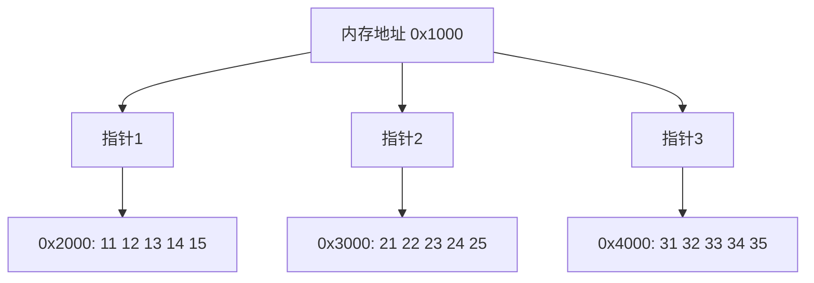

# 基础数据结构

## 数组

在计算机科学中, 数组是由一组元素(值或变量)组成的数据结构, 每个元素有至少一个索引或键来表示

因为数组内的元素是连续存储的, 所有数组中元素的地址, 可以通过其索引计算出来, 例如:

```java
int[] array = {1,2,3,4,5}
```

知道了数组的数据起始地址$BaseAddress$,就可以由公式 $BaseAddress + i size$ 计算出索引 $i$ 元素的地址

- $i$ 即索引,在 Java、C 等语言都是从 0 开始
- $size$ 是每个元素占用字节,例如 $int$ 占 $4$,$double$ 占 $8$

**小测试**

```java
byte[] array = {1,2,3,4,5}
```

已知 array 的数据的起始地址是 0x7138f94c8,那么元素 3 的地址是什么？

> 答：0x7138f94c8 + 2 1 = 0x7138f94ca

**空间占用**

Java 中数组结构为:

- 8 字节 markword
- 4 字节 class 指针(压缩 class 指针的情况)
- 4 字节 数组大小(决定了数组最大容量是 $2^{32}$)
- 数组元素 + 对齐字节(Java 中所有对象大小都是 8 字节的整数倍[^12],不足的要用对齐字节补足)

例如:

```java
int[] array = {1, 2, 3, 4, 5};
```

的大小为 40 个字节,组成如下:

```txt
8 + 4 + 4 + 5*4 + 4(alignment)
```

**随机访问性能**

即根据索引查找元素,时间复杂度是 $O(1)$

### 动态数组

动态数组是对基本数组的一种智能封装,它能够自动调整大小,使用起来更加灵活。

```java
public class DynamicArray implements Iterable<Integer> {
    private int size = 0; // 实际元素个数
    private int capacity = 8; // 容量
    private int[] array = {}; // 底层数组

    // 其他方法...
}
```

#### 主要特性

1. 自动扩容: 当元素数量达到上限时,数组会自动扩大。这就是checkAndGrow()方法的作用。
2. 逻辑大小与容量分离: size表示实际元素数量,capacity表示数组容量。这种设计让数组既能高效使用空间,又能快速添加新元素。
3. 多种遍历方式: 提供了基于Consumer、Iterator和Stream的三种遍历方法,适应不同的使用场景。

#### 性能特点

- 插入或删除操作
  - 头部位置: 时间复杂度O(n),需要移动所有元素。
  - 中间位置: 时间复杂度O(n),平均需要移动一半元素。
  - 尾部位置: 通常是O(1),但在需要扩容时会是O(n)。
- 随机访问
  - 时间复杂度O(1),与静态数组相同
- 空间复杂度
  - O(n),但实际占用空间可能略大于元素数量,为了减少频繁扩容

动态数组结合了数组的快速访问和可变大小的优点,是一种被广泛使用的数据结构。Java中的ArrayList就是动态数组的一个实现。

在使用时,需要注意频繁的头部或中部插入/删除可能会导致性能问题。这种情况下,可能需要考虑使用LinkedList等其他数据结构。

### 二维数组

二维数组就像是数组的套娃游戏。想象一下，你有一个大盒子，里面装着几个小盒子，每个小盒子里又整齐地排列着一些物品。

```java
int[][] array = {
    {11, 12, 13, 14, 15},  // 第一个小盒子
    {21, 22, 23, 24, 25},  // 第二个小盒子
    {31, 32, 33, 34, 35},  // 第三个小盒子
};
```

#### 内存中的样子

```txt
内存地址    内容
0x1000     [指针1]--> | [指针2]--> | [指针3]-->
            |          |           |
            |          |           |
            V          V           V
0x2000     [11][12][13][14][15]
0x3000     [21][22][23][24][25]
0x4000     [31][32][33][34][35]
```

- 大盒子（二维数组）占 32 个字节，里面放着指向三个小盒子的地址
- 每个小盒子（一维数组）各占 40 个字节
- 小盒子里的物品（元素）排列得整整齐齐

**使用方法**

对于一个二维数组 `Array[m][n]`:

- m 是有多少个小盒子
- n 是每个小盒子里能装多少东西
- 要拿到 Array[i][j]，就是先找第 i 个小盒子，然后从里面拿第 j 个物品

**小测试: 寻宝游戏**

假设我们有这样一个"藏宝图"：

```java
byte[][] array = {
    {11, 12, 13, 14, 15},
    {21, 22, 23, 24, 25},
    {31, 32, 33, 34, 35},
};
```

藏宝图的起始位置在 0x1000，请找出数字 23 藏在哪里？

解密步骤：

1. 藏宝图起点：0x1000
2. 大盒子大小：32 字节（0x20）
3. 第一个小盒子大小：24 字节（0x18）
4. 第二个小盒子的盖子：16 字节（0x10）
5. 23 在第二个小盒子里，位置是 2

所以，23 的确切位置是：0x1000 + 0x20 + 0x18 + 0x10 + 2 = 0x104a



### 局部性原理

局部性原理是计算机系统性能优化的重要基础。这里我们主要讨论空间局部性。

**空间局部性概念**：

- CPU从内存读取数据后，会将其存入高速缓存。
- 缓存的最小存储单位是缓存行（cache line），通常为64字节。
- 读取某个数据时，系统会同时读取其临近数据，这就是空间局部性的体现。

**性能影响实例**:

比较以下两种遍历二维数组的方法：

```java
int rows = 1000000;
int columns = 14;
int[][] a = new int[rows][columns];

// 方法1：按行遍历（ij方法）
public static void ij(int[][] a, int rows, int columns) {
    long sum = 0L;
    for (int i = 0; i < rows; i++) {
        for (int j = 0; j < columns; j++) {
            sum += a[i][j];
        }
    }
    System.out.println(sum);
}

// 方法2：按列遍历（ji方法）
public static void ji(int[][] a, int rows, int columns) {
    long sum = 0L;
    for (int j = 0; j < columns; j++) {
        for (int i = 0; i < rows; i++) {
            sum += a[i][j];
        }
    }
    System.out.println(sum);
}
```

执行结果

```txt
ij方法用时：16196200 纳秒 (17%)
ji方法用时：80087100 纳秒 (83%)
```

性能差异分析

1.  ij方法（按行遍历）：
    - 充分利用了缓存中的数据。
    - 当读取a[0][0]时，a[0][1]到a[0][13]也被加载到缓存。
    - 后续访问这些数据时，可直接从缓存读取，减少了内存访问。
2.  ji方法（按列遍历）：
    - 频繁地跨越内存区域，缓存利用率低。
    - 每次内循环都可能导致缓存未命中，增加了内存访问次数。

局部性原理的应用

1. I/O操作：顺序读写通常比随机读写更高效。
2. 数据结构选择：数组通常比链表更能利用空间局部性。

### 越界检查

Java在数组操作中内置了越界检查机制, 这是一个重要的安全特性

```java
bool is_within_bounds(int index) const
{
    return 0 <= index && index < length();
}
```

- 这段代码来自 openjdk\src\hotspot\share\oops\arrayOop.hpp
- JVM 自动执行这种检查，开发者无需手动调用

这种机制能有效防止数组越界访问，提高程序的健壮性。

### 习题

#### E01. 合并有序数组 (对应 Leetcode 88)

题目要求将数组内两个有序区间合并。例如：

```txt
[1, 5, 6, 2, 4, 10, 11]
```

可视为两个有序区间：[1, 5, 6] 和 [2, 4, 10, 11]
合并后：[1, 2, 4, 5, 6, 10, 11]

##### 方法1：递归实现

递归方法的核心思想是每次选择较小的元素放入结果数组。

```java
public static void merge(int[] a1, int i, int iEnd, int j, int jEnd,
                         int[] a2, int k) {
    if (i > iEnd) {
        System.arraycopy(a1, j, a2, k, jEnd - j + 1);
        return;
    }
    if (j > jEnd) {
        System.arraycopy(a1, i, a2, k, iEnd - i + 1);
        return;
    }
    if (a1[i] < a1[j]) {
        a2[k] = a1[i];
        merge(a1, i + 1, iEnd, j, jEnd, a2, k + 1);
    } else {
        a2[k] = a1[j];
        merge(a1, i, iEnd, j + 1, jEnd, a2, k + 1);
    }
}
```

##### 迭代实现

迭代方法使用while循环，逐个比较两个区间的元素。

```java
public static void merge(int[] a1, int i, int iEnd,
                         int j, int jEnd,
                         int[] a2) {
    int k = i;
    while (i <= iEnd && j <= jEnd) {
        if (a1[i] < a1[j]) {
            a2[k++] = a1[i++];
        } else {
            a2[k++] = a1[j++];
        }
    }
    if (i > iEnd) {
        System.arraycopy(a1, j, a2, k, jEnd - j + 1);
    }
    if (j > jEnd) {
        System.arraycopy(a1, i, a2, k, iEnd - i + 1);
    }
}
```

这两种方法各有特点：

- 递归方法代码简洁，但在处理大数组时可能导致栈溢出。
- 迭代方法更为高效，尤其在处理大数组时。
