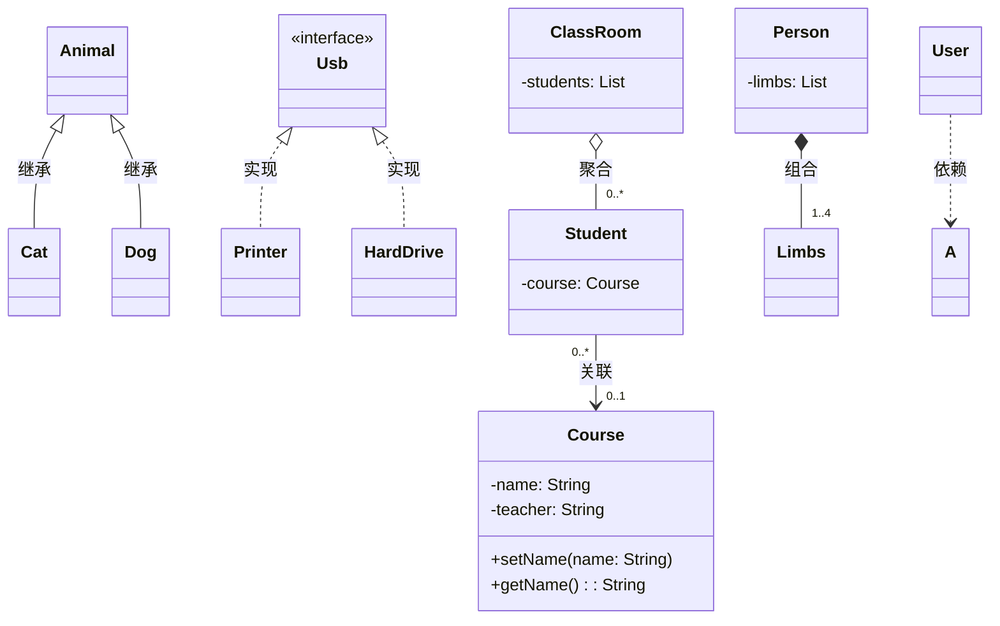

Node.js是一个开源, 跨平台的JavaScript运行时环境

Node安装
LTS和Current区别

 检查是否安装成功
 node -v
 npm -v
 npx -v
 

1. npm init 创建一个package.json,项目描述文件->创建包名->(1.0.0)版本->描述->入口文件(index.js)

```mermaid
classDiagram
    Animal <|-- Cat : 继承
    Animal <|-- Dog : 继承
    
    class Animal {
    }
    
    class Cat {
    }
    
    class Dog {
    }
    
    Usb <|.. Printer : 实现
    Usb <|.. HardDrive : 实现
    
    class Usb {
        <<interface>>
    }
    
    class Printer {
    }
    
    class HardDrive {
    }
    
    Student "0..*" --> "0..1" Course : 关联
    ClassRoom o-- "0..*" Student : 聚合
    
    class Student {
        -course: Course
    }
    
    class Course {
        -name: String
        -teacher: String
        +setName(name: String)
        +getName(): String
    }
    
    class ClassRoom {
        -students: List<Student>
    }
    
    Person *-- "1..4" Limbs : 组合
    
    class Person {
        -limbs: List<Limbs>
    }
    
    class Limbs {
    }
    
    User ..> A : 依赖
    
    class User {
    }
    
    class A {
    }
```