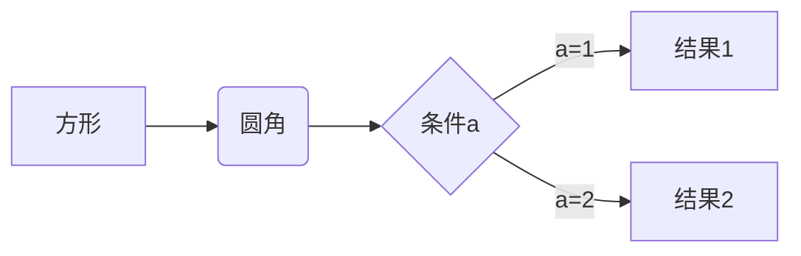

# Markdown语法学习笔记

## 一、标题

使用 # 符号来表示标题级别，1-6个 # 分别对应1-6级标题：

```txt
# 一级标题
## 二级标题
### 三级标题
#### 四级标题
##### 五级标题
###### 六级标题
```

如果你在一些笔记软件当中使用,还可以使用快捷键:

- Ctrl + 数字1-6：将选中文本设置为对应级别标题
- Ctrl + 0：将选中文本设置为普通文本
- Ctrl + +/-：增加/减少标题级别

## 二、段落

### 1. 换行

在行末加两个空格再回车，或直接使用空行来换行。

### 2. 分割线

使用三个或以上的 - 或 \* 来创建分割线：

```txt
---
***
```

## 效果:

## 三、文字显示

### 1. 字体

```txt
粗体：**文本** 或 __文本__
斜体：*文本* 或 _文本_
粗斜体：***文本*** 或 ___文本___
删除线：~~文本~~
下划线：<u>文本</u>
高亮：==文本==
```

效果:

- 粗体：**文本** 或 **文本**
- 斜体：_文本_ 或 _文本_
- 粗斜体：**_文本_** 或 **_文本_**
- 删除线：~~文本~~
- 下划线：<u>文本</u>
- 高亮：==文本==

> 当前可能会没有效果, 因为有的语法不支持, 如果你使用typora或者obsidian专业的笔记软件应该是可以的

### 2. 上下标

```txt
标：x^2^
下标：H~2~O
```

效果:

- 标：x^2^
- 下标：H~2~O

> 如果你专业的也不管用, 可能是设置没开, 去你的编辑器设置里, 将对应的语法功能打开

## 四、列表

### 1. 无序列表

使用 -、\* 或 + 作为列表标记：

```txt
- 项目1
* 项目2
+ 项目3
```

效果:

- 项目1

* 项目2

- 项目3

#### 2. 有序列表

使用数字加点：

```txt
1. 第一项
2. 第二项
3. 第三项
```

效果:

1. 第一项
2. 第二项
3. 第三项

### 3. 任务列表

```txt
- [ ] 未完成任务
- [x] 已完成任务
```

效果:

- [ ] 未完成任务
- [x] 已完成任务

## 五、区块引用

使用 > 符号：

```txt
> 这是一个引用
>> 这是嵌套引用
```

效果:

> 这是一个引用
>
> > 这是嵌套引用

## 六、代码

### 1. 行内代码

使用反引号包裹: \`代码\`

效果:

`代码`

### 2. 代码块

使用三个反引号包裹，可指定语言：

```txt
//这里`加了空格,去掉即可, 方便观看
` ` `java
System.out.println("Hello World!");
` ` `
```

## 七、链接

```txt
[链接文本](URL "可选标题")
<URL>
```

效果:
[链接文本](URL "可选标题")
<URL>

## 八、图片

```txt

```

效果:


## 九、表格

```txt
| 列1 | 列2 | 列3 |
|-----|:---:|----:|
| 左对齐 | 居中 | 右对齐 |
```

## 十、数学公式

```txt
使用 $ 包裹行内公式，使用 $$ 包裹块级公式：
```

效果:

行内公式：$E=mc^2$

块级公式：

$$
\frac{n!}{k!(n-k)!} = \binom{n}{k}
$$

## 十一、流程图

使用 mermaid 语法：

```txt
` ` `mermaid
graph LR
A[方形] -->B(圆角)
    B --> C{条件a}
    C -->|a=1| D[结果1]
    C -->|a=2| E[结果2]
```

效果:



## 十二、HTML元素支持

Markdown支持部分HTML元素，如：

```txt
<center> 居中
<kbd> 按键样式
<b> 加粗
<i> 斜体
<sup> 上标
<sub> 下标
```

## 十三、转义字符

使用反斜杠 \ 来转义特殊字符。

## 十四、数学公式的进阶用法

### 1. 上下标

```txt
$x^{y^z}=(1+e^x)^{-2xy^w}$
$\sideset{^1_2}{^3_4}{\underset{6}\bigotimes}$
```

效果:

$x^{y^z}=(1+e^x)^{-2xy^w}$
$\sideset{^1_2}{^3_4}{\underset{6}\bigotimes}$

### 2. 括号和分隔符

```txt
$\langle\quad\rangle\quad\lceil\quad\rceil\quad\lfloor\quad\rfloor\quad\lbrace\quad\rbrace\quad\lVert\quad\rVert$
$f(x,y,z)=3y^2z\left(3+\dfrac{7x+5}{1+y^2}\right)$
```

效果:

$\langle\quad\rangle\quad\lceil\quad\rceil\quad\lfloor\quad\rfloor\quad\lbrace\quad\rbrace\quad\lVert\quad\rVert$
$f(x,y,z)=3y^2z\left(3+\dfrac{7x+5}{1+y^2}\right)$

### 3. 分数

```txt
$\frac{a}{b}\quad\dfrac{a}{b}\quad {a\over b}$
```

效果:

$\frac{a}{b}\quad\dfrac{a}{b}\quad {a\over b}$

### 4. 开方

```txt
$\sqrt{2}\quad\sqrt[3]{2}$
```

效果:

$\sqrt{2}\quad\sqrt[3]{2}$

### 5. 省略号

```txt
$\cdots\quad\ldots\quad\vdots\quad\ddots$
```

效果:

$\cdots\quad\ldots\quad\vdots\quad\ddots$

### 6. 矢量和均值

```txt
$\overrightarrow{E(\vec{r})}\quad\overleftarrow{E(\vec{r})}\quad\overleftrightarrow{E(\vec{r})}$
$\overline{v}=\bar{v}\quad\underline{v}$
```

$\overrightarrow{E(\vec{r})}\quad\overleftarrow{E(\vec{r})}\quad\overleftrightarrow{E(\vec{r})}$
$\overline{v}=\bar{v}\quad\underline{v}$

## 十五、高级表格

### 1. 合并单元格

使用HTML标签来实现：

```txt
<table>
  <tr>
    <th>列1</th>
    <th>列2</th>
    <th>列3</th>
  </tr>
  <tr>
    <td rowspan="2">行1+行2</td>
    <td colspan="2">列2+列3</td>
  </tr>
  <tr>
    <td>行2列2</td>
    <td>行2列3</td>
  </tr>
</table>
```

效果:

<table>
  <tr>
    <th>列1</th>
    <th>列2</th>
    <th>列3</th>
  </tr>
  <tr>
    <td rowspan="2">行1+行2</td>
    <td colspan="2">列2+列3</td>
  </tr>
  <tr>
    <td>行2列2</td>
    <td>行2列3</td>
  </tr>
</table>

## 十六、脚注

```txt
这里是一个脚注的例子[^1]

[^1]: 这是脚注的内容。
```

效果:

这里是一个脚注的例子[^1]

[^1]: 这是脚注的内容。

## 十七、任务列表

```txt
- [x] 已完成任务
- [ ] 未完成任务
- [ ] ~~取消的任务~~
```

效果:

- [x] 已完成任务
- [ ] 未完成任务
- [ ] ~~取消的任务~~

## 十八、emoji表情

可以直接使用emoji字符，或者使用短代码：

```txt
:smile: :heart: :thumbsup:
```

效果:

:smile: :heart: :thumbsup:


## 十九、目录生成

许多Markdown编辑器支持自动生成目录，通常使用 [TOC] 标记：

```txt
[TOC]

# 标题1
## 标题1.1
# 标题2
## 标题2.1
```

## 二十、LaTeX公式

对于复杂的数学公式，可以使用LaTeX语法：

```txt
$$
\begin{aligned}
\dot{x} & = \sigma(y-x) \\
\dot{y} & = \rho x - y - xz \\
\dot{z} & = -\beta z + xy
\end{aligned}
$$
```

效果:

$$
\begin{aligned}
\dot{x} & = \sigma(y-x) \\
\dot{y} & = \rho x - y - xz \\
\dot{z} & = -\beta z + xy
\end{aligned}
$$

