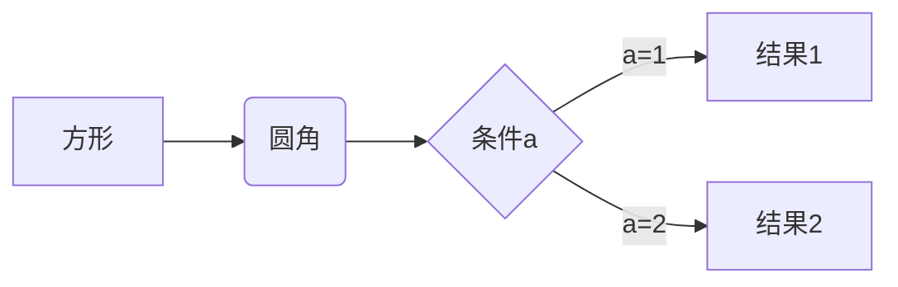

# Markdown语法学习笔记

## 一、标题

使用 # 符号来表示标题级别，1-6个 # 分别对应1-6级标题：

```txt
# 一级标题
## 二级标题
### 三级标题
#### 四级标题
##### 五级标题
###### 六级标题
```

如果你在一些笔记软件当中使用,还可以使用快捷键:

- Ctrl + 数字1-6：将选中文本设置为对应级别标题
- Ctrl + 0：将选中文本设置为普通文本
- Ctrl + +/-：增加/减少标题级别

## 二、段落

### 1. 换行

在行末加两个空格再回车，或直接使用空行来换行。

### 2. 分割线

使用三个或以上的 - 或 \* 来创建分割线：

```txt
---
***
```

## 效果:

## 三、文字显示

### 1. 字体

```txt
粗体：**文本** 或 __文本__
斜体：*文本* 或 _文本_
粗斜体：***文本*** 或 ___文本___
删除线：~~文本~~
下划线：<u>文本</u>
高亮：==文本==
```

效果:

- 粗体：**文本** 或 **文本**
- 斜体：_文本_ 或 _文本_
- 粗斜体：**_文本_** 或 **_文本_**
- 删除线：~~文本~~
- 下划线：<u>文本</u>
- 高亮：==文本==

> 当前可能会没有效果, 因为有的语法不支持, 如果你使用typora或者obsidian专业的笔记软件应该是可以的

### 2. 上下标

```txt
标：x^2^
下标：H~2~O
```

效果:

- 标：x^2^
- 下标：H~2~O

> 如果你专业的也不管用, 可能是设置没开, 去你的编辑器设置里, 将对应的语法功能打开

## 四、列表

### 1. 无序列表

使用 -、\* 或 + 作为列表标记：

```txt
- 项目1
* 项目2
+ 项目3
```

效果:

- 项目1

* 项目2

- 项目3

#### 2. 有序列表

使用数字加点：

```txt
1. 第一项
2. 第二项
3. 第三项
```

效果:

1. 第一项
2. 第二项
3. 第三项

### 3. 任务列表

```txt
- [ ] 未完成任务
- [x] 已完成任务
```

效果:

- [ ] 未完成任务
- [x] 已完成任务

## 五、区块引用

使用 > 符号：

```txt
> 这是一个引用
>> 这是嵌套引用
```

效果:

> 这是一个引用
>
> > 这是嵌套引用

## 六、代码

### 1. 行内代码

使用反引号包裹: \`代码\`

效果:

`代码`

### 2. 代码块

使用三个反引号包裹，可指定语言：

```txt
//这里`加了空格,去掉即可, 方便观看
` ` `java
System.out.println("Hello World!");
` ` `
```

## 七、链接

```txt
[链接文本](URL "可选标题")
<URL>
```

效果:
[链接文本](URL "可选标题")
<URL>

## 八、图片

```txt

```

效果:


## 九、表格

```txt
| 列1 | 列2 | 列3 |
|-----|:---:|----:|
| 左对齐 | 居中 | 右对齐 |
```

## 十、数学公式

```txt
使用 $ 包裹行内公式，使用 $$ 包裹块级公式：
```

效果:

行内公式：$E=mc^2$

块级公式：

$$
\frac{n!}{k!(n-k)!} = \binom{n}{k}
$$

## 十一、流程图

使用 mermaid 语法：

```txt
` ` `mermaid
graph LR
A[方形] -->B(圆角)
    B --> C{条件a}
    C -->|a=1| D[结果1]
    C -->|a=2| E[结果2]
```

效果:



## 十二、HTML元素支持

Markdown支持部分HTML元素，如：

```txt
<center> 居中
<kbd> 按键样式
<b> 加粗
<i> 斜体
<sup> 上标
<sub> 下标
```

## 十三、转义字符

使用反斜杠 \ 来转义特殊字符。

## 十四、数学公式的进阶用法

### 1. 上下标

```txt
$x^{y^z}=(1+e^x)^{-2xy^w}$
${}_1^2\bigotimes_4^3\underset{6}{\bigotimes}$
```

效果:

$x^{y^z}=(1+e^x)^{-2xy^w}$
${}_1^2\bigotimes_4^3\underset{6}{\bigotimes}$

### 2. 括号和分隔符

```txt
$\langle\quad\rangle\quad\lceil\quad\rceil\quad\lfloor\quad\rfloor\quad\lbrace\quad\rbrace\quad\lVert\quad\rVert$
$f(x,y,z)=3y^2z\left(3+\dfrac{7x+5}{1+y^2}\right)$
```

效果:

$\langle\quad\rangle\quad\lceil\quad\rceil\quad\lfloor\quad\rfloor\quad\lbrace\quad\rbrace\quad\lVert\quad\rVert$
$f(x,y,z)=3y^2z\left(3+\dfrac{7x+5}{1+y^2}\right)$

### 3. 分数

```txt
$\frac{a}{b}\quad\dfrac{a}{b}\quad {a\over b}$
```

效果:

$\frac{a}{b}\quad\dfrac{a}{b}\quad {a\over b}$

### 4. 开方

```txt
$\sqrt{2}\quad\sqrt[3]{2}$
```

效果:

$\sqrt{2}\quad\sqrt[3]{2}$

### 5. 省略号

```txt
$\cdots\quad\ldots\quad\vdots\quad\ddots$
```

效果:

$\cdots\quad\ldots\quad\vdots\quad\ddots$

### 6. 矢量和均值

```txt
$\overrightarrow{E(\vec{r})}\quad\overleftarrow{E(\vec{r})}\quad\overleftrightarrow{E(\vec{r})}$
$\overline{v}=\bar{v}\quad\underline{v}$
```

$\overrightarrow{E(\vec{r})}\quad\overleftarrow{E(\vec{r})}\quad\overleftrightarrow{E(\vec{r})}$
$\overline{v}=\bar{v}\quad\underline{v}$

## 十五、高级表格

### 1. 合并单元格

使用HTML标签来实现：

```txt
<table>
  <tr>
    <th>列1</th>
    <th>列2</th>
    <th>列3</th>
  </tr>
  <tr>
    <td rowspan="2">行1+行2</td>
    <td colspan="2">列2+列3</td>
  </tr>
  <tr>
    <td>行2列2</td>
    <td>行2列3</td>
  </tr>
</table>
```

效果:

<table>
  <tr>
    <th>列1</th>
    <th>列2</th>
    <th>列3</th>
  </tr>
  <tr>
    <td rowspan="2">行1+行2</td>
    <td colspan="2">列2+列3</td>
  </tr>
  <tr>
    <td>行2列2</td>
    <td>行2列3</td>
  </tr>
</table>

## 十六、脚注

```txt
这里是一个脚注的例子[^1]

[^1]: 这是脚注的内容。
```

效果:

这里是一个脚注的例子[^1]

[^1]: 这是脚注的内容。

## 十七、任务列表

```txt
- [x] 已完成任务
- [ ] 未完成任务
- [ ] ~~取消的任务~~
```

效果:

- [x] 已完成任务
- [ ] 未完成任务
- [ ] ~~取消的任务~~

## 十八、emoji表情

可以直接使用emoji字符，或者使用短代码：

```txt
:smile: :heart: :thumbsup:
```

效果:

:smile: :heart: :thumbsup:

## 十九、目录生成

许多Markdown编辑器支持自动生成目录，通常使用 [TOC] 标记：

```txt
[TOC]

# 标题1
## 标题1.1
# 标题2
## 标题2.1
```

## 二十、LaTeX公式

对于复杂的数学公式，可以使用LaTeX语法：

```txt
$$
\begin{aligned}
\dot{x} & = \sigma(y-x) \\
\dot{y} & = \rho x - y - xz \\
\dot{z} & = -\beta z + xy
\end{aligned}
$$
```

效果:

$$
\begin{aligned}
\dot{x} & = \sigma(y-x) \\
\dot{y} & = \rho x - y - xz \\
\dot{z} & = -\beta z + xy
\end{aligned}
$$

## 二十一、方程组

可以使用 \begin{array} 或 \begin{cases} 来创建方程组：

```txt
$$
\left\{
\begin{array}{l}
a_1x+b_1y+c_1z=d_1\\
a_2x+b_2y+c_2z=d_2\\
a_3x+b_3y+c_3z=d_3
\end{array}
\right.
$$

或者

$$
\begin{cases}
a_1x+b_1y+c_1z=d_1\\
a_2x+b_2y+c_2z=d_2\\
a_3x+b_3y+c_3z=d_3
\end{cases}
$$
```

$$
\left\{
\begin{array}{l}
a_1x+b_1y+c_1z=d_1\\
a_2x+b_2y+c_2z=d_2\\
a_3x+b_3y+c_3z=d_3
\end{array}
\right.
$$

$$
\begin{cases}
a_1x+b_1y+c_1z=d_1\\
a_2x+b_2y+c_2z=d_2\\
a_3x+b_3y+c_3z=d_3
\end{cases}
$$

## 二十二、连分式

使用 \cfrac 来创建连分式：

```txt
$$
x=a_0+\cfrac{1^2}{a_1+\cfrac{2^2}{a_2+\cfrac{3^2}{a_3+\cfrac{4^2}{a_4+\cdots}}}}
$$
```

效果：

$$
x=a_0+\cfrac{1^2}{a_1+\cfrac{2^2}{a_2+\cfrac{3^2}{a_3+\cfrac{4^2}{a_4+\cdots}}}}
$$

## 二十三、交换图表

使用 AMScd 包来创建交换图表：

```txt
$$
\require{AMScd}
\begin{CD}
A @>a>> B\\
@VbVV @VcVV\\
C @>>d> D
\end{CD}
$$
```

效果：

$$
\require{AMScd}
\begin{CD}
A @>a>> B\\
@VbVV @VcVV\\
C @>>d> D
\end{CD}
$$

## 二十四、矩阵

使用 \begin{matrix}, \begin{pmatrix}, \begin{bmatrix}, \begin{Bmatrix}, \begin{vmatrix} 或 \begin{Vmatrix} 来创建不同样式的矩阵：

```txt
$$
\begin{pmatrix}
a & b\\
c & d
\end{pmatrix}
\quad
\begin{bmatrix}
a & b\\
c & d
\end{bmatrix}
\quad
\begin{Bmatrix}
a & b\\
c & d
\end{Bmatrix}
\quad
\begin{vmatrix}
a & b\\
c & d
\end{vmatrix}
\quad
\begin{Vmatrix}
a & b\\
c & d
\end{Vmatrix}
$$
```

效果：

$$
\begin{pmatrix}
a & b\\
c & d
\end{pmatrix}
\quad
\begin{bmatrix}
a & b\\
c & d
\end{bmatrix}
\quad
\begin{Bmatrix}
a & b\\
c & d
\end{Bmatrix}
\quad
\begin{vmatrix}
a & b\\
c & d
\end{vmatrix}
\quad
\begin{Vmatrix}
a & b\\
c & d
\end{Vmatrix}
$$

## 二十五、颜色

在一些Markdown渲染器中，可以使用HTML的颜色语法：

```txt
<font color="red">这是红色文字</font>
<font color="#00FF00">这是绿色文字</font>
```

效果：
<font color="red">这是红色文字</font>
<font color="#00FF00">这是绿色文字</font>

在LaTeX公式中，可以使用 \color 命令：

```txt
$$
\color{red}{x^2} + \color{blue}{y^2} = \color{green}{z^2}
$$
```

效果：

$$
\color{red}{x^2} + \color{blue}{y^2} = \color{green}{z^2}
$$

## 二十六、希腊字母

在数学公式中，可以使用反斜杠加上希腊字母的英文名来输入希腊字母：
| 语法 | 显示 | 语法 | 显示 | 语法 | 显示 |
|------|------|------|------|------|------|
| \Alpha(\alpha) | $\Alpha(\alpha)$ | \Beta(\beta) | $\Beta(\beta)$ | \Gamma(\gamma) | $\Gamma(\gamma)$ |
| \Delta(\delta) | $\Delta(\delta)$ | \Epsilon(\epsilon) | $\Epsilon(\epsilon)$ | \Zeta(\zeta) | $\Zeta(\zeta)$ |
| \Eta(\eta) | $\Eta(\eta)$ | \Theta(\theta) | $\Theta(\theta)$ | \Iota(\iota) | $\Iota(\iota)$ |
| \Kappa(\kappa) | $\Kappa(\kappa)$ | \Lambda(\lambda) | $\Lambda(\lambda)$ | \Mu(\mu) | $\Mu(\mu)$ |
| \Nu(\nu) | $\Nu(\nu)$ | \Xi(\xi) | $\Xi(\xi)$ | \Omicron(\omicron) | $\Omicron(\omicron)$ |
| \Pi(\pi) | $\Pi(\pi)$ | \Rho(\rho) | $\Rho(\rho)$ | \Sigma(\sigma) | $\Sigma(\sigma)$ |
| \Tau(\tau) | $\Tau(\tau)$ | \Upsilon(\upsilon) | $\Upsilon(\upsilon)$ | \Phi(\phi) | $\Phi(\phi)$ |
| \Chi(\chi) | $\Chi(\chi)$ | \Psi(\psi) | $\Psi(\psi)$ | \Omega(\omega) | $\Omega(\omega)$ |

## 二十七、特殊符号

### 关系运算符

| 输入       | 显示         | 输入      | 显示        | 输入     | 显示       |
| ---------- | ------------ | --------- | ----------- | -------- | ---------- |
| \pm        | $\pm$        | \times    | $\times$    | \div     | $\div$     |
| \mid       | $\mid$       | \nmid     | $\nmid$     | \cdot    | $\cdot$    |
| \circ      | $\circ$      | \ast      | $\ast$      | \bigodot | $\bigodot$ |
| \bigotimes | $\bigotimes$ | \bigoplus | $\bigoplus$ | \leq     | $\leq$     |
| \geq       | $\geq$       | \neq      | $\neq$      | \approx  | $\approx$  |
| \equiv     | $\equiv$     | \sum      | $\sum$      | \prod    | $\prod$    |
| \coprod    | $\coprod$    |           |             |          |            |

### 集合运算符

| 输入      | 显示        | 输入      | 显示        | 输入      | 显示        |
| --------- | ----------- | --------- | ----------- | --------- | ----------- |
| \emptyset | $\emptyset$ | \in       | $\in$       | \notin    | $\notin$    |
| \subset   | $\subset$   | \supset   | $\supset$   | \subseteq | $\subseteq$ |
| \supseteq | $\supseteq$ | \bigcap   | $\bigcap$   | \bigcup   | $\bigcup$   |
| \bigvee   | $\bigvee$   | \bigwedge | $\bigwedge$ | \biguplus | $\biguplus$ |

### 对数运算符

| 输入 | 显示   | 输入 | 显示  | 输入 | 显示  |
| ---- | ------ | ---- | ----- | ---- | ----- |
| \log | $\log$ | \lg  | $\lg$ | \ln  | $\ln$ |

### 三角运算符

| 输入 | 显示   | 输入   | 显示     | 输入 | 显示   |
| ---- | ------ | ------ | -------- | ---- | ------ |
| \bot | $\bot$ | \angle | $\angle$ | \sin | $\sin$ |
| \cos | $\cos$ | \tan   | $\tan$   | \cot | $\cot$ |
| \sec | $\sec$ | \csc   | $\csc$   |      |        |

### 微积分运算符

| 输入   | 显示     | 输入   | 显示     | 输入       | 显示         |
| ------ | -------- | ------ | -------- | ---------- | ------------ |
| \int   | $\int$   | \iint  | $\iint$  | \iiint     | $\iiint$     |
| \oint  | $\oint$  | \lim   | $\lim$   | \infty     | $\infty$     |
| \infty | $\infty$ | \nabla | $\nabla$ | \mathrm{d} | $\mathrm{d}$ |

### 逻辑运算符

| 输入        | 显示          | 输入       | 显示         | 输入  | 显示    |
| ----------- | ------------- | ---------- | ------------ | ----- | ------- |
| \because    | $\because$    | \therefore | $\therefore$ |       |         |
| \forall     | $\forall$     | \exists    | $\exists$    |       |         |
| \not\subset | $\not\subset$ | \not<      | $\not<$      | \not> | $\not>$ |
| \not=       | $\not=$       |            |              |       |         |

## 二十八、字体

在数学公式中可以使用不同的字体：

| 输入      | 说明     | 显示                |
| --------- | -------- | ------------------- |
| \rm       | 罗马体   | $\rm{Sample}$       |
| \it       | 意大利体 | $\it{Sample}$       |
| \bf       | 粗体     | $\bf{Sample}$       |
| \sf       | 等线体   | $\sf{Sample}$       |
| \tt       | 打字机体 | $\tt{Sample}$       |
| \mathfrak | 哥特体   | $\mathfrak{Sample}$ |
| \mathcal  | 花体     | $\mathcal{Sample}$  |
| \mathbb   | 黑板粗体 | $\mathbb{Sample}$   |
| \mathrm   | 正体     | $\mathrm{Sample}$   |
| \mathit   | 数学斜体 | $\mathit{Sample}$   |
