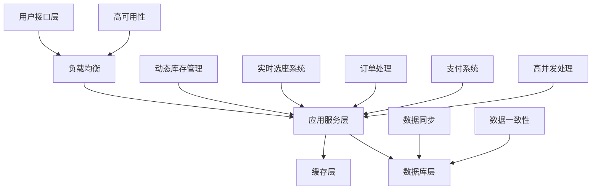
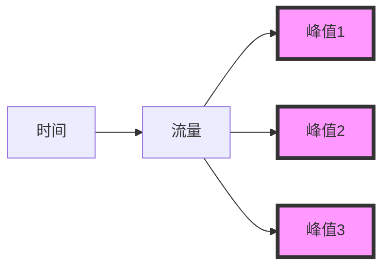
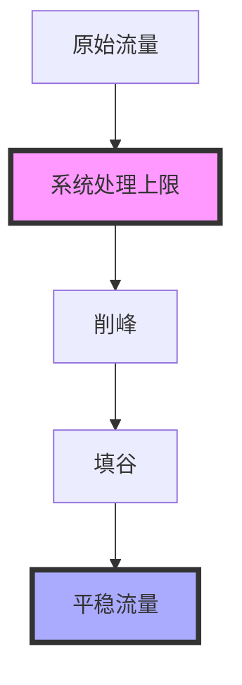
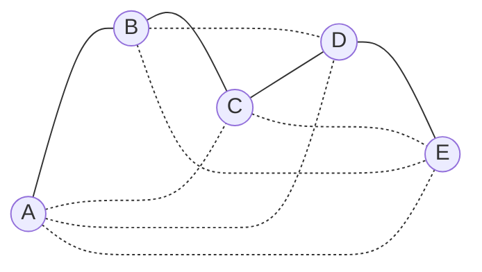
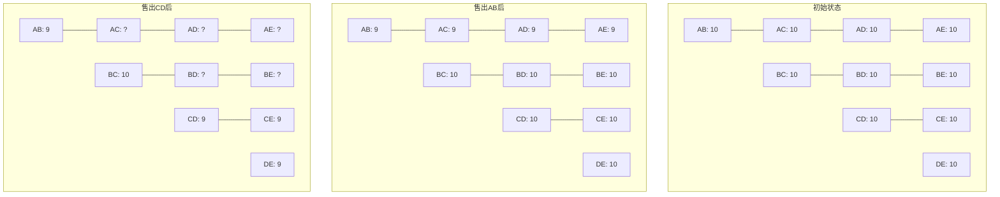
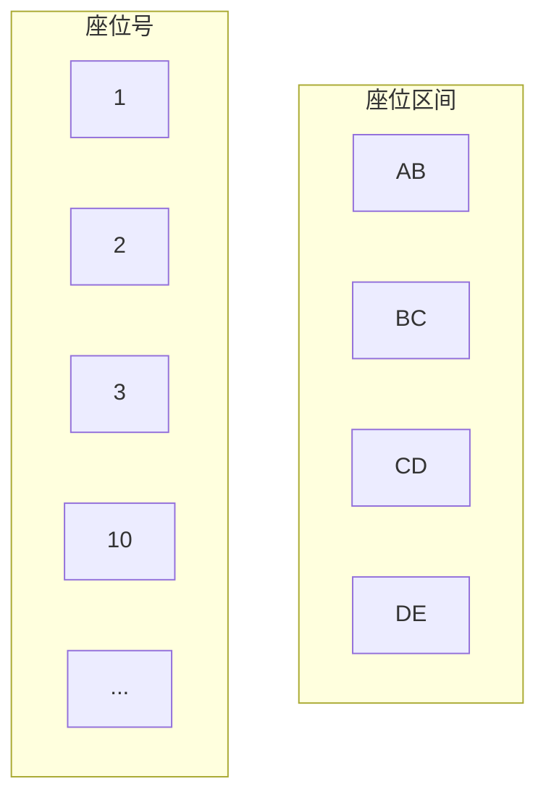
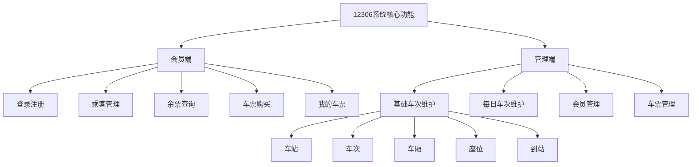
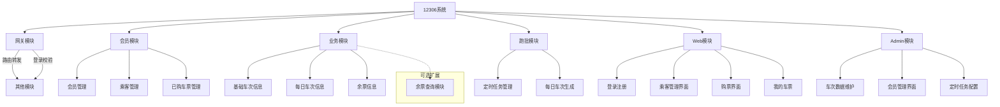
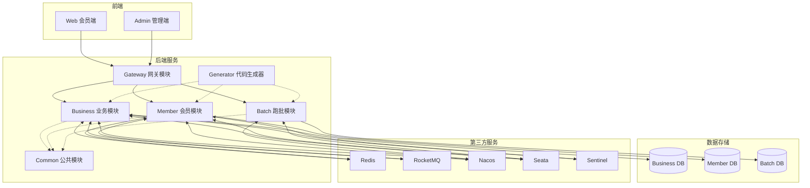

# 12306 yyds!

## 众多高并发为何选择12306

在众多高并发系统中, 12306 铁路订票系统无疑是一个独特而富有挑战性的案例. 下面我们会看下为什么选择12306作为学习高并发的典型项目, 以及它与其他高并发系统的区别.

首先, 看一下常见的高并发场景:

1. 电商平台的秒杀活动（如双十一）
2. 第三方支付系统（如支付宝、微信支付）
3. 社交媒体的热点事件（如微博热搜）
4. 大规模日志处理系统

这些系统都面临高并发挑战, 但是12306可以说在复杂度和持续性上面更胜一筹

### 12306系统的特性

1. 动态库存管理

与传统电商系统不同，12306的库存是动态变化的。例如，一趟从北京到上海的列车，可能会在途中多个站点上下客。这意味着同一个座位可能在不同区间被多次售出，大大增加了库存管理的复杂性。

2. 实时选座功能

12306需要为用户提供实时的座位信息和选择功能, 这要求系统能够快速处理大量并发请求, 同时保证数据的一致性

3. 线上线下渠道整合

与纯线上系统不同，12306需要同时处理来自网络和实体售票窗口的请求。这增加了系统的复杂度，要求更高的数据同步能力。

4. 持续高并发压力

unlike电商秒杀等短时高峰，12306系统面临的是长期持续的高并发压力，特别是在春运期间。这对系统的稳定性和可扩展性提出了更高要求。

5. 严格的一致性要求

火车票销售绝对不允许出现超卖情况。这意味着系统必须在高并发环境下保证强一致性，这是一个显著的技术挑战。

我用mermaid照着视频做了个简化的12306系统架构图, 展示其主要组件和挑战



## 全球最忙碌的票务系统

12306在全世界票务系统可以说是独占鳌头了, 是世界上最大票务网站

### 12306业务规模

- 日请求量: 约1600亿次, 平均每秒180万次请求(QPS)
- 年售票量：约30亿张
- 高峰日售票能力：2000万张
- 峰值售票速度：每秒1300张(TPS)

### 流量特征

通常，高并发系统的流量遵循"二八定律"，即20%的时间产生80%的请求。一般的秒杀系统流量图如下：


然而，12306的流量模式与此不同。由于采用了多时段放票策略（最多21个时间点），12306的流量呈现出多个峰值的特征：



这种流量模式使得12306的高峰期QPS估计在300万左右

### 应对高并发的策略

面对如此庞大的业务量，12306采取了多种策略来提升系统性能并管理流量：

- 提高处理能力
  1. 硬件扩展：增加服务器数量
  2. 引入分布式内存数据库（如GemFire）：
     - 将约4TB数据存入内存
     - 将查询时间从15秒缩短到0.2秒
  3. 优化算法和数据模型：
     - 改进票务数据的存储结构
     - 优化库存管理和选座逻辑
- 削峰填谷
  当系统处理能力达到上限时，需要采取削峰填谷的策略：



### 具体措施包括

- 业务层面：

  1. 验证码：通过验证码分散用户请求
  2. 分时段放票：将一天的票量分散到多个时间点
  3. 排队机制：允许用户在高峰期排队等待

- 技术层面：
  1. 限流：控制系统同时处理的请求数量
  2. 异步处理：将请求放入队列，异步处理，避免系统瞬时压力过大

## 如何保证不超卖, 不少卖, 并承受高并发

12306作为一个持续性的高并发票务系统，面临三大挑战：

1. 不能超卖(避免同一座位售给多人)
2. 尽量不少卖(最大化收益)
3. 承受极高并发(支持大量余票查询和快速售票)

为了应对这些挑战, 12306采用了特殊的底层模型设计, 既方便读取又方便写入。

### 余票查询优化

为了加速余票查询，系统记录每两个站之间的余票数量，可以将查询简化为单表操作。

例如，一列经过A、B、C、D、E五个站的火车，可能的购票组合有：

AB, AC, AD, AE, BC, BD, BE, CD, CE, DE（共10种）

计算公式：n个站点的组合数 = (n-1) + (n-2) + ... + 1



### 库存管理的复杂性

假设火车有10个座位，初始时每个区间都有10张票。但售出一张票后，情况变得复杂

1. 售出A到B的票：
   - AB, AC, AD, AE的余票减为9
   - BC, BD, BE, CD, CE, DE保持10张
2. 售出C到D的票：
   - CD, CE, DE的余票减为9
   - AB, BC保持不变
   - AC, AD, AE, BD, BE需要特殊处理



为什么需要对`AC, AD, AE, BD, BE`特殊处理

1. 因为这些区间都与CD有部分重叠，但不完全包含CD
2. 它们的余票数量取决于之前售出的AB票和现在售出的CD票是否占用了同一个座位

处理逻辑:

1. 如果CD票和AB票占用了不同的座位，那么AC, AD, AE的余票应该减1（变为8），而BD, BE保持不变（仍为10）
2. 如果CD票和AB票恰好占用了同一个座位，那么AC, AD, AE的余票不变（仍为9），而BD, BE的余票减1（变为9）

### 座位区间管理

为了更精确地管理库存，我们需要记录每个座位的售出情况：



当售出某个区间的票时，我们标记该座位在相应区间的占用情况。这样可以准确计算剩余可售票数。

### 库存更新算法

更新库存时需考虑两个条件：

1. 大区间包含所购买的小区间
2. 该座位在大区间内之前未被购买

例如，购买CD区间的票：

- 影响AD, AE（因为包含CD）
- 不影响AB, BC（因为不包含CD）
- 是否影响AC取决于所选座位在AC区间的占用情况

### 座位购买记录

用二进制串记录每个座位的销售情况:

```
座位1: 1000 (AB区间已售)
座位2: 0010 (CD区间已售)
座位3: 0000 (全部区间可售)
...
```

这种记录方式有两个作用：

1. 正确扣减库存
2. 支持选座功能（如选择靠窗座位）

### 购票流程

1. 用户选择区间和座位
2. 更新座位销售详情（如 0000 变为 1000）
3. 更新相关区间的余票数量
4. 确保以上操作在一个事务内完成，保证原子性

## 12306 系统核心功能概述

> 视频给了思维导图, 这里把它做成图, 因为截图的话其实不太清晰, 而且有的没什么必要, 之前做博客的时候通过oss存储桶跟picgo加vscode做笔记, 可以存储图片, 可以开一章, 挖个坑回头填



### 会员端功能

1. 登录注册: 采用手机号加验证码的模式
2. 乘客管理: 添加乘客, 为自己或他人购票, 支持多人同时购票
3. 余票查询: 查询特定日期和路线的所有车次及余票, 包含性能优化策略
4. 车票购买: 支持多张票购买和选座功能, 是系统中逻辑最复杂的部分
5. 我的车票: 查看用户购买的所有车票

### 管理端功能

1. 基础车次维护:
   - 车站：维护全国所有车站信息
   - 车次：记录火车的基本信息（编号、始发站、终点站、时间等）
   - 车厢：维护每趟列车的车厢数量和类型
   - 座位：标识每个座位的位置信息，支持选座功能
   - 到站：记录列车经过的站点、时间和停留时长
2. 每日车次维护：基于基础车次信息，自动生成每日车次数据，支持手动调整。
3. 会员管理：查看所有会员信息，可扩展会员状态管理功能。
4. 车票管理：查看所有已售出的车票信息。

此外，还包括代码生成器等辅助功能，用于提高开发效率。

## 12306系统功能模块划分

12306系统被划分为六个主要模块，每个模块负责特定的功能：



### 网关模块

- 功能: 路由转发和登录校验
- 作用: 所有请求的入口，包括前后端交互和后端服务间调用
- 优势: 形成以网关为核心的星型网络结构，避免服务间直接调用造成的混乱

### 会员模块

- 功能: 管理会员、乘客和已购买的车票信息
- 包含：会员状态管理、乘客信息管理、车票查询

### 业务模块

- 功能：管理所有车次数据和余票信息
- 包含：基础车次信息、每日车次信息

### 跑批模块

- 功能：管理定时任务
- 特点：通过界面配置和管理定时任务，如每日车次信息生成

### Web模块

- 功能：提供会员端使用的所有界面
- 包含：登录注册、乘客管理、购票等功能

### Admin模块

- 功能：提供管理员使用的所有界面
- 包含：车次数据维护、定时任务管理等

### 注意事项

- 在实际项目中，可能会将超高并发的接口（如余票查询）单独作为一个模块
- 模块划分允许根据不同功能的需求分配不同的资源（如服务器节点数）

## 12306系统整体架构设计

12306系统采用前后端分离的微服务架构，整体分为六个核心模块，并集成了多个第三方服务来增强系统功能。

### 系统模块概览

系统分为前端和后端两大部分：

**前端包括**:

1. Web模块：面向普通用户的会员端，可配置为www域名。
2. Admin模块：面向系统管理员的管理端。

**后端包括**:

3. Gateway模块：作为系统的统一入口，负责路由转发和登录校验。
4. Business模块：处理所有与车次相关的核心业务逻辑。
5. Member模块：管理会员信息、登录注册和乘客数据。
6. Batch模块：负责定时任务的执行和管理。

### 数据库设计

为了提高安全性和性能，系统采用了数据库隔离策略。Business、Member和Batch模块各自使用独立的数据库。这种设计虽然增加了跨库查询的复杂性，但通过适当的数据冗余可以解决这个问题。例如，可以在必要时将关键会员信息复制到Business模块的数据库中。

### 扩展模块

除了核心模块，系统还包含两个重要的扩展模块：

1. Common模块：包含公共代码、工具类和配置，作为依赖被其他模块引用，提高代码复用率。
2. Generator模块：强大的代码生成器，可以快速生成持久层、服务层、控制器和前端界面代码，大大提高开发效率。

### 第三方服务集成

为了增强系统功能和性能，12306系统集成了多个第三方服务：

- Redis：用于缓存，提高数据访问速度。
- RocketMQ：处理异步消息，有助于系统解耦和削峰填谷。
- Nacos：作为注册中心和配置中心，便于服务发现和动态配置。
- Seata：管理分布式事务，确保跨服务操作的数据一致性。
- Sentinel：实现限流功能，保护系统免受过载。

### 系统架构图



### 架构特点

1. 模块化设计提高了系统的可维护性和扩展性。
2. 微服务架构允许各模块独立部署和扩展，提高系统灵活性。
3. 统一的网关管理增强了系统安全性。
4. 第三方服务的集成丰富了系统功能，提升了性能。
5. 代码生成器大大提高了开发效率。

## 12306系统数据库表结构

12306系统的数据库设计分为三大模块：会员模块、业务模块和其他模块。每个模块都有其特定的表结构，用于支持系统的各项功能。

### 会员模块

会员模块包含三个主要表：

1. 会员表
   - 主要字段：手机号（用于注册和登录）
   - 注意：采用验证码登录，无需存储密码
2. 乘客表
   - 主要字段：会员ID、姓名、身份证、旅客类型（成人/儿童/残疾人等）
   - 作用：关联会员和乘客信息，用于购票
3. 车票表
   - 主要字段：会员ID、乘客ID、乘客姓名（冗余）、日期、车次、座位信息
   - 作用：记录购票信息，便于打印车票

### 业务模块

业务模块包含多个表，用于管理车站、车次和座位信息：

1. 车站表

   - 主要字段：站名、站名拼音
   - 作用：记录全国车站信息，用于下拉选择

2. 车次表

   - 主要字段：车次编号、车次类型、始发站、终点站、出发时间、到达时间
   - 作用：记录基本车次信息

3. 到站表

   - 主要字段：车次ID、站名、进站时间、出站时间、停留时长、里程
   - 作用：记录车次经过的所有站点信息

4. 车厢表

   - 主要字段：车次ID、箱号、座位类型、座位数、排数、列数
   - 作用：记录每个车次的车厢信息

5. 座位表

   - 主要字段：车次ID、车厢号、排号、列号
   - 作用：记录具体座位信息

6. 每日车次表

   - 主要字段：基础车次信息 + 日期
   - 作用：生成每日具体车次信息

7. 每日到站表

   - 主要字段：到站信息 + 日期
   - 作用：记录每日具体到站信息

8. 每日车厢表

   - 主要字段：车厢信息 + 日期
   - 作用：记录每日具体车厢信息

9. 每日座位表

   - 主要字段：座位信息 + 日期 + 销售详情（用0101表示）
   - 作用：记录每日座位销售情况

10. 每日余票表
    - 主要字段：车次信息 + 日期 + 各类型座位余票数
    - 作用：方便快速查询余票，包含冗余信息以提高查询效率

### 其他模块

1. 定时任务表（Quartz相关）

   - 作用：存储定时任务信息，支持通过界面管理定时任务

2. 分布式事务表（Seata相关）
   - 作用：支持分布式事务管理

### 数据库设计特点

1. 模块化设计：不同模块使用独立的数据库，提高安全性和性能。
2. 冗余设计：在某些表中添加冗余字段，以提高查询效率。
3. 灵活性：支持通过管理界面对某些数据（如每日车次信息）进行微调。
4. 性能优化：如每日余票表的设计，专门用于提高余票查询效率。
5. 扩展性：包含支持定时任务和分布式事务的表结构。

## 百万人抢票系统设计方案

为了支持100万人同时抢购1万张票（相当于每100人抢1张票），系统设计需要从多个方面进行优化。以下是主要的优化策略：

### 前端优化

前端优化可以显著减轻后端压力

1. CDN加速：使用内容分发网络加速静态资源加载。
2. 页面静态化：将秒杀页面静态化，提高访问速度。
3. 倒计时和Loading：
   - 倒计时：减少用户在秒杀开始前频繁刷新页面。
   - Loading提示：防止用户在秒杀过程中重复提交。
4. 验证码：使用验证码分散用户请求，减缓系统压力。

### 后端优化

后端优化是保证系统稳定性的关键：

1. 微服务架构：按功能模块或热点接口拆分服务。
2. 负载均衡：分散请求到多个服务节点。
3. 限流降级：控制流量，并在服务不可用时有备选方案。
4. 缓存策略：合理使用本地缓存和分布式缓存，注意缓存相关问题。
5. 令牌机制：只允许持有令牌的用户参与秒杀，减少无效请求。
6. 异步处理：类似餐厅点餐模式，先返回订单号，后台异步处理。

### 数据库优化

数据库优化对于高并发系统至关重要：

1. 分库分表：
   - 业务分库：不同业务使用独立数据库。
   - 读写分离：分离读写操作，提高性能。
   - 水平分表：按地区或时间划分。
   - 垂直分表：将大表按字段拆分。
2. 数据冗余：适度违反范式，用空间换时间。
3. 分布式数据库：如JM Fire，适用于大型项目。

### 其他优化策略

1. 分时段秒杀：将秒杀活动分散到多个时间点。
2. 弹性扩容：根据负载自动增加服务器资源。
3. 候补功能：类似12306的候补购票，减少用户反复刷新。

上一节 [[仿12306高性能售票系统/项目日记Day01|项目日记Day01]]
下一节 [[仿12306高性能售票系统/项目日记Day02|项目日记Day02]]
