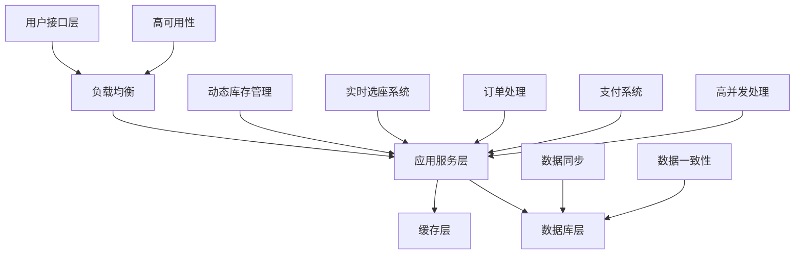
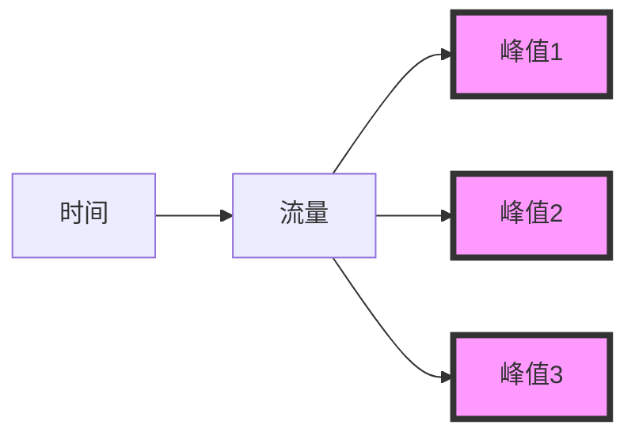
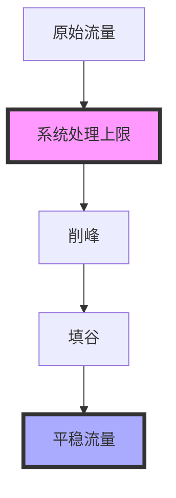
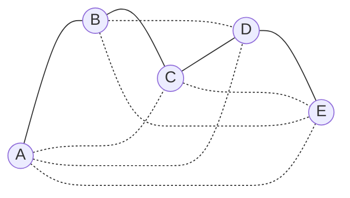
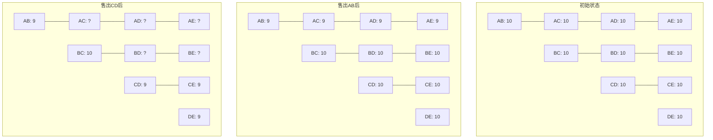
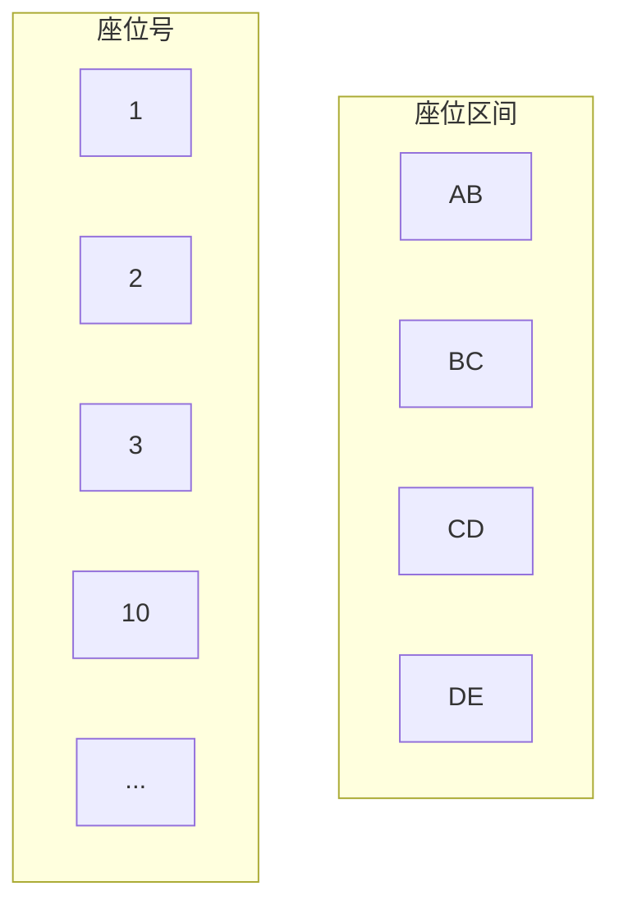

# 12306 yyds!

## 众多高并发为何选择12306

在众多高并发系统中, 12306 铁路订票系统无疑是一个独特而富有挑战性的案例. 下面我们会看下为什么选择12306作为学习高并发的典型项目, 以及它与其他高并发系统的区别.

首先, 看一下常见的高并发场景:

1. 电商平台的秒杀活动（如双十一）
2. 第三方支付系统（如支付宝、微信支付）
3. 社交媒体的热点事件（如微博热搜）
4. 大规模日志处理系统

这些系统都面临高并发挑战, 但是12306可以说在复杂度和持续性上面更胜一筹

### 12306系统的特性

1. 动态库存管理

与传统电商系统不同，12306的库存是动态变化的。例如，一趟从北京到上海的列车，可能会在途中多个站点上下客。这意味着同一个座位可能在不同区间被多次售出，大大增加了库存管理的复杂性。

2. 实时选座功能

12306需要为用户提供实时的座位信息和选择功能, 这要求系统能够快速处理大量并发请求, 同时保证数据的一致性

3. 线上线下渠道整合

与纯线上系统不同，12306需要同时处理来自网络和实体售票窗口的请求。这增加了系统的复杂度，要求更高的数据同步能力。

4. 持续高并发压力

unlike电商秒杀等短时高峰，12306系统面临的是长期持续的高并发压力，特别是在春运期间。这对系统的稳定性和可扩展性提出了更高要求。

5. 严格的一致性要求

火车票销售绝对不允许出现超卖情况。这意味着系统必须在高并发环境下保证强一致性，这是一个显著的技术挑战。

我用mermaid照着视频做了个简化的12306系统架构图, 展示其主要组件和挑战



## 全球最忙碌的票务系统

12306在全世界票务系统可以说是独占鳌头了, 是世界上最大票务网站

### 12306业务规模

- 日请求量: 约1600亿次, 平均每秒180万次请求(QPS)
- 年售票量：约30亿张
- 高峰日售票能力：2000万张
- 峰值售票速度：每秒1300张(TPS)

### 流量特征

通常，高并发系统的流量遵循"二八定律"，即20%的时间产生80%的请求。一般的秒杀系统流量图如下：


然而，12306的流量模式与此不同。由于采用了多时段放票策略（最多21个时间点），12306的流量呈现出多个峰值的特征：



这种流量模式使得12306的高峰期QPS估计在300万左右

### 应对高并发的策略

面对如此庞大的业务量，12306采取了多种策略来提升系统性能并管理流量：

- 提高处理能力
  1. 硬件扩展：增加服务器数量
  2. 引入分布式内存数据库（如GemFire）：
     - 将约4TB数据存入内存
     - 将查询时间从15秒缩短到0.2秒
  3. 优化算法和数据模型：
     - 改进票务数据的存储结构
     - 优化库存管理和选座逻辑
- 削峰填谷
  当系统处理能力达到上限时，需要采取削峰填谷的策略：



### 具体措施包括

- 业务层面：

  1. 验证码：通过验证码分散用户请求
  2. 分时段放票：将一天的票量分散到多个时间点
  3. 排队机制：允许用户在高峰期排队等待

- 技术层面：
  1. 限流：控制系统同时处理的请求数量
  2. 异步处理：将请求放入队列，异步处理，避免系统瞬时压力过大

## 如何保证不超卖, 不少卖, 并承受高并发

12306作为一个持续性的高并发票务系统，面临三大挑战：

1. 不能超卖(避免同一座位售给多人)
2. 尽量不少卖(最大化收益)
3. 承受极高并发(支持大量余票查询和快速售票)

为了应对这些挑战, 12306采用了特殊的底层模型设计, 既方便读取又方便写入。

### 余票查询优化

为了加速余票查询，系统记录每两个站之间的余票数量，可以将查询简化为单表操作。

例如，一列经过A、B、C、D、E五个站的火车，可能的购票组合有：

AB, AC, AD, AE, BC, BD, BE, CD, CE, DE（共10种）

计算公式：n个站点的组合数 = (n-1) + (n-2) + ... + 1



### 库存管理的复杂性

假设火车有10个座位，初始时每个区间都有10张票。但售出一张票后，情况变得复杂

1. 售出A到B的票：
    - AB, AC, AD, AE的余票减为9
    - BC, BD, BE, CD, CE, DE保持10张
2. 售出C到D的票：
    - CD, CE, DE的余票减为9
    - AB, BC保持不变
    - AC, AD, AE, BD, BE需要特殊处理



为什么需要对`AC, AD, AE, BD, BE`特殊处理

1. 因为这些区间都与CD有部分重叠，但不完全包含CD
2. 它们的余票数量取决于之前售出的AB票和现在售出的CD票是否占用了同一个座位

处理逻辑:

1. 如果CD票和AB票占用了不同的座位，那么AC, AD, AE的余票应该减1（变为8），而BD, BE保持不变（仍为10）
2. 如果CD票和AB票恰好占用了同一个座位，那么AC, AD, AE的余票不变（仍为9），而BD, BE的余票减1（变为9）

### 座位区间管理

为了更精确地管理库存，我们需要记录每个座位的售出情况：


当售出某个区间的票时，我们标记该座位在相应区间的占用情况。这样可以准确计算剩余可售票数。

### 库存更新算法

更新库存时需考虑两个条件：

1. 大区间包含所购买的小区间
2. 该座位在大区间内之前未被购买

例如，购买CD区间的票：

- 影响AD, AE（因为包含CD）
- 不影响AB, BC（因为不包含CD）
- 是否影响AC取决于所选座位在AC区间的占用情况

### 座位购买记录

用二进制串记录每个座位的销售情况:

```
座位1: 1000 (AB区间已售)
座位2: 0010 (CD区间已售)
座位3: 0000 (全部区间可售)
...
```

这种记录方式有两个作用：

1. 正确扣减库存
2. 支持选座功能（如选择靠窗座位）

### 购票流程

1. 用户选择区间和座位
2. 更新座位销售详情（如 0000 变为 1000）
3. 更新相关区间的余票数量
4. 确保以上操作在一个事务内完成，保证原子性


上一节 [[仿12306高性能售票系统/项目日记Day01|项目日记Day01]]
