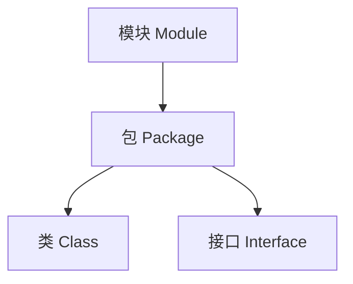
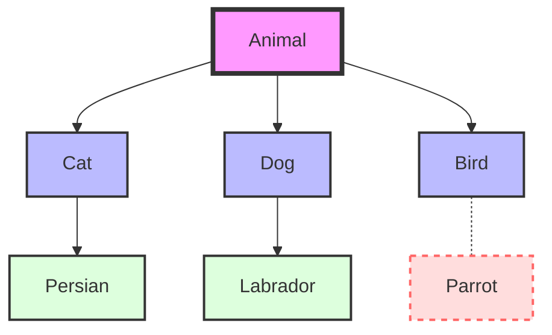
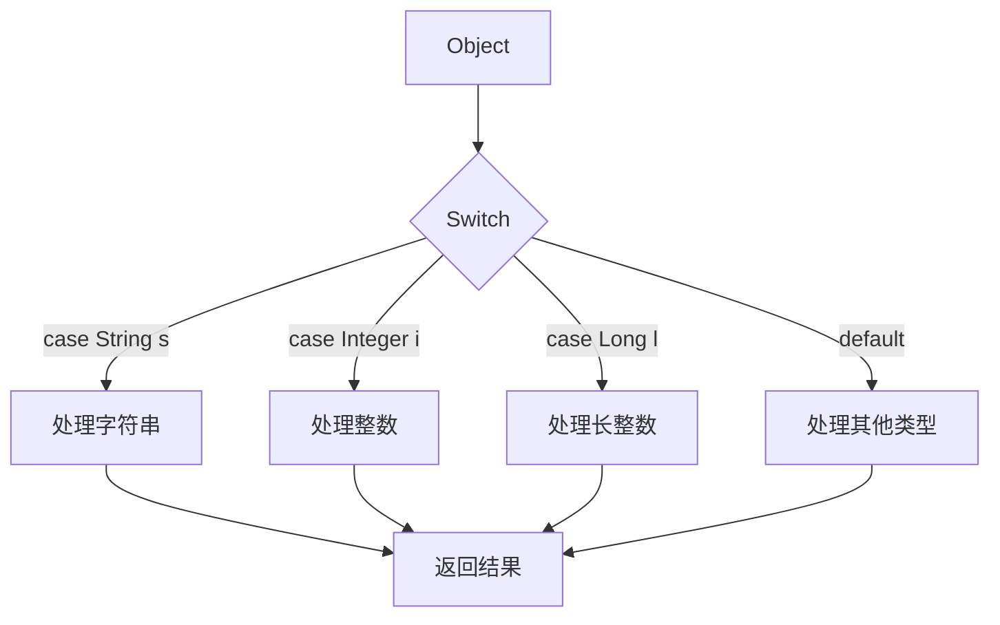
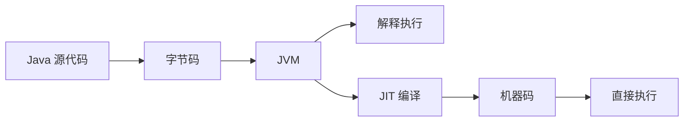
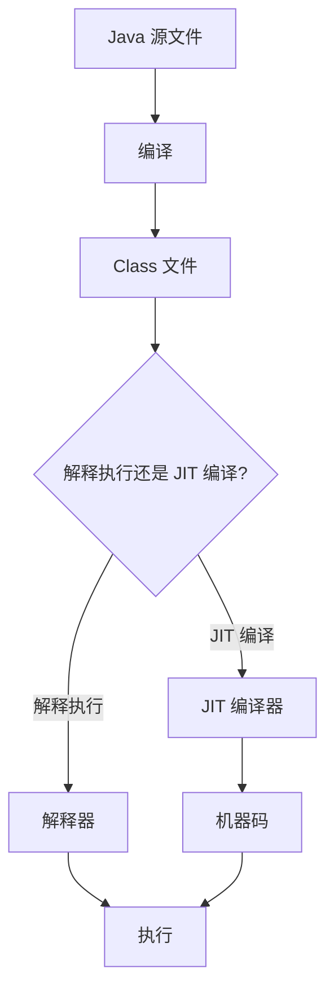

# JDK9～17新特性

## JDK 9新特性: jshell交互式工具

jshell是JDK 9引入的一个交互式命令行工具, 主要用于快速测试和学习Java代码

### 主要特点

1. 即时执行：无需编写完整的Java程序，可以直接输入和执行Java代码片段。
2. 交互式环境：提供类似REPL（Read-Eval-Print Loop）的交互式环境。
3. 自动补全：支持Tab键自动补全，提高编码效率。
4. 命令历史：可以使用上下箭头键查看和重用之前输入的命令
5. 变量共享：在一个会话中定义的变量可以在后续命令中使用。
6. 方法定义：支持直接定义和调用方法。
7. 无需分号：每行代码结束可以省略分号。

### 使用示例

1. 启动jshell

```bash
jshell
```

2. 打印语句

```bash
System.out.println("test")
```

3. 定义变量

```bash
String hello = "hello world"
```

4. 使用变量

```bash
System.out.println(hello)
```

### 主要用途

1. 教学工具：适合大学教师或培训机构用于Java教学。
2. 快速测试：开发人员可以快速测试小段代码或API。
3. 学习和探索：方便学习新的Java特性或库

## JDK 9模块化开发特性

JDK 9 引入的模块化开发时Java平台的一次重要升级, 旨在提高代码的封装性和可维护性

### 模块化概念

模块化在包(package)的基础上增加了一个新的抽象层次-模块(module). 这种结构允许开发者更精确地控制代码的可见性和依赖关系



### 核心组件

1. module-info.java: 模块的描述文件，位于模块根目录。
2. exports: 声明可以被外部访问的包。
3. equires: 声明模块依赖。

### 实现步骤

1. 创建模块并添加 module-info.java 文件。
2. 在被调用模块中使用 exports 声明开放的包。
3. 在调用模块中使用 requires 声明所需的外部模块。

```java
// 模块A的module-info.java
module test.a {
    exports com.test.a.package1;
    // exports com.test.a.package2; // 可选：开放多个包
}

// 模块B的module-info.java
module test.b {
    requires test.a;
}
```

### 优势

- 提高代码封装性
- 明确模块间依赖关系
- 增强应用安全性
- 改善性能（通过更有效的类加载）

### 实际应用

虽然模块化提供了诸多优势, 但在实际项目中的应用还不普遍, 主要原因包括:

1. 增加了项目复杂度
2. 对现有代码库的改造成本高
3. 部分第三方库尚未完全支持

### 我的理解

我自己也整理了一些JDK的新特性, 我试着理解一下模块化开发的内容, 首先JDK 9模块化开发简介, 想象现在我们正在建造一座大楼(Java程序), 在JDK 8及以前呢, 我们可以理解为, 我们有很多房间(就是包/packages), 每个房间里有家具(类/classes), 这种方式, 会出现一个问题: 任何人都可以进入任何房间, 使用任何家具. 而在JDK 9模块化开发之后, 我们就可以把房间分组成套房(模块/modules), 也可以指定哪些套房需要相互连接(requires), 也可以指定哪些套房的门是开着的(exports).
那么我们应该如何用呢, 那首先就是需要我们创建一个特殊的文件(module-info.java)放在你的"套房"的入口, 这个文件里你写到"这个套房叫什么名字(module 名称),哪些房间可以让外人进入(exports),这个套房需要连接到哪些套房(requires)"
这样带给我们很多好处, 提供了更好的安全性--可以隐藏不想让别人看到的"房间",更清晰的结构--很容易看出哪些"套房"依赖于其他"房间",可能运行的更快--系统知道只需要加载必要的"套房"

### 举个🌰 : 图书管理系统

#### **核心模块(library-core)**

这个模块包含基本的图书和用户管理功能

**目录结构**:

```
library-core/
├── src/
│   ├── com.library.core/
│   │   ├── Book.java
│   │   ├── User.java
│   │   └── internal/
│   │       └── DatabaseConnection.java
│   └── module-info.java
```

> 用tree命令可以获取到项目结构

**module-info.java 内容**

```java
module com.library.core {
    exports com.library.core;
    // 注意我们没有导出 internal 包
}
```

**Book.java**

```java
package com.library.core;

public class Book {
    private String title;
    private String author;

    // 构造函数、getter和setter
}
```

#### 用户界面模块 (library-ui)

这个模块提供图形界面，依赖于核心模块。

```
library-ui/
├── src/
│   ├── com.library.ui/
│   │   └── LibraryApp.java
│   └── module-info.java
```

**module-info.java 内容**

```java
module com.library.ui {
    requires com.library.core;
    // 如果使用JavaFX，还需要添加：
    // requires javafx.controls;
}
```

**LibraryApp.java**

```java
package com.library.ui;

import com.library.core.Book;
// import com.library.core.internal.DatabaseConnection; // 这行会导致编译错误，因为internal包没有被导出

public class LibraryApp {
    public static void main(String[] args) {
        Book book = new Book();
        // 使用Book类的代码
        // DatabaseConnection db = new DatabaseConnection(); // 这行会导致编译错误
    }
}
```

1. 在library-core模块中, 只导出了com.library.core包, 而没有导出internal包. 这一位着其他模块可以使用Book和User类, 但不能直接访问DatabaseConnection类
2. 在library-ui模块中, 声明了对com.library.core模块的依赖. 这允许我们使用核心模块中导出的类
3. 如果尝试在LibraryApp中使用DatabaseConnection类, 编译器会报错, 因为这个类在一个未导出的包中

通过模块化我们可以精确地控制哪些部分对外可见, 哪些部分保持内部使用. 这提高了代码的封装性和安全性, 同时也使得系统的结构更加清晰

## JDK 10新特性: var局部变量推导

### 基本概念

var 关键字允许在局部变量声明时进行类型推导, 简化代码编写

### 使用要求

1. 必须要能推到出实际类型
2. 只能用于声明局部变量

### 使用示例

```java
// 正确用法
var test1 = new Test1();
var number = 1;

// 错误用法
var test11; // 编译错误：必须初始化
class SomeClass {
    var classField = 10; // 编译错误：不能用于类字段
}
```

### 优点

- 简化代码, 减少冗长的类型声明
- 特别适用于复杂类型的声明

```java
// 旧方式
ArrayList<String> list = new ArrayList<>();

// 使用var
var list = new ArrayList<String>();
```

### 注意事项

- 过度使用可能减低代码可读性
- 不适用于没有初始化的变量声明

### 个人观点

虽然var可以简化代码, 但是显式声明类型可能在某些情况下更清晰. 使用与否主要取决于个人或团队的编码风格和偏好. 总的来说, var提供了一种更简洁的局部变量声明方式, 但应谨慎使用, 确保代码的清晰度和可读性不受影响

### 举个🌰

> 我试了试, 还挺好用的, 一些基础用法都适用, 可以看一下

#### 基本数据类型

```java
var i = 10;              // 推导为int
var d = 3.14;            // 推导为double
var b = true;            // 推导为boolean
var c = 'A';             // 推导为char
var s = "Hello";         // 推导为String
```

#### 复杂数据类型

```java
var list = new ArrayList<String>();     // 推导为ArrayList<String>
var map = new HashMap<String, Integer>(); // 推导为HashMap<String, Integer>
var entry = map.entrySet().iterator().next(); // 推导为Map.Entry<String, Integer>
```

#### 匿名内部类

```java
var runnable = new Runnable() {
    @Override
    public void run() {
        System.out.println("Hello, var!");
    }
};  // 推导为匿名Runnable实现类
```

#### 循环中的使用

```java
for (var i = 0; i < 10; i++) {
    System.out.println(i);
}

var numbers = Arrays.asList(1, 2, 3, 4, 5);
for (var num : numbers) {
    System.out.println(num);
}
```

#### Lambda表达式 (不能直接使用var)

```java
// 错误用法
var lambda = (x, y) -> x + y;  // 编译错误

// 正确用法
BiFunction<Integer, Integer, Integer> lambda = (x, y) -> x + y;
```

#### 方法返回值

```java
public class Example {
    public static void main(String[] args) {
        var result = getComplexObject();
        // 使用result，无需知道确切类型
    }

    private static SomeComplexType getComplexObject() {
        return new SomeComplexType();
    }
}
```

#### 不推荐的用法

```java
var obj = null;  // 编译错误，无法推导类型
var x = 1, y = 2;  // 编译错误，不支持多变量声明

// 可读性降低的例子
var x = someMethodWithUnclearReturnType();
```

#### 与泛型结合

```java
var list = new ArrayList<Map<String, List<Integer>>>();
// 等同于 ArrayList<Map<String, List<Integer>>> list = new ArrayList<>();
```

## JDK 11新特性: 单文件程序

### 概述

JDK 11引入了单文件程序特性, 允许直接运行单个Java源文件, 无需先编译成class文件

### 主要特点

1. 直接执行: 可以直接用`java`命令运行`.java`文件
2. 无需编译: 跳过了传统的javac编译步骤
3. 限于单文件: 只适用于单个Java源文件
4. 包限制: 不支持包声明和导入其他自定义类

### 使用方法

```bash
java FileName.java
```

### 示例

假设有一个名为TestB.java的文件, 内容如下:

```java
public class TestB {
    public static void main(String[] args) {
        System.out.println("Hello World");
    }
}
```

可以直接运行

```bash
java TestB.java
```

输出

```
Hello World
```

### 注意事项

1. 不支持复杂的项目结构
2. 不能使用外部依赖
3. 主要用于简单, 独立的程序

## JDK 11新特性: Shebang脚本

### 什么是SHebang?

Shebang（也写作She-bang）是一个由 #! 开头的字符序列，通常出现在Unix系统的脚本文件第一行。它指定了执行这个脚本文件的解释器。

### Java中的Shebang支持

JDK 11允许Java文件使用Shebang, 使得Java代码可以像脚本一样直接执行

### 基本格式

```bash
#!/path/to/java --source 11
```

### 使用步骤

1. 创建一个不带`.java`后缀的文件(例如`test`)
2. 文件首行添加Shebang

```bash
#!/path/to/your/jdk/bin/java --source 11
```

3. 编写Java代码（无需public class声明）
4. 给文件添加执行权限（Unix系统）

```bash
chmod +x test
```

5. 执行脚本

```bash
./test
```

### 注意事项

1. 需要使用Unix-like环境（Linux, macOS, 或Windows的Git Bash
2. 文件无需`.java`后缀
3. 使用--source 11参数指定Java版本
4. 脚本中的Java代码不需要声明public class

### 局限性

1. 主要用于简单脚本, 不适合复杂应用
2. 执行环境需要支持Shebang(Windows CMD不支持)

这个特性使得Java可以更方便地用于编写简单的脚本和工具, 特别是在Unix-like系统中, 它为Java带来了类似脚本语言的便利性, 同时保留了Java的强大功能

## JDK 14新特性: 文本块

文本块是JDK 14引入的一个新特性

### 主要优点

1. 提高多行字符串的可读性
2. 减少字符串拼接和转义的需求
3. 特别适合编写JSON, HTML, SQL等多行文本

### 使用方法

#### 传统方法(JDK 8及以前)

```java
String json1 = "{\n" +
               "  \"name\": \"test\"\n" +
               "}";
```

#### 新方法(JDK 14及以后)

```java
String json2 = """
               {
                 "name": "test"
               }
               """;
```

### 特点

1. 使用三个双引号`（"""）`来开始和结束文本块
2. 可以直接包含换行符，无需显式添加 \n
3. 保留文本的格式，包括缩进
4. 结果字符串与传统方式相同

### 使用场景

- JSON字符串
- HTML模版
- SQL查询
- 任何需要保留格式的多行文本

### 注意事项

- 开始的三个双引号后必须紧跟换行
- 结束的三个双引号可以单独占一行, 用于控制最后的换行

### 结论

文本块大大简化了多行字符串的编写, 提高了代码的可读性和维护性. 对于需要处理大量格式化文本的开发者来说, 这是一个非常有用的特性

## JDK 14新特性: instanceof的增强

### 背景

- instanceof关键字在Java 14之前就已存在
- 用于判断对象类型

### 传统用法

```java
Object a = "hello";
if (a instanceof String) {
    String b = (String) a;
    System.out.println(b);
}
```

特点:

- 需要单独进行类型转换
- 代码较为冗长

### Java 14增强用法

```java
Object a = "hello";
if (a instanceof String b) {
    System.out.println(b);
}
```

特点:

- 类型检查和转换合并为一步
- 代码更简洁, 易读

### 优势

- 减少代码量
- 提高代码可读性
- 避免重复的类型转换代码

### 注意事项

- 两种写法的输出结果相同
- 新语法仅在if语句中有效

### 总结

Java 14增强是一个小而有用的改进, 使得类型检查和转换的代码更加简洁和优雅

### 我的理解

这一部分不是太重要, 因为肯定都用过, 用来测试拿到的类型到底是否正确, 我之前学c++的时候有typeof可以判断出当前数据是什么类型, js当中也有, 而java当中的instanceof操作符用于检查对象是否为特定类型的实例, 这是Java 14引入的匹配模式(Pattern Matching) for instanceof
它的工作原理结合了类型检查和类型转换, 引入了模式变量(Pattern Variable)的概念, 让我们来做个对比
**传统语法**

```java
if (obj instanceof String) {
    String s = (String) obj;
    // 使用 s
}
```

**新语法**

```java
if (obj instanceof String s) {
    // 直接使用 s
}
```

上述的工作流程如下:

1. 类型检查: 验证obj是否为String类型
2. 类型转换: 如果是, 自动将obj转换为String类型
3. 变量绑定: 将转换后的值绑定到新声明的变量s
4. 作用域: s只在if语句块内有效

新的语法帮助我们合并了检查和转换步骤, 同时避免了显式类型转换可能引发的ClassCastException, 当然模式变量在条件为false时不会被初始化, 且不能再instanceof表达式中使用已声明的变量, 编译器负责生成必要的类型检查和转换代码, 在运行时, JVM确保类型安全和正确的变量绑定

## Java 14新特性: 空指针异常提示增强

### 背景

- 在java 14之前, 空指针异常（NullPointerException）的提示信息不够详细
- 对于复杂表达式，难以确定具体哪个变量导致了空指针异常

### Java 8的空指针异常提示

- 只能定位到发生异常的行号
- 不能之处具体哪个变量是null

示例:

```java
List<String> list = null;
System.out.println(list.size());
```

输出:

```
Exception in thread "main" java.lang.NullPointerException
    at com.example.Main.main(Main.java:6)
```

### Java 14的空指针异常提示增强

- 能够精确定位到导致空指针异常的变量
- 对于复杂表达式，可以指出具体哪部分是null

(Java 14+)输出

```
Exception in thread "main" java.lang.NullPointerException: Cannot invoke "java.util.List.size()" because "list" is null
    at com.example.Main.main(Main.java:6)
```

### 配置方法

1. 打开项目结构(Project Structure)
2. 选择模块(Modules)
3. 在每个模块的Dependencies标签下, 将Module SDK设置为Java 14或更高版本
4. 在项目设置中, 确保Language Level也设置为相应的Java版本

## Java 16新特性: Record类

### 背景

- Record类是Java 16引入的一种特殊类型
- 主要用于存储和传输数据, 类似于DTO,VO,PO等

### 传统数据类

```java
public class TestDTO {
    private String name;
    private String password;

    // 构造函数、getter、setter、toString、equals、hashCode方法
}
```

特点:

- 需要手动编写或使用IDE生成getter,setter等方法
- 可以使用Lombok等插件简化代码

### Record类

```java
public record TestRecord(String name, String password) {}
```

特点:

- 使用record关键字声明
- 在括号内直接声明字段
- 自动生成构造函数、getter、toString、equals、hashCode方法
- 字段默认为final，不可变

### 使用对比

**传统数据类使用**

```java
TestDTO dto = new TestDTO();
dto.setName("test1");
dto.setName("test2"); // 可以多次修改
dto.setPassword("password");
```

**Record类的使用**

```java
TestRecord record = new TestRecord("test", "password");
String name = record.name(); // 使用方法而非字段访问
// record.name = "newName"; // 编译错误，不能修改
```

### Record类的特点

- 不可变性：一旦创建，字段值不能更改
- 简洁性：大大减少了样板代码
- 自动生成方法：无需手动编写或生成常用方法
- 适用场景：适合用于只需要初始化一次的数据存储

### 注意事项

- Record类是final的，不能被继承
- 不能声明实例字段（除了在参数列表中声明的）
- 可以声明静态字段和方法
- 可以实现接口

### 总结

Record类提供了一种简洁、不可变的数据存储方式，特别适合用于数据传输对象（DTO）和值对象（VO）。它通过减少样板代码提高了开发效率，同时保证了数据的不可变性。

### 我的理解

#### Record类的本质

Record类本质上是一种特殊的不可变数据类, 它的主要目的是用来存储和传输数据. 可以将其视为一种简化的, 不可变的POJO(Plain Old Java Object)

#### Record类的工作原理

1. 自动生成的内容：

当声明一个 Record 类时，Java 编译器会自动为您生成以下内容：- 私有的、final 的字段（对应于您在 Record 声明中定义的组件）- 一个包含所有组件的公共构造函数 - 对应每个组件的公共访问方法（getter，但命名与字段相同）- equals() 和 hashCode() 方法 - toString() 方法

2. 不可变性

Record 类的所有字段都是 final 的，这意味着一旦对象被创建，其状态就不能被改变。

#### 为什么使用 Record 类？

1. 代码简洁：减少了大量样板代码（boilerplate code）。
2. 不可变性：保证了数据的一致性和线程安全。
3. 语义清晰：明确表示这个类仅用于存储数据。

#### 举个🌰

```java
// 传统的 POJO
public class PersonPOJO {
    private final String name;
    private final int age;

    public PersonPOJO(String name, int age) {
        this.name = name;
        this.age = age;
    }

    public String getName() { return name; }
    public int getAge() { return age; }

    @Override
    public boolean equals(Object o) {
        if (this == o) return true;
        if (o == null || getClass() != o.getClass()) return false;
        PersonPOJO that = (PersonPOJO) o;
        return age == that.age && Objects.equals(name, that.name);
    }

    @Override
    public int hashCode() {
        return Objects.hash(name, age);
    }

    @Override
    public String toString() {
        return "PersonPOJO{" +
               "name='" + name + '\'' +
               ", age=" + age +
               '}';
    }
}

// 等效的 Record 类
public record PersonRecord(String name, int age) {}
```

使用这两个类

```java
PersonPOJO pojo = new PersonPOJO("Alice", 30);
System.out.println(pojo.getName()); // 输出: Alice

PersonRecord record = new PersonRecord("Bob", 25);
System.out.println(record.name()); // 输出: Bob

// 尝试修改 Record（会导致编译错误）
// record.name = "Charlie"; // 错误：Record 的字段是 final 的

// 使用 toString()
System.out.println(record); // 输出: PersonRecord[name=Bob, age=25]

// 使用 equals()
PersonRecord record2 = new PersonRecord("Bob", 25);
System.out.println(record.equals(record2)); // 输出: true
```

#### Record类的局限性

1. 不能添加额外的实例字段。
2. 不能继承其他类（但可以实现接口）
3. 总是 final 的，不能被继承。

#### 何时使用Record类?

Record 类特别适合用于：

- 数据传输对象（DTO）
- 值对象（Value Objects）
- 不可变数据的封装
- 简单的数据结构，如点、坐标等

## Java 17 新特性：Sealed 类详解

### 什么是 Sealed 类？

Sealed 类（密封类）是 Java 17 引入的一个新特性，它允许类的作者精确控制哪些类可以继承自该类。这个特性的主要目的是提供对继承的更细粒度的控制。

### 为什么需要 Sealed 类？

在传统的 Java 类继承中，我们面临以下问题：

1. 类可以被任意继承，难以管理。
2. 子类可能会不恰当地重写父类方法，导致行为不一致。
3. 难以一目了然地知道一个类被哪些类继承。

Sealed 类就是为了解决这些问题而设计的。

### Sealed 类的工作原理

#### 基本语法

```java
public sealed class Animal permits Cat, Dog, Bird {
    // 类的内容
}
```

在这个例子中：
`sealed` 关键字表明 Animal 是一个密封类。
`permits` 关键字后面列出了允许继承 Animal 的所有直接子类。

#### 继承关系图示



在这个图中：

- Animal 是密封类，只允许 Cat、Dog 和 Bird 继承。
- Cat、Dog 和 Bird 可以选择是否进一步限制继承。
- Parrot 试图继承 Bird 可能会失败，除非 Bird 允许进一步继承。

### Sealed 类的规则

#### 密封类必须有子类

如果一个类被声明为 sealed，它必须至少有一个子类。否则，编译器会报错。

#### 子类的声明方式

Sealed 类的直接子类必须使用以下三种修饰符之一：

1. final：表示这个子类不能再被继承。
2. sealed：表示这个子类也是一个密封类，需要指定它允许的子类。
3. non-sealed：表示这个子类是一个普通类，可以被任意继承。

#### 示例

```java
public sealed class Shape permits Circle, Square, Triangle {
    // Shape 的内容
}

public final class Circle extends Shape {
    // Circle 不能再被继承
}

public sealed class Square extends Shape permits ColoredSquare {
    // Square 只允许 ColoredSquare 继承
}

public non-sealed class Triangle extends Shape {
    // Triangle 可以被任意继承
}

public final class ColoredSquare extends Square {
    // ColoredSquare 的内容
}

public class IsoscelesTriangle extends Triangle {
    // 可以正常继承 Triangle
}
```

### Sealed 类的优势

1. 明确的继承结构：通过查看密封类的声明，可以立即知道所有可能的子类。
2. 防止未经授权的继承：避免了类被意外或恶意继承的风险。
3. 优化潜力：编译器和 JVM 可能会利用已知的继承结构进行优化。
4. 更好的模式匹配：在未来的 Java 版本中，密封类可能会与模式匹配特性更好地集成。

### 使用场景

1. 领域模型：当你有一个固定的、已知的子类集合时。
2. 设计模式实现：例如，在实现状态模式或策略模式时。
3. API 设计：当你想限制 API 的扩展方式时

### 注意事项

- 密封类和它的所有允许的子类必须在同一个模块中（如果使用了模块系统），或者在同一个包中（如果没有使用模块）。
- 使用 non-sealed 可以"打破"密封，允许进一步的任意继承
- Sealed 类的概念主要用于类的设计阶段，它不会在运行时提供额外的安全性。

## Java 17 新特性：Switch 增强

### 背景介绍

Java 17 对 switch 语句进行了进一步的增强，这个增强建立在 Java 14 引入的 switch 表达式基础之上，并与 instanceof 模式匹配结合，提供了更简洁、更强大的语法。

### Switch 增强的主要特点

1. 与 instanceof 模式匹配结合
2. 支持多个条件的简洁写法
3. 使用箭头语法 (->) 代替传统的 case 和 break 语句
4. 引入了模式匹配的概念

### 示例

```java
Object obj = // 某个对象

String result = switch (obj) {
    case String s -> "It's a String: " + s;
    case Integer i -> "It's an Integer: " + i;
    case Long l -> "It's a Long: " + l;
    default -> "It's something else: " + obj;
};

System.out.println(result);
```

### 与传统 switch 的对比

**传统 switch**

```java
String result;
if (obj instanceof String) {
    String s = (String) obj;
    result = "It's a String: " + s;
} else if (obj instanceof Integer) {
    Integer i = (Integer) obj;
    result = "It's an Integer: " + i;
} else if (obj instanceof Long) {
    Long l = (Long) obj;
    result = "It's a Long: " + l;
} else {
    result = "It's something else: " + obj;
}
```

**增强版 switch**

```java
String result = switch (obj) {
    case String s -> "It's a String: " + s;
    case Integer i -> "It's an Integer: " + i;
    case Long l -> "It's a Long: " + l;
    default -> "It's something else: " + obj;
};
```

### 图解 Switch 增强



### 注意事项

1. 这个特性在 Java 17 中仍然是预览特性，需要使用 --enable-preview 标志来启用。
2. 使用箭头语法 (->) 时，不需要显式的 break 语句。
3. 每个 case 分支都必须要么返回一个值，要么抛出一个异常

### 优势

1. 代码简洁：减少了大量的 if-else 语句和类型转换。
2. 类型安全：编译器可以检查类型匹配，减少运行时错误。
3. 可读性：代码结构更清晰，意图更明确。
4. 性能潜力：编译器可能会对这种结构进行优化。

### 使用场景

1. 处理多态对象：当需要根据对象的实际类型执行不同操作时。
2. 复杂的条件判断：替代复杂的 if-else 链。
3. 模式匹配：结合 instanceof 进行更复杂的模式匹配。

## Spring Boot 3: AOT 与 JIT 介绍

### JIT (Just-In-Time) 编译

JIT 是 "Just-In-Time" 的缩写，意为"即时编译"。

#### JIT 工作原理



1. Java 源代码被编译成字节码
2. JVM 加载字节码
3. JVM 解释执行字节码
4. 热点代码被 JIT 编译器编译成机器码
5. 直接执行机器码，提高性能

#### JIT 的优点

- 跨平台：一次编写，到处运行
- 动态优化：根据运行时情况优化代码
- 支持动态特性：如反射、动态加载等

#### JIT 的缺点

- 启动时间较长：需要预热
- 内存占用较大：需要 JVM 和运行时编译器

### AOT (Ahead-Of-Time) 编译

AOT 是 "Ahead-Of-Time" 的缩写，意为"预先编译"或"提前编译"。

#### AOT 工作原理


1. Java 源代码直接被 AOT 编译器编译成本地机器码
2. 生成的可执行文件可以直接运行，无需 JVM

#### AOT 的优点

1. 快速启动：启动时间可以从秒级降到毫秒级

```
   JIT: ~2000ms
   AOT: ~100ms 或更少
```

2. 小体积：

   - 不需要完整的 JDK（可能 200MB+）
   - 生成的可执行文件较小（几十 MB）

3. 云原生友好：
   - 快速扩展：可以在短时间内启动多个实例
   - 资源效率：占用更少的系统资源

#### AOT 的缺点

1. 不支持跨平台：

   - 为 Windows 编译的程序无法在 Linux 上运行
   - 需要为每个目标平台单独编译

2. 不支持动态特性：

   - 无法使用反射、动态代理等特性
   - 不支持某些 AOP（面向切面编程）功能

3. 编译环境要求：
   - 需要目标平台特定的编译工具链

### AOT 在 Spring Boot 3 中的应用

Spring Boot 3 引入 AOT 支持，主要用于

1. 提高应用启动速度
2. 减少内存占用
3. 支持生成原生镜像（Native Images）

示例: 使用SpringBoot3的AOT功能

```xml
<build>
    <plugins>
        <plugin>
            <groupId>org.springframework.boot</groupId>
            <artifactId>spring-boot-maven-plugin</artifactId>
            <configuration>
                <classifier>exec</classifier>
            </configuration>
        </plugin>
        <plugin>
            <groupId>org.graalvm.buildtools</groupId>
            <artifactId>native-maven-plugin</artifactId>
        </plugin>
    </plugins>
</build>
```

使用以上 Maven 配置，可以生成原生可执行文件。

### 结论

AOT 编译为 Spring Boot 应用带来了显著的性能提升，特别是在启动时间和资源占用方面。然而，由于其限制（如缺乏跨平台支持和动态特性），在生产环境中使用时需要谨慎评估。
AOT 特别适合云原生和微服务架构，可以实现快速扩展和高效资源利用。在选择使用 JIT 还是 AOT 时，需要根据具体的应用场景和需求来权衡。

## JIT 在高并发场景中的生产问题分享

### 问题现象

- 热点应用在重启后出现业务超时
- 几分钟后恢复正常
- 影响所有重启的实例

### Java程序执行流程



- Java 源文件编译成 Class 文件
- Class 文件可以通过解释器直接执行
- 热点代码触发 JIT 编译，生成机器码
- 后续执行直接使用机器码，提高效率

### JIT 编译触发条件

- 方法被频繁调用（例如超过 10,000 次）
- 在一定时间范围内的高频调用
- 不是所有类都会触发 JIT 编译

### 问题原因分析

1. 高并发应用重启后，大量请求同时涌入
2. 多个热点类同时触发 JIT 编译
3. JIT 编译过程消耗大量 CPU 资源
4. 导致请求处理变慢，出现超时
5. JIT 编译完成后，性能恢复正常

### 解决方案

#### 预热策略

```java
public class Preheater {
    public static void preheat() {
        for (int i = 0; i < 1000; i++) {
            // 调用热点方法
            hotMethod1();
            hotMethod2();
            // ...
        }
    }

    private static void hotMethod1() {
        // 热点方法的实现
    }

    private static void hotMethod2() {
        // 热点方法的实现
    }
}
```

- 在应用启动后，流量进入前进行预热
- 自动运行热点代码数百次
- 触发 JIT 编译，但不影响实际业务

#### 流量控制

```java
public class TrafficController {
    private static final int FULL_TRAFFIC = 100;
    private static int currentTraffic = 10; // 初始 10% 流量

    public static boolean allowRequest() {
        return Math.random() * 100 < currentTraffic;
    }

    public static void increaseTraffic() {
        if (currentTraffic < FULL_TRAFFIC) {
            currentTraffic += 10; // 每次增加 10% 流量
        }
    }
}
```

- 启动时开启小流量（如 10%）
- 逐步增加流量，直到达到正常水平
- 可以设置定时任务，每隔一段时间增加一定比例的流量

### 实施步骤

1. 实现预热机制：
   - 识别应用中的热点方法
   - 在应用启动后，自动调用这些方法数百次
2. 实现流量控制：
   - 在负载均衡器或应用入口处实现流量控制逻辑
   - 设置定时任务，逐步增加流量
3. 监控和调整：
   - 监控应用性能和 JVM 指标
   - 根据实际情况调整预热次数和流量增加策略

### 注意事项

- 预热过程不应影响实际业务逻辑
- 流量控制应考虑整体系统的负载均衡
- 持续监控应用性能，及时调整策略


## Spring Boot 3 使用 GraalVM 实现 AOT

### 准备工作

#### 下载并安装 GraalVM

- 访问 GraalVM 官方下载页面
- 选择 Java 17 版本（Spring Boot 3 最低支持 Java 17）
- 下载适合您操作系统的版本

#### 配置环境变量

- 设置 JAVA_HOME 指向 GraalVM 安装目录
- 更新 PATH 变量，包含 GraalVM 的 bin 目录

#### 安装 Native Image

- 在线安装: gu install native-image
- 离线安装:
    1. 下载 Native Image 组件
    2. 使用命令：gu install -L <path-to-native-image-jar>

#### 安装 Visual Studio 2022（Windows 用户）

- 下载并安装 Visual Studio 2022 社区版
- 勾选"使用 C++ 的桌面开发"
- 安装 MSVC 和 Windows SDK

### 创建 Spring Boot 3 项目
- 使用 Spring Initializr 或 IDE 创建项目
- 选择 Spring Boot 3.0.0 版本
- 添加依赖：
    - Spring Web
    - GraalVM Native Support

### 项目配置

#### 修改 pom.xml

```xml
<parent>
    <groupId>org.springframework.boot</groupId>
    <artifactId>spring-boot-starter-parent</artifactId>
    <version>3.0.0</version>
</parent>

<dependencies>
    <dependency>
        <groupId>org.springframework.boot</groupId>
        <artifactId>spring-boot-starter-web</artifactId>
    </dependency>
</dependencies>

<build>
    <plugins>
        <plugin>
            <groupId>org.graalvm.buildtools</groupId>
            <artifactId>native-maven-plugin</artifactId>
        </plugin>
        <plugin>
            <groupId>org.springframework.boot</groupId>
            <artifactId>spring-boot-maven-plugin</artifactId>
        </plugin>
    </plugins>
</build>
```
#### 注意事项

- Maven 仓库路径不要包含中文字符
- 确保使用的是 GraalVM Java 17 版本

### AOT 编译

#### 使用 x64 Native Tools Command Prompt

- 打开 x64 Native Tools Command Prompt for VS 2022
- 导航到项目目录

#### 执行编译命令

```bash
mvn -Pnative native:compile
```

### 运行本地可执行文件

- 编译完成后，在 target 目录下找到 .exe 文件
- 直接运行该文件或通过命令行运行

### 性能对比

- 传统 Spring Boot 启动时间：约 1.5 秒
- AOT 编译后启动时间：约 100 毫秒

### 局限性

- 不支持某些动态特性，如 AOP（示例中的 LogAspect 无法生效）
- 可能与某些依赖库不兼容

### 总结

使用 GraalVM 和 AOT 编译可以显著提高 Spring Boot 应用的启动速度和减小部署体积。然而，它也带来了一些限制，特别是在动态特性方面。随着技术的发展，这些限制可能会在未来的版本中得到改善。


上一节 [[仿12306高性能售票系统/项目日记Day02|项目日记Day02]]
