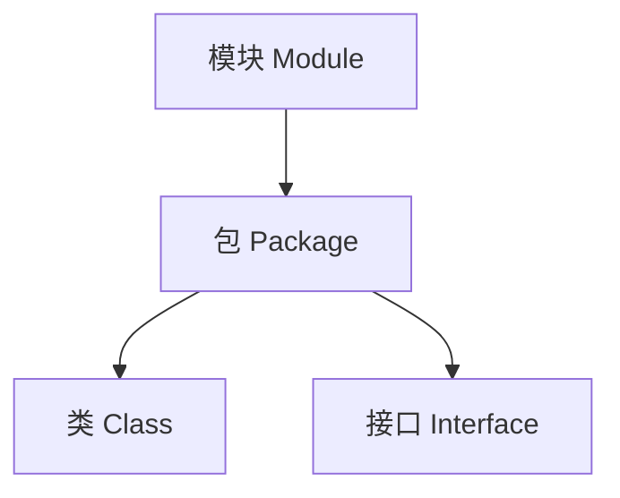

# JDK9～17新特性

## JDK 9新特性: jshell交互式工具

jshell是JDK 9引入的一个交互式命令行工具, 主要用于快速测试和学习Java代码

### 主要特点

1. 即时执行：无需编写完整的Java程序，可以直接输入和执行Java代码片段。
2. 交互式环境：提供类似REPL（Read-Eval-Print Loop）的交互式环境。
3. 自动补全：支持Tab键自动补全，提高编码效率。
4. 命令历史：可以使用上下箭头键查看和重用之前输入的命令
5. 变量共享：在一个会话中定义的变量可以在后续命令中使用。
6. 方法定义：支持直接定义和调用方法。
7. 无需分号：每行代码结束可以省略分号。

### 使用示例

1. 启动jshell

```bash
jshell
```

2. 打印语句

```bash
System.out.println("test")
```

3. 定义变量

```bash
String hello = "hello world"
```

4. 使用变量

```bash
System.out.println(hello)
```

### 主要用途

1. 教学工具：适合大学教师或培训机构用于Java教学。
2. 快速测试：开发人员可以快速测试小段代码或API。
3. 学习和探索：方便学习新的Java特性或库

## JDK 9模块化开发特性

JDK 9 引入的模块化开发时Java平台的一次重要升级, 旨在提高代码的封装性和可维护性

### 模块化概念

模块化在包(package)的基础上增加了一个新的抽象层次-模块(module). 这种结构允许开发者更精确地控制代码的可见性和依赖关系



### 核心组件

1. module-info.java: 模块的描述文件，位于模块根目录。
2. exports: 声明可以被外部访问的包。
3. equires: 声明模块依赖。

### 实现步骤

1. 创建模块并添加 module-info.java 文件。
2. 在被调用模块中使用 exports 声明开放的包。
3. 在调用模块中使用 requires 声明所需的外部模块。

```java
// 模块A的module-info.java
module test.a {
    exports com.test.a.package1;
    // exports com.test.a.package2; // 可选：开放多个包
}

// 模块B的module-info.java
module test.b {
    requires test.a;
}
```

### 优势

- 提高代码封装性
- 明确模块间依赖关系
- 增强应用安全性
- 改善性能（通过更有效的类加载）

### 实际应用

虽然模块化提供了诸多优势, 但在实际项目中的应用还不普遍, 主要原因包括:

1. 增加了项目复杂度
2. 对现有代码库的改造成本高
3. 部分第三方库尚未完全支持

### 我的理解

我自己也整理了一些JDK的新特性, 我试着理解一下模块化开发的内容, 首先JDK 9模块化开发简介, 想象现在我们正在建造一座大楼(Java程序), 在JDK 8及以前呢, 我们可以理解为, 我们有很多房间(就是包/packages), 每个房间里有家具(类/classes), 这种方式, 会出现一个问题: 任何人都可以进入任何房间, 使用任何家具. 而在JDK 9模块化开发之后, 我们就可以把房间分组成套房(模块/modules), 也可以指定哪些套房需要相互连接(requires), 也可以指定哪些套房的门是开着的(exports).
那么我们应该如何用呢, 那首先就是需要我们创建一个特殊的文件(module-info.java)放在你的"套房"的入口, 这个文件里你写到"这个套房叫什么名字(module 名称),哪些房间可以让外人进入(exports),这个套房需要连接到哪些套房(requires)"
这样带给我们很多好处, 提供了更好的安全性--可以隐藏不想让别人看到的"房间",更清晰的结构--很容易看出哪些"套房"依赖于其他"房间",可能运行的更快--系统知道只需要加载必要的"套房"

### 举个🌰 : 图书管理系统

#### **核心模块(library-core)**

这个模块包含基本的图书和用户管理功能

**目录结构**:

```
library-core/
├── src/
│   ├── com.library.core/
│   │   ├── Book.java
│   │   ├── User.java
│   │   └── internal/
│   │       └── DatabaseConnection.java
│   └── module-info.java
```

> 用tree命令可以获取到项目结构

**module-info.java 内容**

```java
module com.library.core {
    exports com.library.core;
    // 注意我们没有导出 internal 包
}
```

**Book.java**

```java
package com.library.core;

public class Book {
    private String title;
    private String author;

    // 构造函数、getter和setter
}
```

#### 用户界面模块 (library-ui)

这个模块提供图形界面，依赖于核心模块。

```
library-ui/
├── src/
│   ├── com.library.ui/
│   │   └── LibraryApp.java
│   └── module-info.java
```

**module-info.java 内容**

```java
module com.library.ui {
    requires com.library.core;
    // 如果使用JavaFX，还需要添加：
    // requires javafx.controls;
}
```

**LibraryApp.java**

```java
package com.library.ui;

import com.library.core.Book;
// import com.library.core.internal.DatabaseConnection; // 这行会导致编译错误，因为internal包没有被导出

public class LibraryApp {
    public static void main(String[] args) {
        Book book = new Book();
        // 使用Book类的代码
        // DatabaseConnection db = new DatabaseConnection(); // 这行会导致编译错误
    }
}
```

1. 在library-core模块中, 只导出了com.library.core包, 而没有导出internal包. 这一位着其他模块可以使用Book和User类, 但不能直接访问DatabaseConnection类
2. 在library-ui模块中, 声明了对com.library.core模块的依赖. 这允许我们使用核心模块中导出的类
3. 如果尝试在LibraryApp中使用DatabaseConnection类, 编译器会报错, 因为这个类在一个未导出的包中

通过模块化我们可以精确地控制哪些部分对外可见, 哪些部分保持内部使用. 这提高了代码的封装性和安全性, 同时也使得系统的结构更加清晰

## JDK 10新特性: var局部变量推导

### 基本概念

var 关键字允许在局部变量声明时进行类型推导, 简化代码编写

### 使用要求

1. 必须要能推到出实际类型
2. 只能用于声明局部变量

### 使用示例

```java
// 正确用法
var test1 = new Test1();
var number = 1;

// 错误用法
var test11; // 编译错误：必须初始化
class SomeClass {
    var classField = 10; // 编译错误：不能用于类字段
}
```

### 优点

- 简化代码, 减少冗长的类型声明
- 特别适用于复杂类型的声明

```java
// 旧方式
ArrayList<String> list = new ArrayList<>();

// 使用var
var list = new ArrayList<String>();
```

### 注意事项

- 过度使用可能减低代码可读性
- 不适用于没有初始化的变量声明

### 个人观点

虽然var可以简化代码, 但是显式声明类型可能在某些情况下更清晰. 使用与否主要取决于个人或团队的编码风格和偏好. 总的来说, var提供了一种更简洁的局部变量声明方式, 但应谨慎使用, 确保代码的清晰度和可读性不受影响

### 举个🌰

>我试了试, 还挺好用的, 一些基础用法都适用, 可以看一下

#### 基本数据类型

```java
var i = 10;              // 推导为int
var d = 3.14;            // 推导为double
var b = true;            // 推导为boolean
var c = 'A';             // 推导为char
var s = "Hello";         // 推导为String
```

#### 复杂数据类型

```java
var list = new ArrayList<String>();     // 推导为ArrayList<String>
var map = new HashMap<String, Integer>(); // 推导为HashMap<String, Integer>
var entry = map.entrySet().iterator().next(); // 推导为Map.Entry<String, Integer>
```

#### 匿名内部类

```java
var runnable = new Runnable() {
    @Override
    public void run() {
        System.out.println("Hello, var!");
    }
};  // 推导为匿名Runnable实现类
```

#### 循环中的使用

```java
for (var i = 0; i < 10; i++) {
    System.out.println(i);
}

var numbers = Arrays.asList(1, 2, 3, 4, 5);
for (var num : numbers) {
    System.out.println(num);
}
```

#### Lambda表达式 (不能直接使用var)

```java
// 错误用法
var lambda = (x, y) -> x + y;  // 编译错误

// 正确用法
BiFunction<Integer, Integer, Integer> lambda = (x, y) -> x + y;
```

#### 方法返回值

```java
public class Example {
    public static void main(String[] args) {
        var result = getComplexObject();
        // 使用result，无需知道确切类型
    }

    private static SomeComplexType getComplexObject() {
        return new SomeComplexType();
    }
}
```

#### 不推荐的用法

```java
var obj = null;  // 编译错误，无法推导类型
var x = 1, y = 2;  // 编译错误，不支持多变量声明

// 可读性降低的例子
var x = someMethodWithUnclearReturnType();
```

#### 与泛型结合

```java
var list = new ArrayList<Map<String, List<Integer>>>();
// 等同于 ArrayList<Map<String, List<Integer>>> list = new ArrayList<>();
```

## JDK 11新特性: 单文件程序

### 概述

JDK 11引入了单文件程序特性, 允许直接运行单个Java源文件, 无需先编译成class文件

### 主要特点

1. 直接执行: 可以直接用`java`命令运行`.java`文件
2. 无需编译: 跳过了传统的javac编译步骤
3. 限于单文件: 只适用于单个Java源文件
4. 包限制: 不支持包声明和导入其他自定义类

### 使用方法

```bash
java FileName.java
```

### 示例

假设有一个名为TestB.java的文件, 内容如下:

```java
public class TestB {
    public static void main(String[] args) {
        System.out.println("Hello World");
    }
}
```

可以直接运行

```bash
java TestB.java
```

输出

```
Hello World
```

### 注意事项

1. 不支持复杂的项目结构
2. 不能使用外部依赖
3. 主要用于简单, 独立的程序

## JDK 11新特性: Shebang脚本

### 什么是SHebang?

Shebang（也写作She-bang）是一个由 #! 开头的字符序列，通常出现在Unix系统的脚本文件第一行。它指定了执行这个脚本文件的解释器。

### Java中的Shebang支持

JDK 11允许Java文件使用Shebang, 使得Java代码可以像脚本一样直接执行

### 基本格式

```bash
#!/path/to/java --source 11
```

### 使用步骤

1. 创建一个不带`.java`后缀的文件(例如`test`)
2. 文件首行添加Shebang
```bash
#!/path/to/your/jdk/bin/java --source 11
```
3. 编写Java代码（无需public class声明）
4. 给文件添加执行权限（Unix系统）
```bash
chmod +x test
```
5. 执行脚本
```bash
./test
```

### 注意事项

1. 需要使用Unix-like环境（Linux, macOS, 或Windows的Git Bash
2. 文件无需`.java`后缀
3. 使用--source 11参数指定Java版本
4. 脚本中的Java代码不需要声明public class

### 局限性

1. 主要用于简单脚本, 不适合复杂应用
2. 执行环境需要支持Shebang(Windows CMD不支持)

这个特性使得Java可以更方便地用于编写简单的脚本和工具, 特别是在Unix-like系统中, 它为Java带来了类似脚本语言的便利性, 同时保留了Java的强大功能


## JDK 14新特性: 文本块

文本块是JDK 14引入的一个新特性

### 主要优点

1. 提高多行字符串的可读性
2. 减少字符串拼接和转义的需求
3. 特别适合编写JSON, HTML, SQL等多行文本

### 使用方法

#### 传统方法(JDK 8及以前)
```java
String json1 = "{\n" +
               "  \"name\": \"test\"\n" +
               "}";
```

#### 新方法(JDK 14及以后)
```java
String json2 = """
               {
                 "name": "test"
               }
               """;
```

### 特点

1. 使用三个双引号`（"""）`来开始和结束文本块
2. 可以直接包含换行符，无需显式添加 \n
3. 保留文本的格式，包括缩进
4. 结果字符串与传统方式相同

### 使用场景
- JSON字符串
- HTML模版
- SQL查询
- 任何需要保留格式的多行文本

### 注意事项

- 开始的三个双引号后必须紧跟换行
- 结束的三个双引号可以单独占一行, 用于控制最后的换行

### 结论

文本块大大简化了多行字符串的编写, 提高了代码的可读性和维护性. 对于需要处理大量格式化文本的开发者来说, 这是一个非常有用的特性


上一节 [[仿12306高性能售票系统/项目日记Day02|项目日记Day02]]
